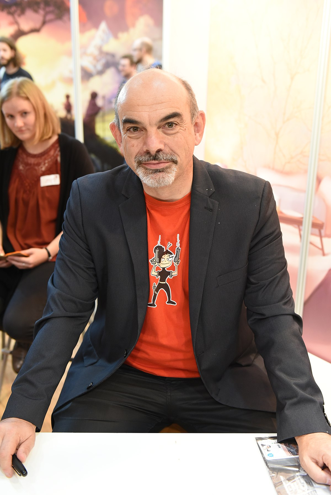

Let me introduce to you 15 famous board game designers. They are like 🎥 movie directors - can have their own style through the works. And it's always interesting, what' new they can invent.

I can't ✍️ write about all the board game designers. This list is created in my humble opinion. If you know someone else who deserves to be here - write to me, and I will create **Part II** later ;)

I don't want to compare these people, that's why this list is ordered alphabetically. 😇

So, let's go to the board games 📽️ Kubricks!

- [🇦🇹 Alexander Pfister](#alexander-pfister)
- [🇫🇷 Antoine Bauza](#antoine-bauza)
- [🇫🇷 → 🇨🇭 Bruno Cathala](#bruno-cathala)
- [🇮🇹 Daniele Tascini](#daniele-tascini)
- [🇨🇦 Eric M. Lang](#eric-m-lang)
- [🇺🇸 Jamey Stegmaier](#jamey-stegmaier)
- [🇬🇧 → 🇳🇿 → 🇦🇺 Martin Wallace](#martin-wallace)
- [🇩🇪 → 🇬🇧 Reiner Knizia](#reiner-knizia)
- [🇺🇸 Rob Daviau](#rob-daviau)
- [🇮🇹 Simone Luciani](#simone-luciani)
- [🇩🇪 Stefan Feld](#stefan-feld)
- [🇺🇸 Thomas Lehmann](#thomas-lehmann)
- [🇩🇪 Uwe Rosenberg](#uwe-rosenberg)
- [🇵🇹 Vital Lacerda](#vital-lacerda)
- [🇨🇿 Vlaada Chvátil](#vlaada-chvatil)

You can find digital versions of their games <a href="../digital-board-games" target="_blank">here</a>.

import Game from '../../../src/components/game';

---

## <a href="https://boardgamegeek.com/boardgamedesigner/11767/alexander-pfister" name="alexander-pfister" target="_blank">🇦🇹 Alexander Pfister</a>

> Alexander Pfister (born 1971 in Austria) is game designer who has been living in Vienna, Austria.
>
> He grew up in Vorarlberg and started developing his own games as a child. Alexander studied economics and works independently in the financial sector.

<a href="https://boardgamegeek.com/boardgamedesigner/11767/alexander-pfister/linkeditems/boardgamedesigner?pageid=1&sort=rank" target="_blank">Some high-rated games</a>:

- <Game gameName="Great Western Trail" />
- <Game gameName="Mombasa" />
- <Game gameName="Maracaibo" />
- <Game gameName="Isle of Skye: From Chieftain to King" />
- <Game gameName="Port Royal" />

---

## <a href="https://boardgamegeek.com/boardgamedesigner/9714/antoine-bauza" name="antoine-bauza" target="_blank">🇫🇷 Antoine Bauza</a>

> Antoine Bauza is the popular designer of several award-winning games, including **7 Wonders** and **Hanabi** (which won the 2013 Spiel des Jahres prize). Even before the success of **7 Wonders**, Antoine was well-known for his many other games, including **Ghost Stories** and **Tokaido**.
>
> Bauza was born on August 25, 1978. As a teenager, he was very interested in role-playing games, and wanted to become a video game designer. However, Bauza decided not to pursue video games as a career because he did not want to move away to Shanghai or Montreal, where video game companies were hiring at the time.
>
> An avid board game player, Bauza decided to start making board games in 2007. In 2010, he began working on board games full-time.

<a href="https://boardgamegeek.com/boardgamedesigner/9714/antoine-bauza/linkeditems/boardgamedesigner?pageid=1&sort=rank" target="_blank">Some high-rated games</a>:

- <Game gameName="7 Wonders Duel" />
- <Game gameName="7 Wonders" />
- <Game gameName="Ghost Stories" />
- <Game gameName="Takenoko" />
- <Game gameName="Hanabi" />

---

## <a href="https://boardgamegeek.com/boardgamedesigner/1727/bruno-cathala" name="bruno-cathala" target="_blank">🇫🇷 → 🇨🇭 Bruno Cathala</a>

> Bruno Cathala (born 1963) is a French game designer who has lived in Haute-Savoie near Geneva, Switzerland, since 1986.
>
> Bruno started developing games in the early 2000s.
>
> He is a designer of titles such as **Five Tribes**, **Kanagawa**, **Shadows Over Camelot** and **Kingdomino**. He won the Spiel Des Jahres in 2017 for **Kingdomino**.

<a href="https://boardgamegeek.com/boardgamedesigner/1727/bruno-cathala/linkeditems/boardgamedesigner?pageid=1&sort=rank" target="_blank">Some high-rated games</a>:

- <Game gameName="7 Wonders Duel" />
- <Game gameName="Five Tribes" />
- <Game gameName="Cyclades" />
- <Game gameName="Kingdomino" />
- <Game gameName="Mission: Red Planet (Second Edition)" />
- <Game gameName="Abyss" />

---

## <a href="https://boardgamegeek.com/boardgamedesigner/59986/daniele-tascini" name="daniele-tascini" target="_blank">🇮🇹 Daniele Tascini</a>

> Loving boardgames and any other kind of 'intelligent' games, Daniele Tascini used to invent and create games for his friends since he was very young. He had several high level expriences as a gamer, with RPG first, **Magic:The Gathering**, and finally boardgames.

<a href="https://boardgamegeek.com/boardgamedesigner/59986/daniele-tascini/linkeditems/boardgamedesigner?pageid=1&sort=rank" target="_blank">Some high-rated games</a>:

- <Game gameName="Tzolk'in: The Mayan Calendar" />
- <Game gameName="The Voyages of Marco Polo" />
- <Game gameName="Teotihuacan: City of Gods" />

---

## <a href="https://boardgamegeek.com/boardgamedesigner/1533/eric-m-lang" name="eric-m-lang" target="_blank">🇨🇦 Eric M. Lang</a>

> Eric M. Lang (born in 1972) is a Canadian game designer based in Toronto, currently serving as Game Director at CMON.
>
> He began his career as a playtester for FASA before publishing his first game, **Mystick** independently in 2000.

<a href="https://boardgamegeek.com/boardgamedesigner/1533/eric-m-lang/linkeditems/boardgamedesigner?pageid=1&sort=rank" target="_blank">Some high-rated games</a>:

- <Game gameName="Blood Rage" />
- <Game gameName="Rising Sun" />
- <Game gameName="Chaos in the Old World" />
- <Game gameName="Arcadia Quest" />
- <Game gameName="The Godfather: Corleone's Empire" />
- <Game gameName="Lord of the Rings: The Confrontation" />

---

## <a href="https://boardgamegeek.com/boardgamedesigner/62640/jamey-stegmaier" name="jamey-stegmaier" target="_blank">🇺🇸 Jamey Stegmaier</a>

>  Jamey (born in 1981) has been designing board games his entire life, but in late 2011 he started developing his first published board game via Kickstarter, **Viticulture: The Strategic Game of Winemaking**.

<a href="https://boardgamegeek.com/boardgamedesigner/62640/jamey-stegmaier/linkeditems/boardgamedesigner?pageid=1&sort=rank" target="_blank">Some high-rated games</a>:

- <Game gameName="Scythe" />
- <Game gameName="Viticulture Essential Edition" />
- <Game gameName="Viticulture" />
- <Game gameName="Tapestry" />
- <Game gameName="Charterstone" />
- <Game gameName="Euphoria: Build a Better Dystopia" />

---

## <a href="https://boardgamegeek.com/boardgamedesigner/6/martin-wallace" name="martin-wallace" target="_blank">🇬🇧 → 🇳🇿 → 🇦🇺 Martin Wallace</a>

> Martin Wallace is a game designer from Manchester, England (currently living in Australia after a stint in New Zealand), who is the founder of Warfrog/Treefrog Games.
>
> Wallace is known for designing complex strategy games that depict a variety of historical settings. Two themes he has frequently used are the construction and operation of railroads, and the rise and fall of ancient civilizations. He has developed a reputation for blending elegant European style game mechanics with the strong themes that are more typical of American style games. Many of his games feature economic systems, incorporating rules for income, taxation, and debt.
>
>  Wallace's most popular game, **Age of Steam**, was the winner of the 2003 International Gamers Award, and was one of the top twenty rated games on BoardGameGeek.

<a href="https://boardgamegeek.com/boardgamedesigner/6/martin-wallace/linkeditems/boardgamedesigner?pageid=1&sort=rank" target="_blank">Some high-rated games</a>:

- <Game gameName="Brass: Birmingham" />
- <Game gameName="Brass: Lancashire" />
- <Game gameName="Railways of the World" />
- <Game gameName="Age of Steam" />
- <Game gameName="Steam" />
- <Game gameName="A Few Acres of Snow" />
- <Game gameName="London" />
- <Game gameName="London (Second Edition)" />

---

## <a href="https://boardgamegeek.com/boardgamedesigner/2/reiner-knizia" name="reiner-knizia" target="_blank">🇩🇪 → 🇬🇧 Reiner Knizia</a>

>  Reiner Knizia (born 1957 in Germany) is a full-time game designer who lived for many years in England. He earned a PhD in mathematics and has previously worked in the banking industry.
>
> His first published games in 1990 were **Gold Digger** and **Desperados**. Since then he has been one of the world's most prolific game designers with more than 600 games and books published in numerous languages and countries including many global licences such as **Lord of the Rings**, **Game of Thrones**, **LEGO**, **Mensa**, **Disney**, **Monopoly**, **Playmobil**, **Simpsons**, **Asterix**, **Star Trek and Star Wars**. Over 13 million games and books sold worldwide. He is particularly notable for his auction trilogy and his tile-laying trilogy.

<a href="https://boardgamegeek.com/boardgamedesigner/2/reiner-knizia/linkeditems/boardgamedesigner?pageid=1&sort=rank" target="_blank">Some high-rated games</a>:

- <Game gameName="Tigris & Euphrates" />
- <Game gameName="Ra" />
- <Game gameName="The Quest for El Dorado" />
- <Game gameName="Samurai" />
- <Game gameName="Battle Line" />
- <Game gameName="Modern Art" />
- <Game gameName="Lost Cities" />

---

## <a href="https://boardgamegeek.com/boardgamedesigner/442/rob-daviau" name="rob-daviau" target="_blank">🇺🇸 Rob Daviau</a>

> Rob Daviau (born c. 1970) is a game designer from Western Massachusetts.
>
> David known for creating legacy board gaming. He has guest lectured at Massachusetts Institute of Technology, Carnegie Mellon University, and New York University on game design and has been a visiting professor of game design at Hampshire College. In 1998, Daviau joined Hasbro as a writer for text-heavy games like Trivial Pursuit and Taboo.
>
> He has been married to Lindsay Daviau who has worked in the board game industry in production, prototype development, play testing, graphic design, and art direction. She is one of two art directors for Restoration Games. He met her while working at Hasbro.
>
> Daviau is credited as the designer of over 80 board games or game items.

<a href="https://boardgamegeek.com/boardgamedesigner/442/rob-daviau/linkeditems/boardgamedesigner?pageid=1&sort=rank" target="_blank">Some high-rated games</a>:

- <Game gameName="Pandemic Legacy: Season 1" />
- <Game gameName="Pandemic Legacy: Season 2" />
- <Game gameName="Risk Legacy" />

---

## <a href="https://boardgamegeek.com/boardgamedesigner/35418/simone-luciani" name="simone-luciani" target="_blank">🇮🇹 Simone Luciani</a>

> Simone Luciani (born in 1977) is an Italian game designer from Fermo. He published his first game (**frutti di mare**) in 2009, a simple card game. He likes to create any kind of games. From 2014 he works as Chief of Editorial Development in Cranio Creations.

<a href="https://boardgamegeek.com/boardgamedesigner/35418/simone-luciani/linkeditems/boardgamedesigner?pageid=1&sort=rank" target="_blank">Some high-rated games</a>:

- <Game gameName="Tzolk'in: The Mayan Calendar" />
- <Game gameName="The Voyages of Marco Polo" />
- <Game gameName="Grand Austria Hotel" />
- <Game gameName="Lorenzo il Magnifico" />
- <Game gameName="Barrage" />

---

## <a href="https://boardgamegeek.com/boardgamedesigner/4958/stefan-feld" name="stefan-feld" target="_blank">🇩🇪 Stefan Feld</a>

> Stefan Feld (born in 1970) is a game designer from Gengenbach, Baden-Württemberg, Germany.
>
> He is particularly known for the ingenious use of dice in his games, using them to add variety and different options without excessive randomness. Three of the games he has designed, **Strasbourg**, **Bruges**, and **Carpe Diem** have been nominated for the prestigious award Kennerspiel des Jahres in Germany. Many of his games feature artwork from game artist Harald Lieske.

<a href="https://boardgamegeek.com/boardgamedesigner/4958/stefan-feld/linkeditems/boardgamedesigner?pageid=1&sort=rank" target="_blank">Some high-rated games</a>:

- <Game gameName="The Castles of Burgundy" />
- <Game gameName="Trajan" />
- <Game gameName="Bora Bora" />
- <Game gameName="Bruges" />
- <Game gameName="Notre Dame" />
- <Game gameName="In the Year of the Dragon" />

---

## <a href="https://boardgamegeek.com/boardgamedesigner/150/thomas-lehmann" name="thomas-lehmann" target="_blank">🇺🇸 Thomas Lehmann</a>

>  Lehmann is a former economist, programmer, technical writer, and game publisher (Prism Games) who now designs strategy board, card, and dice games full time.
>
> His most famous game is **Race for the Galaxy**. The game won Boardgamegeek's Golden Geek Award for best card game, Fairplay Magazine’s À la carte award for best card game of 2008, and was described by the magazine Tric Trac as "LE jeu de cartes de cette année 2008" (THE card game of the year 2008).

<a href="https://boardgamegeek.com/boardgamedesigner/150/thomas-lehmann/linkeditems/boardgamedesigner?pageid=1&sort=rank" target="_blank">Some high-rated games</a>:

- <Game gameName="Race for the Galaxy" />
- <Game gameName="Roll for the Galaxy" />
- <Game gameName="Res Arcana" />
- <Game gameName="1846: The Race for the Midwest" />

---

## <a href="https://boardgamegeek.com/boardgamedesigner/10/uwe-rosenberg" name="uwe-rosenberg" target="_blank">🇩🇪 Uwe Rosenberg</a>

> Uwe Rosenberg (born 27 March 1970) is a German game designer and the co-founder of Lookout Games. He initially became known for his card game Bohnanza, which was successful both in Germany and internationally. He also designed Agricola, a genre-changing game that dethroned Puerto Rico as the highest rated game on BoardGameGeek.com in September 2008 and stayed at the top of the rankings until March 2010.
>
> Rosenberg is well known for the development of complex, economic eurogames, as well as innovative card game mechanisms. Many of his designs have been recognized as being excellent for solitary play.

<a href="https://boardgamegeek.com/boardgamedesigner/10/uwe-rosenberg/linkeditems/boardgamedesigner?pageid=1&sort=rank" target="_blank">Some high-rated games</a>:

- <Game gameName="A Feast for Odin" />
- <Game gameName="Caverna: The Cave Farmers" />
- <Game gameName="Agricola" />
- <Game gameName="Le Havre" />
- <Game gameName="Fields of Arle" />
- <Game gameName="Agricola" />
- <Game gameName="Patchwork" />
- <Game gameName="Ora et Labora" />

---

## <a href="https://boardgamegeek.com/boardgamedesigner/12396/vital-lacerda" name="vital-lacerda" target="_blank">🇵🇹 Vital Lacerda</a>

>  Born in 1967 in Lisbon, Vital Lacerda has a masters degree in Marketing and Advertising. After working in advertising agencies for almost 15 years as an art director, and later as the creative director of his own agency, he decided to try his luck as a freelance graphic designer in 2006. Boardgame design is his greatest and most loved passion.
>
> Vital Lacerda is a designer who specialises in layering complex systems upon very simple ones and his ability to create intricate such interconnections between actions and resources in his games is unrivalled.

<a href="https://boardgamegeek.com/boardgamedesigner/12396/vital-lacerda/linkeditems/boardgamedesigner?pageid=1&sort=rank" target="_blank">Some high-rated games</a>:

- <Game gameName="The Gallerist" />
- <Game gameName="Lisboa" />
- <Game gameName="On Mars" />
- <Game gameName="Vinhos Deluxe Edition" />
- <Game gameName="Kanban: Driver's Edition" />

---

## <a href="https://boardgamegeek.com/boardgamedesigner/789/vlaada-chvatil" name="vlaada-chvatil" target="_blank">🇨🇿 Vlaada Chvátil</a>

> Vlaada Chvátil is a Czech game designer whose games are often on the border between thematic games and euros.
>
> He became a recognizable name in the board game community following the publication of **Through the Ages: A Story of Civilization** in 2006 and thereafter his designs frequently made the top 100 list on BoardGameGeek. In 2016, he won the coveted award "Spiel des Jahres" (Game of the Year) in Germany for **Codenames**.
>
> Vlaada's designs are strongly rooted in the game's theme preferring the mechanics that fit the theme best. His attachment to the theme is also evident in the way he writes the rules for his games which always make the theme apparent and sometimes even uses the theme to inject humor into the process of learning a game.
>
> He also gained a reputation for innovative mechanics and a diverse range of designs, including the epic civilization game **Through the Ages**, the award-winning party word game **Codenames**, and the real time sci-fi adventure **Galaxy Trucker** which required the players to simultaneously rummage through a pile of cardboard tiles looking for ones to improve their spaceship.

<a href="https://boardgamegeek.com/boardgamedesigner/789/vlaada-chvatil/linkeditems/boardgamedesigner?pageid=1&sort=rank" target="_blank">Some high-rated games</a>:

- <Game gameName="Through the Ages: A New Story of Civilization" />
- <Game gameName="Mage Knight Board Game" />
- <Game gameName="Through the Ages: A Story of Civilization" />
- <Game gameName="Codenames" />
- <Game gameName="Codenames: Duet" />
- <Game gameName="Galaxy Trucker" />

--

Games' ranks update: <Game isDateOnly />
