import Designer from '../../../src/components/designer';
import Game from '../../../src/components/game';
import A from '../../../src/components/a';

Let me introduce to you 20 more (the first 15 can be found <a href="../15-cool-board-game-designers" target="_blank">here</a>) famous board game designers. Initially, I wanted to make one more 15 designers list, but I have prepared more designers. And I had to remove somebody... But why? My blog - my rules 🙃. Let it be 20 designers list now)

It's not easy to find the info about some designers. Let their games list speaks for itself.

<A id="list" />

- <Designer name="bruno-faidutti" isPageLink />
- <Designer name="christian-t-petersen" isPageLink />
- <Designer name="cole-wehrle" isPageLink />
- <Designer name="corey-konieczka" isPageLink />
- <Designer name="david-turczi" isPageLink />
- <Designer name="friedemann-friese" isPageLink />
- <Designer name="ignacy-trzewiczek" isPageLink />
- <Designer name="jeroen-doumen" isPageLink />
- <Designer name="joris-wiersinga" isPageLink />
- <Designer name="mac-gerdts" isPageLink />
- <Designer name="michael-kiesling" isPageLink />
- <Designer name="phil-walker-harding" isPageLink />
- <Designer name="richard-borg" isPageLink />
- <Designer name="richard-garfield" isPageLink />
- <Designer name="rudiger-dorn" isPageLink />
- <Designer name="ryan-laukat" isPageLink />
- <Designer name="virginio-gigli" isPageLink />
- <Designer name="vladimir-suchy" isPageLink />
- <Designer name="wolfgang-kramer" isPageLink />
- <Designer name="wolfgang-warsch" isPageLink />

[bonus](#raman-hryhoryk)

The list is again sorted alphabetically.

And you can again find digital versions of their games <a href="../digital-board-games" target="_blank">here</a>.

---

## <Designer name="bruno-faidutti" /> [⬆️](#list)

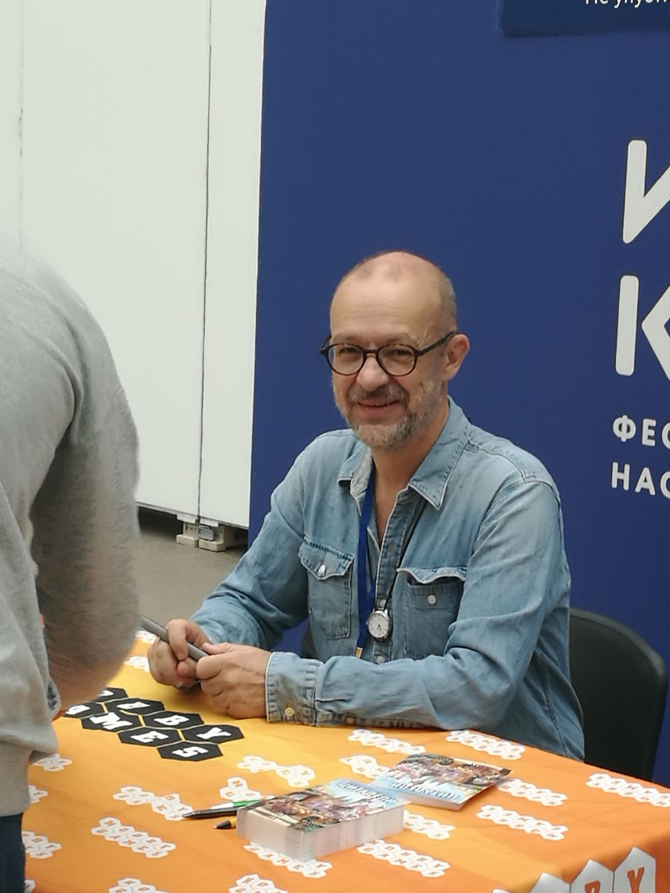

> Bruno Faidutti (born October 23, 1961) is a prolific French game designer, historian, and sociologist who frequently collaborates with other game designers, including Alan R. Moon, Bruno Cathala, and Michael Schacht, although he has also done many designs on his own, including perhaps his most famous game, **Citadels**.
>
> Bruno Faidutti has created and published over 40 board and card games.

<Designer name="bruno-faidutti" isGames />:
 
 

- <Game gameName="Mission: Red Planet (Second Edition)" /> (with <Designer name="bruno-cathala" />
  )
- <Game gameName="Raptor" /> (with <Designer name="bruno-cathala" />)
- <Game gameName="Citadels" />

---

## <Designer name="christian-t-petersen" /> [⬆️](#list)

> Christian Petersen is the founder and CEO of Fantasy Flight Games, as well as one of their main game designers. His design of **Twilight Imperium** helped transform Fantasy Flight from a small importer of European comics into a large game publisher.
>
> Christian Petersen is born in Washington, grew up in Denmark, and moved back to Minnesota in 1991.

<Designer name="christian-t-petersen" isGames />:
 
 

- <Game gameName="Twilight Imperium: Fourth Edition" /> (with <Designer name="dane-beltrami" /> and <Designer
    name="corey-konieczka"
    isPageLink
  />
  )
- <Game gameName="Twilight Imperium: Third Edition" />
- <Game gameName="A Game of Thrones: The Board Game (Second Edition)" />
- <Game gameName="Star Wars: Armada" /> (with <Designer name="james-kniffen" />)
- <Game gameName="Lord of the Rings: The Confrontation" /> (with <Designer name="reiner-knizia" /> and <Designer name="eric-m-lang" />
  )
- <Game gameName="StarCraft: The Board Game" /> (with <Designer
    name="corey-konieczka"
    isPageLink
  />
  )

---

## <Designer name="cole-wehrle" /> [⬆️](#list)

> Cole, born 1986, grew up in Fort Wayne, Indiana. He attended Indiana University and earned a degree in Journalism and English with additional concentrations in History (19th century) and film. As a student he was heavily involved in labor rights movements in Bloomington, Indiana and studied under Purnima Bose and Joss Marsh. His undergraduate thesis was on the writings of Sir Richard Francis Burton and Franz Fanon. After graduation he worked as a manager of a group home for children with disabilities and as a research assistant. He then attended the University of Texas at Austin and earned his MA in 2012 and his PhD in 2017. While at UT, Cole was a member of the E3W interest group and the Digital Writing and Research Lab. His dissertation concerns how the experience of empire altered the way British writers imagined distances of time and space during the early and mid 19th century. It was directed by Samuel Baker and Neville Hoad.
>
> After his defense, he joined Leder Games in Saint Paul, Minnesota as a developer and game designer. His first game with Leder, **Root**, was crowdfunded in 2017 and published the following year. He continues to work at Leder Games as a staff game designer and helps direct the studio. In 2018 he started Wehrlegig Games with his brother, Drew, which handles the publication of his historical games.

<Designer name="cole-wehrle" isGames />:
 
 

- <Game gameName="Root" />
- <Game gameName="Pax Pamir: Second Edition" />

---

## <Designer name="corey-konieczka" /> [⬆️](#list)

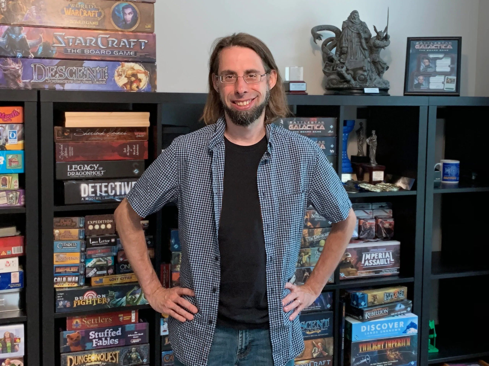

> Corey Konieczka is a table top game designer at Fantasy Flight Games.

<Designer name="corey-konieczka" isGames />:
 
 

- <Game gameName="Twilight Imperium: Fourth Edition" /> (with <Designer name="dane-beltrami" /> and <Designer
    name="christian-t-petersen"
    isPageLink
  />
  )
- <Game gameName="Star Wars: Rebellion" />
- <Game gameName="Star Wars: Imperial Assault" /> (with <Designer name="justin-kemppainen" /> and <Designer name="jonathan-ying" />
  )
- <Game gameName="Battlestar Galactica: The Board Game" />
- <Game gameName="Eldritch Horror" /> (with <Designer name="nikki-valens" />)
- <Game gameName="Forbidden Stars" /> (with <Designer name="samuel-bailey" /> and <Designer name="james-kniffen" />
  )
- <Game gameName="Descent: Journeys in the Dark (Second Edition)" /> (with <Designer name="daniel-clark-i" />
  , <Designer name="adam-sadler" /> and <Designer name="kevin-wilson" />)
- <Game gameName="Runewars" />
- <Game gameName="Star Wars: Outer Rim" /> (with <Designer name="tony-fanchi" />)
- <Game gameName="Mansions of Madness" />

---

## <Designer name="david-turczi" /> [⬆️](#list)

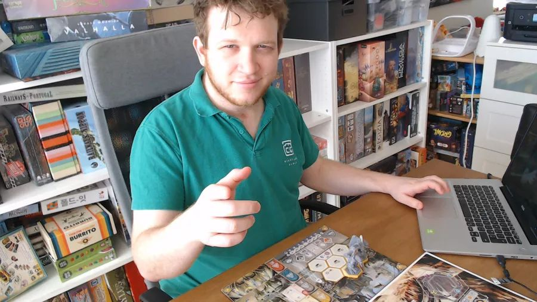

> Dávid Turczi is a game designer from Hungary, living in Leiden, Netherlands (previously lived and worked in London, UK).

<Designer name="david-turczi" isGames />:
 
 

- <Game gameName="Anachrony" /> (with <Designer name="richard-amann" /> and <Designer name="viktor-peter" />
  )
- <Game gameName="Tekhenu: Obelisk of the Sun" /> (with <Designer name="daniele-tascini" />
  )
- <Game gameName="Kitchen Rush" /> (with <Designer name="vangelis-bagiartakis" />
  )
- <Game gameName="Dice Settlers" />
- <Game gameName="Tawantinsuyu: The Inca Empire" />

---

## <Designer name="friedemann-friese" /> [⬆️](#list)

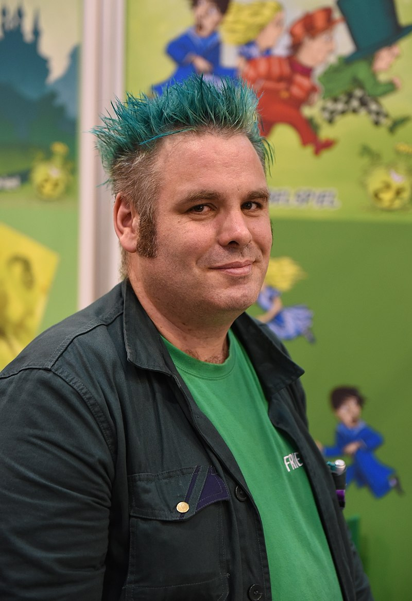

> Friedemann Friese (born June 5, 1970 in Stadthagen, Lower-Saxony, Germany) is a German board game designer who is known for pairing interesting gameplay with quirky themes. He is notorious for liking the color green, to the point which he includes the color on the cover of all of his designs, and has dyed his hair green. He also likes to begin every word in his titles with the letter 'F,' though this trait is sometimes lost in the English versions of his titles. He designs for his own game publishing company, 2F-Spiele.

<Designer name="friedemann-friese" isGames />:
 
 

- <Game gameName="Power Grid" />
- <Game gameName="Power Grid Deluxe: Europe/North America" />
- <Game gameName="Friday" />
- <Game gameName="Fabled Fruit" />

---

## <Designer name="ignacy-trzewiczek" /> [⬆️](#list)

> Ignacy Trzewiczek (born September 23, 1976) is a Polish game designer and long-time role-playing game writer. Author of Boardgames That Tell Stories - collection of essaywork written with famous designers like Rob Daviau, Antoine Bauza, Bruno Cathala, Mike Selinker and many more.

<Designer name="ignacy-trzewiczek" isGames />:
 
 

- <Game gameName="Robinson Crusoe: Adventures on the Cursed Island" />
- <Game gameName="Detective: A Modern Crime Board Game" /> (with <Designer name="przemyslaw-rymer" /> and <Designer name="jakub-lapot" />
  )
- <Game gameName="Imperial Settlers" /> (with <Designer name="maciej-obszanski" />
  )
- <Game gameName="51st State: Master Set" />
- <Game gameName="Imperial Settlers: Empires of the North" /> (with <Designer name="joanna-kijanka" />
  )
- <Game gameName="Prêt-à-Porter" /> (with <Designer name="piotr-haraszczak" />)
- <Game gameName="Stronghold" />

---

## <Designer name="jeroen-doumen" /> [⬆️](#list)

> Jeroen Doumen is a game designer from the Netherlands. He obtained a PhD in mathematics from the Eindhoven University of Technology.

<Designer name="jeroen-doumen" isGames />:
 
 

- <Game gameName="Food Chain Magnate" /> (with <Designer
    name="joris-wiersinga"
    isPageLink
  />
  )
- <Game gameName="Indonesia" /> (with <Designer
    name="joris-wiersinga"
    isPageLink
  />
  )
- <Game gameName="Antiquity" /> (with <Designer
    name="joris-wiersinga"
    isPageLink
  />
  )
- <Game gameName="The Great Zimbabwe" /> (with <Designer
    name="joris-wiersinga"
    isPageLink
  />
  )
- <Game gameName="Roads & Boats" /> (with <Designer
    name="joris-wiersinga"
    isPageLink
  />
  )
- <Game gameName="Pandemic: Rising Tide" /> (with <Designer name="matt-leacock" />
  )

---

## <Designer name="joris-wiersinga" /> [⬆️](#list)

> Joris Wiersinga was born in Arnhem, the Netherlands, in ~1974. He has been designing games since he was a kid, selling his first computer game at age 14 and his first card- and board games a few years later. Together with Jeroen Doumen, Tamara Jannink and Herman Haverkort he founded Splotter Spellen, which has published a number of games listed on the Geek.
>
> Joris' main board game interest lies in complex economic board games. His favourite non-splotter game is probably still 1830, although it's been a long time since he played it...
>
> Outside of Splotter, Joris creates computer games for physical rehabilitation of elderly people with his company SilverFit. He has also created a number of games for professional use in change management and lean operations transformations.

<Designer name="joris-wiersinga" isGames />:
 
 

- <Game gameName="Food Chain Magnate" /> (with <Designer
    name="jeroen-doumen"
    isPageLink
  />
  )
- <Game gameName="Indonesia" /> (with <Designer
    name="jeroen-doumen"
    isPageLink
  />
  )
- <Game gameName="Antiquity" /> (with <Designer
    name="jeroen-doumen"
    isPageLink
  />
  )
- <Game gameName="The Great Zimbabwe" /> (with <Designer
    name="jeroen-doumen"
    isPageLink
  />
  )
- <Game gameName="Roads & Boats" /> (with <Designer
    name="jeroen-doumen"
    isPageLink
  />
  )
- <Game gameName="Bus" /> (with <Designer name="jeroen-doumen" isPageLink />)

---

## <Designer name="mac-gerdts" /> [⬆️](#list)

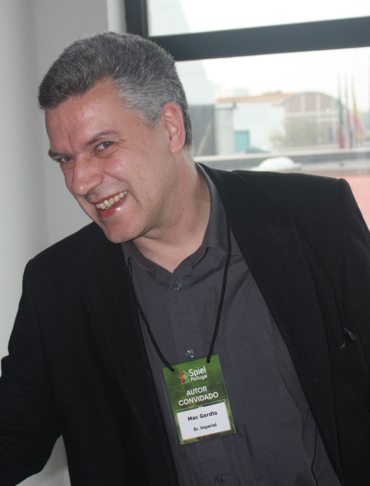

> Mac Gerdts, also known as Walther M. Gerdts, is a game designer from Hamburg, Germany, who is known for designing the Rondel series of board games such as **Imperial**, **Antike**, **Hamburgum**, and **Navegador**, as well as for the **Concordia** series of games and expansions.

<Designer name="mac-gerdts" isGames />:
 
 

- <Game gameName="Concordia" />
- <Game gameName="Imperial" />
- <Game gameName="Concordia Venus" />
- <Game gameName="Navegador" />
- <Game gameName="Imperial 2030" />
- <Game gameName="Antike" />

---

## <Designer name="michael-kiesling" /> [⬆️](#list)

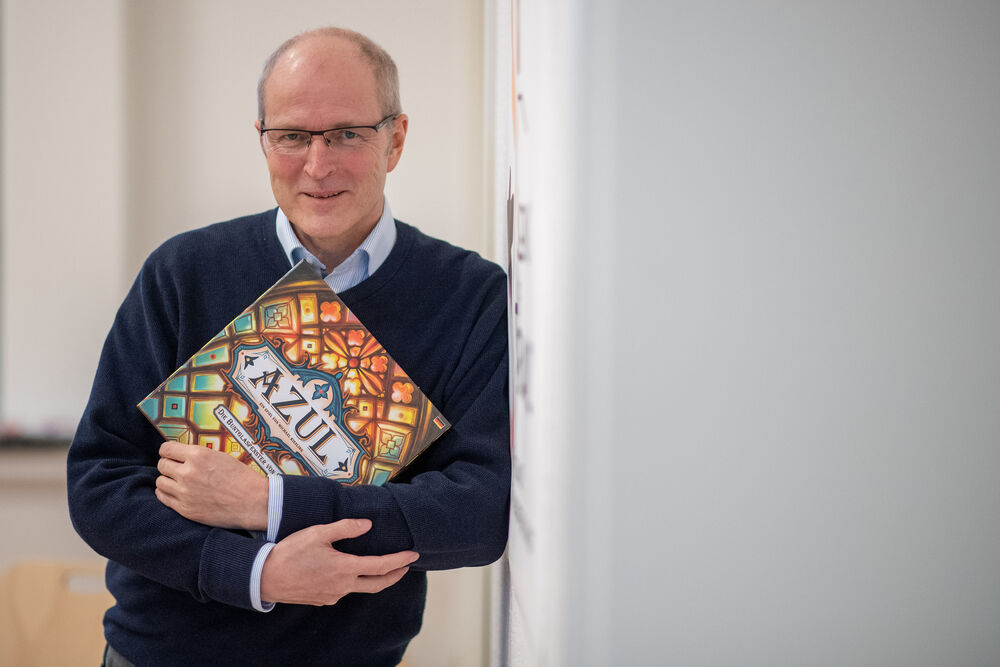

> Michael Kiesling (born 1957 in Bremen, Germany) is a game designer who frequently collaborates with game designer Wolfgang Kramer. He is also a manager of a software company in Bremen.
>
> For many years, Kramer and Michael Kiesling worked on games together by telephone and fax correspondence despite never having met. They have continued to produce games together, and Kiesling's more notable earlier work was generally that which he has produced with Kramer, including Spiel des Jahres winners **Tikal** and **Torres**. However, his solo-authored economic game, **Vikings**, from 2007 is highly sought after, and well-regarded. More recently, his abstract tile laying game series, **Azul**, **Azul: Stained Glass of Sintra** and **Azul: Summer Pavilion**, from 2017-2019 are highly awarded and well thought of.

<Designer name="michael-kiesling" isGames />:
 
 

- <Game gameName="Azul" />
- <Game gameName="Azul: Summer Pavilion" />
- <Game gameName="Heaven & Ale" /> (with <Designer name="andreas-schmidt" />)
- <Game gameName="Tikal" /> (with <Designer name="wolfgang-kramer" isPageLink />)
- <Game gameName="Azul: Stained Glass of Sintra" />
- <Game gameName="Vikings" />

---

## <Designer name="phil-walker-harding" /> [⬆️](#list)

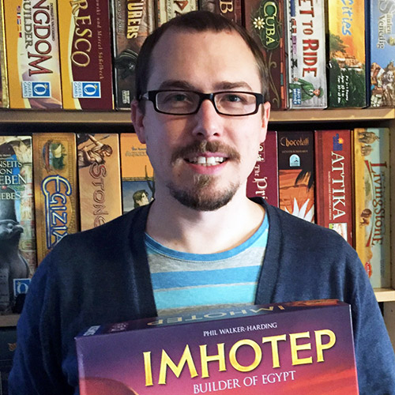

> Phil Walker-Harding (was born in 1981 in Wollongong, Australia) is an Australian game designer who is known, among other things, for the board game **Imhotep**, nominated for the jury award Game of the Year in 2016.

<Designer name="phil-walker-harding" isGames />:
 
 

- <Game gameName="Sushi Go Party!" />
- <Game gameName="Bärenpark" />
- <Game gameName="Gizmos" />
- <Game gameName="Imhotep" />
- <Game gameName="Sushi Go!" />
- <Game gameName="Cacao" />
- <Game gameName="Silver & Gold" />

---

## <Designer name="richard-borg" /> [⬆️](#list)

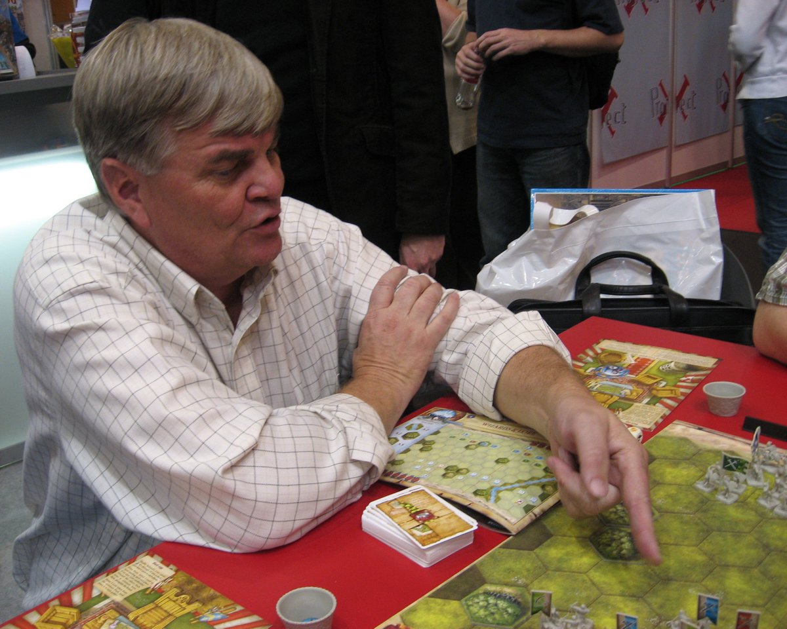

> Richard Borg is a game designer best known for the **Commands and Colors System**, but also well regarded for many other designs. Borg had his first game, **Liars Dice**, published in 1987 by Milton Bradley. This design was later republished as Bluff by F.X. Schmid in 1993 and went on to win the 1993 Spiel des Jahres. Borg continued in game design through the 90s, eventually introducing the **Command and Colors** system in 2000 with **Battle Cry**.

<Designer name="richard-borg" isGames />:
 
 

- <Game gameName="Memoir '44" />
- <Game gameName="Commands & Colors: Ancients" />
- <Game gameName="BattleLore (Second Edition)" /> (with <Designer name="robert-kouba" />
  )
- <Game gameName="BattleLore" />
- <Game gameName="Commands & Colors: Napoleonics" />
- <Game gameName="Perudo" />

---

## <Designer name="richard-garfield" /> [⬆️](#list)

> Richard Channing Garfield (born June 26, 1963 in Philadelphia, Pennsylvania) is a game designer and mathematics professor who is known for creating the very popular card game **Magic: The Gathering**.

<Designer name="richard-garfield" isGames />:
 
 

- <Game gameName="Android: Netrunner" /> (with <Designer name="lukas-litzsinger" />
  )
- <Game gameName="Magic: The Gathering" />
- <Game gameName="Bunny Kingdom" />
- <Game gameName="King of Tokyo" />
- <Game gameName="KeyForge: Call of the Archons" />
- <Game gameName="RoboRally" />
- <Game gameName="King of New York" />

---

## <Designer name="rudiger-dorn" /> [⬆️](#list)

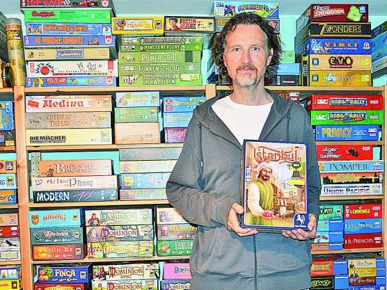

> Rüdiger Dorn (born 1969) is a German-style board game designer.
>
> Fantasy Flight Games published Rüdiger Dorn's fantasy-themed **Dragonheart** (2010). He was nominated for the 2005 Spiel des Jahres award for his game **Jambo**, which also placed 8th for the Deutscher Spiele Preis award. He was also nominated for the 2007 Spiel des Jahres award for his game **Die Baumeister von Arkadia** (released in English as simply **Arkadia**) and in 2012 for Las Vegas. He also won the 2014 Kennerspiel des Jahres award for his game **Istanbul**. In 2016, he was once again nominated for the Spiel des Jahres with his game **Karuba**. In 2018 **Luxor** was also nominated for Spiel des Jahres.

<Designer name="rudiger-dorn" isGames />:
 
 

- <Game gameName="Istanbul" />
- <Game gameName="Goa" />
- <Game gameName="Karuba" />
- <Game gameName="Las Vegas" />
- <Game gameName="Jambo" />
- <Game gameName="Genoa" />

---

## <Designer name="ryan-laukat" /> [⬆️](#list)

> Board game artist and designer living in Salt Lake City, Utah. Ryan's publishing company is Red Raven Games.

<Designer name="ryan-laukat" isGames />:
 
 

- <Game gameName="Near and Far" />
- <Game gameName="Above and Below" />
- <Game gameName="Islebound" />
- <Game gameName="Empires of the Void II" />
- <Game gameName="Eight-Minute Empire: Legends" />

---

## <Designer name="virginio-gigli" /> [⬆️](#list)

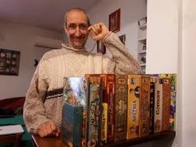

> Board game designer from Italy.

<Designer name="virginio-gigli" isGames />:
 
 

- <Game gameName="Grand Austria Hotel" /> (with <Designer name="simone-luciani" />
  )
- <Game gameName="Lorenzo il Magnifico" /> (with <Designer name="simone-luciani" /> and <Designer name="flaminia-brasini" />
  )
- <Game gameName="Coimbra" /> (with <Designer name="flaminia-brasini" />)
- <Game gameName="Egizia" /> (with <Designer name="flaminia-brasini" />, <Designer name="stefano-luperto" /> and <Designer name="antonio-tinto" />
  )

---

## <Designer name="vladimir-suchy" /> [⬆️](#list)

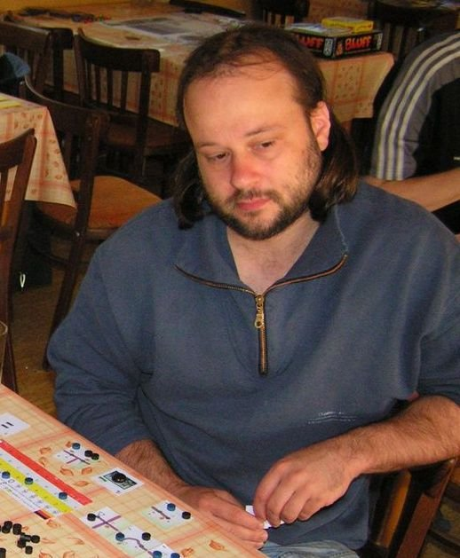

> Vladimír Suchý is a game designer known for various works published by Czech Games Edition.

<Designer name="vladimir-suchy" isGames />:
 
 

- <Game gameName="Underwater Cities" />
- <Game gameName="Pulsar 2849" />
- <Game gameName="Praga Caput Regni" />
- <Game gameName="Last Will" />
- <Game gameName="Shipyard" />
- <Game gameName="The Prodigals Club" />

---

## <Designer name="wolfgang-kramer" /> [⬆️](#list)

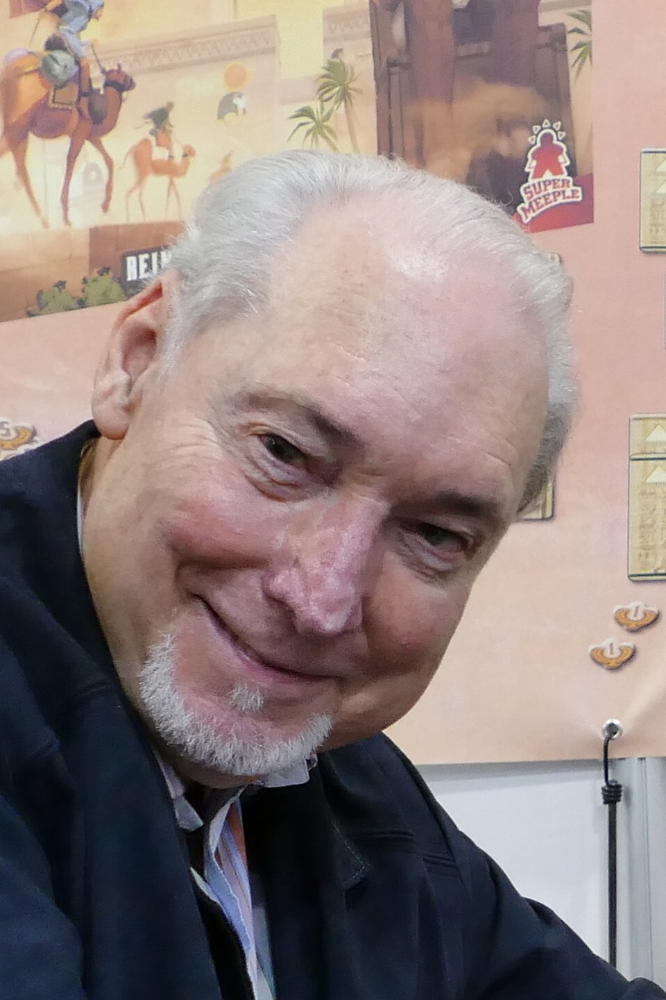

> Wolfgang Kramer is considered one of the key innovators of modern board games. He is often credited with pioneering area-control mechanics, with his game **El Grande**, action-point systems, with the **Mask** Trilogy, and even introducing the familiar victory-point-track-going-around-the-board in **Heimlich & Co**.
>
> Wolfgang Kramer was Germany's first full-time professional game-designer. For many years, Kramer and Michael Kiesling worked on games together by telephone and fax correspondence despite never having met. They are still producing games together, as of 2012, with their Essen 2012 release, **The Palaces of Carrara**. Kramer is now in his seventies, and Kiesling in his fifties.
>
> Kramer has often collaborated with other authors. His collaboration with Richard Ulrich has given him two of his most notable successes, **El Grande**, and **The Princes of Florence**. Kramer has won the German "Spiel Des Jahres" prize a record five times.
>
> There does not seem to be a common theme throughout Kramer's work, which ranges from family games, through to high-strategy titles. What is evident in his games is the sheer wealth of experience Kramer and his collaborators carry.

<Designer name="wolfgang-kramer" isGames />:
 
 

- <Game gameName="El Grande" /> (with <Designer name="richard-ulrich" />)
- <Game gameName="The Princes of Florence" /> (with <Designer name="richard-ulrich" /> and <Designer name="jens-christopher-ulrich" />
  )
- <Game gameName="Tikal" /> (with <Designer
    name="michael-kiesling"
    isPageLink
  />
  )
- <Game gameName="Downforce" /> (with <Designer name="rob-daviau" /> and <Designer name="justin-d-jacobson" />
  )
- <Game gameName="Colosseum" /> (with <Designer name="markus-lubke" />)
- <Game gameName="Torres" /> (with <Designer
    name="michael-kiesling"
    isPageLink
  />
  )

---

## <Designer name="wolfgang-warsch" /> [⬆️](#list)

> Wolfgang Warsch (born February 19, 1980 in Steyr, Upper Austria) is an Austrian molecular biologist and game designer. As a molecular biologist, he works in the field of cancer research and has received several prizes and a scholarship for his work. His board game **The Quacks of Quedlinburg**, the card game **The Mind** and the dice game **That's Pretty Clever!** all appeared in January 2018 and were nominated for Game of the Year or for Kennerspiel des Jahres in the same year, **The Quacks of Quedlinburg** was awarded there.

<Designer name="wolfgang-warsch" isGames />:
 
 

- <Game gameName="The Quacks of Quedlinburg" />
- <Game gameName="That's Pretty Clever!" />
- <Game gameName="The Taverns of Tiefenthal" />
- <Game gameName="Twice as Clever!" />
- <Game gameName="Wavelength" /> (with <Designer name="alex-hague" /> and <Designer name="justin-vickers" />
  )
- <Game gameName="The Mind" />
- <Game gameName="Illusion" />

---

## <Designer name="raman-hryhoryk" /> [⬆️](#list)

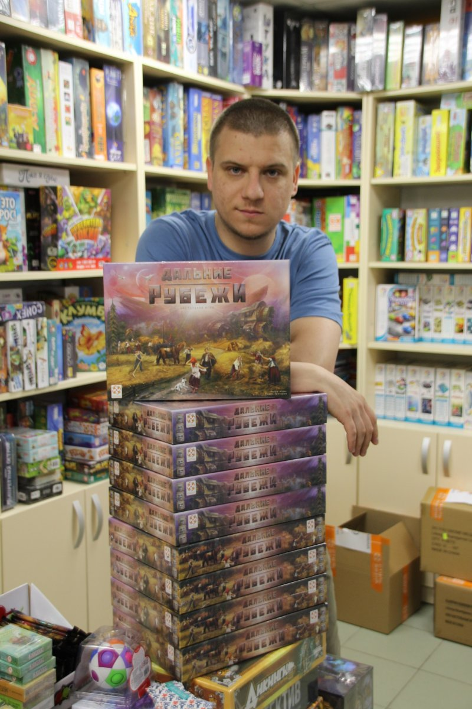

> Raman is a board game designer from Belarus. He works in the board games shop. He is not so famous yet as the designers above, but his game **Red Outpost** is really good. Hope he will create more new games in the future.

<Designer name="raman-hryhoryk" isGames />:
 
 

- <Game gameName="Red Outpost" />

--

Games' ranks update: <Game isDateOnly />
