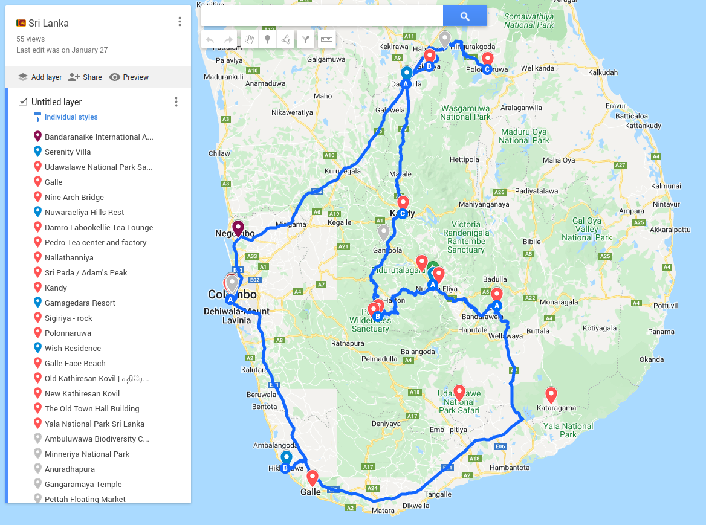
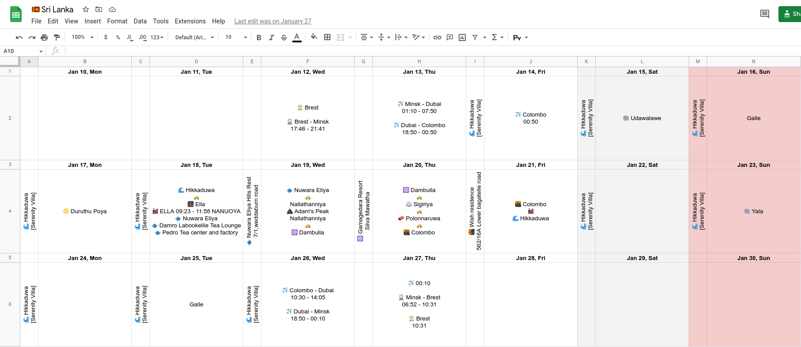

import CloudinaryImage from '../../../src/components/cloudinary-image';
import CloudinaryVideo from '../../../src/components/cloudinary-video';
import A from '../../../src/components/a';

This trip was planned for early 2020 but then covid-19 happened...

### Agenda<A id="agenda" />

- [Agenda](#agenda)
- [Intro](#intro)
- [Dubai](#dubai)
- [Hikkaduwa](#hikkaduwa)
  - [Sunsets and the Ocean](#sunsets-and-the-ocean)
  - [Surfing](#surfing)
  - [Sri Devol Maha Devalaya](#sri-devol-maha-devalaya)
- [Udawalawe National Park](#udawalawe-national-park)
- [Galle](#galle)
- [Ella](#ella)
- [Ella - Nuwara Eliya](#ella-nuwara-eliya)
- [Nuwara Eliya](#nuwara-eliya)
  - [Damro tea factory](#damro-tea-factory)
  - [Pedro tea factory](#pedro-tea-factory)
- [Sri Pada (Adam's Peak)](#sri-pada-adam-s-peak)
- [Kandy](#kandy)
- [Sigiriya](#sigiriya)
- [Polonnaruwa](#polonnaruwa)
- [Colombo](#colombo)
- [Yala National Park](#yala-national-park)
- [Animals](#animals)
- [Transport](#transport)
- [Food](#food)
  - [Sweets](#sweets)
  - [Drinks](#drinks)

### Intro<A id="intro" /> [⬆️](#agenda)

Sri Lanka (formerly known as Ceylon) is a fascinating destination for all kinds of tourists. You can try local cuisine, surfing and hiking, find the traces of old cities or enjoy rich nature with animals variety.

### Dubai<A id="dubai" /> [⬆️](#agenda)

Our path included a plane transfer in the United Arab Emirates. Dubai is a pretty modern city in the desert with many interesting places.

It looks really rich everywhere and the metro without a driver that goes above the ground helps have a quick look at the city.

<CloudinaryImage
  link="v1644070591/maxhere/all-around-sri-lanka/20220113_110042.jpg"
  alt="the view of Dubai"
/>

The city includes a lot of transparent tunnels with AC and escalators to live there even in summer hot. Like in movies about the future!

The giant aquarium with sharks in a shopping mall is an ordinary thing here.

<CloudinaryImage
  link="v1644070591/maxhere/all-around-sri-lanka/20220113_095953.jpg"
  alt="a shark and a pool cleaner in the mall in Dubai"
/>

Apart from everything, the city is popular because of the biggest building in the world (829.8 m).

<CloudinaryImage
  link="v1644070596/maxhere/all-around-sri-lanka/20220113_110421.jpg"
  alt="Burj Khalifa in Dubai - the tallest building in the world"
/>

And the famous palm islands are also here. But I didn't have enough time to look at it not from the airplane.

<CloudinaryImage
  link="v1644070592/maxhere/all-around-sri-lanka/20220113_194659.jpg"
  alt="Palm Islands in Dubai from the airplane"
/>

One more impressive thing there is the airport. It is soooooo colossal. It's like a city inside the city. It can take almost an hour to get from one terminal to another.

What to do there? Right, to taste the east desserts.

<CloudinaryImage
  link="v1644070768/maxhere/all-around-sri-lanka/20220126_154705.jpg"
  alt="baklawa in the Dubai International Airport in Dubai"
/>

<CloudinaryImage
  link="v1644070766/maxhere/all-around-sri-lanka/20220126_154924.jpg"
  alt="opened baklawa in the Dubai International Airport in Dubai"
/>

### Hikkaduwa<A id="hikkaduwa" /> [⬆️](#agenda)

But finally, we are in Hikkaduwa. This is a small village by the ocean. A nice place to stay if you like big ocean waves and would like to try yourself surfing.

Hikkaduwa includes one more street not far from the ocean and small streets going deep to the island.

<CloudinaryImage
  link="v1644070601/maxhere/all-around-sri-lanka/20220115_114508.jpg"
  alt="a street view from Red Lobster Restaurant in Hikkaduwa"
/>

There are several interesting things to do in Hikkaduwa: to visit a big turtle spot and the local temple Seenigama Sri Devol Maha Devalaya.

But the main two sides of Hikkaduwas are relaxation and surfing.

#### Sunsets and the Ocean<A id="sunsets-and-the-ocean" /> [⬆️](#agenda)

Hikkaduwa is situated on the west coast of Sri Lanka so you can meet the fabulous sunsets every evening here. It is impossible to add something to these photos. It's a view definitely worth seeing at least once.

<CloudinaryImage
  link="v1644070592/maxhere/all-around-sri-lanka/20220114_180920.jpg"
  alt="the sunset view from JLH Beach Restaurant & Bar in Hikkaduwa"
/>

<CloudinaryImage
  link="v1644070592/maxhere/all-around-sri-lanka/20220114_183509.jpg"
  alt="one more sunset view from JLH Beach Restaurant & Bar in Hikkaduwa"
/>

<CloudinaryImage
  link="v1644070603/maxhere/all-around-sri-lanka/20220115_174127.jpg"
  alt="rain view from Ocean Vibe Cafe in Hikkaduwa"
/>

<CloudinaryVideo
  link="v1644070611/maxhere/all-around-sri-lanka/20220115_174135.mp4"
  alt="rain view from Ocean Vibe Cafe in Hikkaduwa"
/>

<CloudinaryImage
  link="v1644070605/maxhere/all-around-sri-lanka/20220115_180153.jpg"
  alt="the sunset view from Ocean Vibe Cafe in Hikkaduwa"
/>

<CloudinaryImage
  link="v1644070616/maxhere/all-around-sri-lanka/20220116_181014.jpg"
  alt="the sunset view from Dolphin Restaurant in Hikkaduwa"
/>

<CloudinaryImage
  link="v1644070622/maxhere/all-around-sri-lanka/20220117_174700.jpg"
  alt="the sunset view from Y Hut Restaurant in Hikkaduwa"
/>

<CloudinaryImage
  link="v1644070763/maxhere/all-around-sri-lanka/20220125_182015.jpg"
  alt="the ocean view from the Dolphin Restaurant in Hikkaduwa"
/>

<CloudinaryImage
  link="v1644070767/maxhere/all-around-sri-lanka/20220125_182017.jpg"
  alt="one more ocean view from the Dolphin Restaurant in Hikkaduwa"
/>

#### Surfing<A id="surfing" /> [⬆️](#agenda)

This is the other side of Hikkaduwa. Narigama beach has a nice spot for surfing even for beginners.

I am not a successful surfer but let me try to explain how it works. Surfing includes a lot of difficult parts:

1. Firstly, you need to get to the spot. The waves are pretty big near the bank and try to interfere with you. You go (on this step, it's better to hold the board behind you), then you swim (here, if you see the white wave it's better to leave the board and go down).

2. On the spot, you have to see the waves for yourself. Some of them are too big, and some of them are too small. The waves are grouped in sets. Probably it's one of the hardest parts - to find your wave. And it takes some time.

3. Finally, there is a wave. You have to puddle as quickly as possible to the bank on your board. Your legs are starting to go up and your head is going down. And here is a really difficult moment. You have to get up as quickly as possible. Only one jump from lying down to standing on the board. And the board is not stable at that moment it's moving! The majority of beginners get up too late.

4. And the final part of your are on the wave. You are cool and happy but you have to remember about your position. If you are too behind you will stop pretty fast and the wave will go ahead without you.

Go to step 1.

If something went out of control you feel the how powerful ocean is. Even the small wave looks like tsunami when you are inside and you are absolutely helpless.

But if everything ok it's a really nice feeling. You are high above the sea and it feels like the board has a powerful motor to drag you forward.

One more advice: don't try to stay on board as long as possible. If you are losing the speed and the wave it's better to stop to save some strength going back not from the bank

If you want to tame even a softboard (for beginners) take into account that it will take a lot of time and strength. It requires many days.

<CloudinaryVideo
  link="v1644070725/maxhere/all-around-sri-lanka/20220122_070408.mp4"
  alt="the ocean waves in Narigama beach in Hikkaduwa"
/>

<CloudinaryVideo
  link="v1644070758/maxhere/all-around-sri-lanka/20220124_082534.mp4"
  alt="newbie surfing in Narigama beach in Hikkaduwa"
/>

<CloudinaryVideo
  link="v1644070751/maxhere/all-around-sri-lanka/20220124_084521.mp4"
  alt="one more newbie surfing in Narigama beach in Hikkaduwa"
/>

#### Sri Devol Maha Devalaya<A id="sri-devol-maha-devalaya" /> [⬆️](#agenda)

Local religious life looks pretty various and free. Buddhism is mixed with Hinduism.

<CloudinaryImage
  link="v1644070620/maxhere/all-around-sri-lanka/20220117_140856.jpg"
  alt="Seenigama Sri Devol Maha Devalaya in Hikkaduwa"
/>

Great and crazy Kali.

<CloudinaryImage
  link="v1644070620/maxhere/all-around-sri-lanka/20220117_141357.jpg"
  alt="Kali in Seenigama Sri Devol Maha Devalaya in Hikkaduwa"
/>

Visitors feed this cow with fruits with a respect.

<CloudinaryImage
  link="v1644070621/maxhere/all-around-sri-lanka/20220117_143445.jpg"
  alt="a cow in Seenigama Sri Devol Maha Devalaya in Hikkaduwa"
/>

### Udawalawe National Park<A id="udawalawe-national-park" /> [⬆️](#agenda)

Udawalawe is an elephant park. It has a lot of animals and birds, awesome trees and view. But the main character here is elephant, it's not a problem to find they here.

Elephants live in a wild nature here (it's not a orphanage).

<CloudinaryImage
  link="v1644070595/maxhere/all-around-sri-lanka/20220115_064143.jpg"
  alt="a sunrise elephant in Udawalawe National Park"
/>

Sri Lankan elephant is endemic. It's not so big as African one. But believe me, it's still an elephant and it's massive.

And it's a little bit scary to be so close to them on their territory - they walk right near the jeeps with tourists. But they are peaceful.

<CloudinaryImage
  link="v1644070594/maxhere/all-around-sri-lanka/20220115_071217.jpg"
  alt="three elephants in Udawalawe National Park"
/>

At the beginning of the XIX centure, there were too many elephants that's why it was allowed to kill them.

<CloudinaryImage
  link="v1644070594/maxhere/all-around-sri-lanka/20220115_071957.jpg"
  alt="cars and elephants in Udawalawe National Park"
/>

But now nobody offends them (I hope).

<CloudinaryImage
  link="v1644070600/maxhere/all-around-sri-lanka/20220115_072044.jpg"
  alt="a car and an elephant in Udawalawe National Park"
/>

<CloudinaryImage
  link="v1644070596/maxhere/all-around-sri-lanka/20220115_072124.jpg"
  alt="a tree and elephants in Udawalawe National Park"
/>

<CloudinaryVideo
  link="v1644070768/maxhere/all-around-sri-lanka/20220115_072155.mp4"
  alt="cars and elephants in Udawalawe National Park"
/>

<CloudinaryImage
  link="v1644070603/maxhere/all-around-sri-lanka/20220115_072454.jpg"
  alt="different sizes elephants in Udawalawe National Park"
/>

<CloudinaryImage
  link="v1644070598/maxhere/all-around-sri-lanka/20220115_072842.jpg"
  alt="a big elephant in Udawalawe National Park"
/>

<CloudinaryImage
  link="v1644070606/maxhere/all-around-sri-lanka/20220115_074713.jpg"
  alt="an elephant face in Udawalawe National Park"
/>

<CloudinaryImage
  link="v1644070600/maxhere/all-around-sri-lanka/20220115_080621.jpg"
  alt="a lot of elephants in Udawalawe National Park"
/>

### Galle<A id="galle" /> [⬆️](#agenda)

Galle is a city not far from Hikkaduwa. It's easy to visit it by bus or by train.

<CloudinaryImage
  link="v1644070608/maxhere/all-around-sri-lanka/20220116_083442.jpg"
  alt="train ticket to Galle on the Hikkaduwa train station"
/>

The city is famous by its Fort was built in 1588 by the Portuguese.

The for is "the best example of a fortified city with a fusion of European architecture and South Asian traditions built by Europeans in South and Southeast Asia".

<CloudinaryImage
  link="v1644070609/maxhere/all-around-sri-lanka/20220116_112125.jpg"
  alt="the Meeran Jumma Masjid and Lighthouse view from the Flagrock Bastion in Galle Fort"
/>

It's impossible to imagine the feeling of middle ages portugueses who come here and see this exotic. They wasn't prepared by the internet.

<CloudinaryImage
  link="v1644070611/maxhere/all-around-sri-lanka/20220116_112405.jpg"
  alt="the view of waves from the Flagrock Bastion in Galle Fort"
/>

<CloudinaryImage
  link="v1644070610/maxhere/all-around-sri-lanka/20220116_140455.jpg"
  alt="the Lighthouse street view in Galle Fort"
/>

<CloudinaryImage
  link="v1644070759/maxhere/all-around-sri-lanka/20220125_085808.jpg"
  alt="a streetview in Galle Fort"
/>

But it worth to walk on the street outside the Fort too. The feeling is absolutely different from Hikkaduwa.

<CloudinaryImage
  link="v1644070612/maxhere/all-around-sri-lanka/20220116_144824.jpg"
  alt="Big Buddha on the Main street in Galle"
/>

<CloudinaryImage
  link="v1644070615/maxhere/all-around-sri-lanka/20220116_150905.jpg"
  alt="market on the Colombo - Galle - Hambantota - Wellawaya road in Galle"
/>

Unfortunately, these temples were closed. But later in Colombo we finally visited them.

<CloudinaryImage
  link="v1644070612/maxhere/all-around-sri-lanka/20220116_154724.jpg"
  alt="Hindu Temple on the Colombo - Galle - Hambantota - Wellawaya road in Galle"
/>

<CloudinaryImage
  link="v1644070614/maxhere/all-around-sri-lanka/20220116_155253.jpg"
  alt="Sri Meenachi Sundareshwarar Temple in Galle"
/>

### Ella<A id="ella" /> [⬆️](#agenda)

Here we start a 4 days round trip inside the trip.

We made a list of the coolest places on the island, sorted it by how much we wanted to visit them, chose as many places as we could from the top, and created a round path from Hikkaduwa to Hikkaduwa.

We found a driver named Upul who was an amazing person to go with through most of these places for 3 days.

Ella is the first point of this trip. The way from Hikkaduwa to Ella goes up to the mountains with waterfalls and other beautiful views.

<CloudinaryImage
  link="v1644070626/maxhere/all-around-sri-lanka/20220118_073143.jpg"
  alt="Rawana Falls not far from Ella"
/>

One of the main attractions in Ella is Nine Arch Bridge. We wanted to make a photo with the train on it but it was our train, we would miss it in this case :)

<CloudinaryImage
  link="v1644070624/maxhere/all-around-sri-lanka/20220118_080459.jpg"
  alt="Nine Arch Bridge in Ella"
/>

<CloudinaryImage
  link="v1644070626/maxhere/all-around-sri-lanka/20220118_080705.jpg"
  alt="Nine Arch Bridge in Ella"
/>

<CloudinaryImage
  link="v1644070628/maxhere/all-around-sri-lanka/20220118_080926.jpg"
  alt="Nine Arch Bridge in Ella"
/>

Here is the train but not on the Bridge, we are at the Ella train station. A lot of tourists are already waiting for it.

<CloudinaryImage
  link="v1644070629/maxhere/all-around-sri-lanka/20220118_093318.jpg"
  alt="a train arriving to the Ella train station"
/>

### Ella - Nuwara Eliya<A id="ella-nuwara-eliya" /> [⬆️](#agenda)

Our driver went to Nuwara Eliya to meet us but we chose another transport because this train path is one of the most breathtaking in the world.

<CloudinaryImage
  link="v1644070630/maxhere/all-around-sri-lanka/20220118_101602.jpg"
  alt="a view from the train between Ella and Nanuoya (not far from Nuwara Eliya) train stations"
/>

<CloudinaryImage
  link="v1644070629/maxhere/all-around-sri-lanka/20220118_101922.jpg"
  alt="a view from the train between Ella and Nanuoya (not far from Nuwara Eliya) train stations"
/>

<CloudinaryImage
  link="v1644070629/maxhere/all-around-sri-lanka/20220118_103243.jpg"
  alt="a view from the train between Ella and Nanuoya (not far from Nuwara Eliya) train stations"
/>

<CloudinaryImage
  link="v1644070629/maxhere/all-around-sri-lanka/20220118_104627.jpg"
  alt="a view from the train between Ella and Nanuoya (not far from Nuwara Eliya) train stations"
/>

<CloudinaryVideo
  link="v1644070633/maxhere/all-around-sri-lanka/20220118_105735.mp4"
  alt="a view from the train between Ella and Nanuoya (not far from Nuwara Eliya) train stations"
/>

<CloudinaryImage
  link="v1644070631/maxhere/all-around-sri-lanka/20220118_113915.jpg"
  alt="a view from the train between Ella and Nanuoya (not far from Nuwara Eliya) train stations"
/>

<CloudinaryImage
  link="v1644070632/maxhere/all-around-sri-lanka/20220118_121336.jpg"
  alt="a view from the train between Ella and Nanuoya (not far from Nuwara Eliya) train stations"
/>

<CloudinaryImage
  link="v1644070632/maxhere/all-around-sri-lanka/20220118_121805.jpg"
  alt="a view from the train between Ella and Nanuoya (not far from Nuwara Eliya) train stations"
/>

The main part is here, closer to Nuwara Eliya where the famous tea plantations start.

<CloudinaryImage
  link="v1644070633/maxhere/all-around-sri-lanka/20220118_121854.jpg"
  alt="a view from the train between Ella and Nanuoya (not far from Nuwara Eliya) train stations"
/>

### Nuwara Eliya<A id="nuwara-eliya" /> [⬆️](#agenda)

People call this city old England. This is the coldest place on the island I have visited.

<CloudinaryImage
  link="v1644070637/maxhere/all-around-sri-lanka/20220118_143202.jpg"
  alt="a view from the Nuwara Eliya Hills Rest guest house"
/>

All religions live in peace together here.

<CloudinaryImage
  link="v1644070640/maxhere/all-around-sri-lanka/20220118_192047.jpg"
  alt="religious corner in the Nuwara Eliya Hills Rest guest house"
/>

#### Damro tea factory<A id="damro-tea-factory" /> [⬆️](#agenda)

As I mentioned the city is famous because of tea plantations and tea factories. It exports tea over the world. And the women on these plantations from the ads from childhood are really here.

Damro tea factory is one of the main factories to visit. You can have a look at factory workshops and taste the tea here.

<CloudinaryImage
  link="v1644070633/maxhere/all-around-sri-lanka/20220118_131552.jpg"
  alt="fresh tea drying in the Damro tea factory not far from Nuwara Eliya"
/>

Can you believe almost all the tea on the planet is collected on this island?

<CloudinaryImage
  link="v1644070633/maxhere/all-around-sri-lanka/20220118_131821.jpg"
  alt="industrial premises in the Damro tea factory not far from Nuwara Eliya"
/>

<CloudinaryImage
  link="v1644070634/maxhere/all-around-sri-lanka/20220118_132213.jpg"
  alt="industrial premises in the Damro tea factory not far from Nuwara Eliya"
/>

<CloudinaryImage
  link="v1644070635/maxhere/all-around-sri-lanka/20220118_132529.jpg"
  alt="tea exhibition in the Damro tea factory not far from Nuwara Eliya"
/>

<CloudinaryImage
  link="v1644070636/maxhere/all-around-sri-lanka/20220118_134151.jpg"
  alt="a view from the terrace in Damro tea factory not far from Nuwara Eliya"
/>

<CloudinaryImage
  link="v1644070638/maxhere/all-around-sri-lanka/20220118_134200.jpg"
  alt="a view from the terrace in Damro tea factory not far from Nuwara Eliya"
/>

#### Pedro tea factory<A id="pedro-tea-factory" /> [⬆️](#agenda)

Pedro tea factory is another factory to visit. It's interesting to compare everything with the first one. If you have time - why not?

<CloudinaryImage
  link="v1644070637/maxhere/all-around-sri-lanka/20220118_152718.jpg"
  alt="fresh tea at entrance to the Pedro tea factory in Nuwara Eliya"
/>

<CloudinaryImage
  link="v1644070637/maxhere/all-around-sri-lanka/20220118_152834.jpg"
  alt="fresh tea drying in the Pedro tea factory in Nuwara Eliya"
/>

<CloudinaryImage
  link="v1644070638/maxhere/all-around-sri-lanka/20220118_153017.jpg"
  alt="roller machine in the Pedro tea factory in Nuwara Eliya"
/>

Tea is sorted by its size. The smallest one is the strongest and the cheapest.

<CloudinaryImage
  link="v1644070643/maxhere/all-around-sri-lanka/20220118_153728.jpg"
  alt="types of tea in the Pedro tea factory in Nuwara Eliya"
/>

<CloudinaryImage
  link="v1644070638/maxhere/all-around-sri-lanka/20220118_153747.jpg"
  alt="industrial premises in the Pedro tea factory in Nuwara Eliya"
/>

### Sri Pada (Adam's Peak)<A id="sri-pada-adam-s-peak" /> [⬆️](#agenda)

Adam's Peak or Sri Pada is a sacred place on the island. It's not the tallest mountain but it is the most important for locals and tourists. The path to the top is not easy but every Lankan tries to do it at least once in a couple of years.

The majority of people who go up to the peak try to meet the dawn there. Some people start to climb up the mountain in the evening.

We decided to start later to avoid the people and enjoy nature. It took 2 hours for us but I think it's a good pace.

<CloudinaryImage
  link="v1644070641/maxhere/all-around-sri-lanka/20220119_064900.png"
  alt="the track to Sri Pada (Adam's Peak) from the Nallathanniya (or Delhousie) village"
/>

If the way to the top is longer travelers can buy some food or water or even stay to eat or rest on the way.

<CloudinaryImage
  link="v1644070644/maxhere/all-around-sri-lanka/20220119_064554.jpg"
  alt="the view of Sri Pada (Adam's Peak) from the Nallathanniya (or Delhousie) village"
/>

The way awards people with nice views of the green steep slopes.

<CloudinaryImage
  link="v1644070642/maxhere/all-around-sri-lanka/20220119_071059.jpg"
  alt="the mountains view on the road to Sri Pada (Adam's Peak)"
/>

The road is good. The only problem is you have to go up)

<CloudinaryImage
  link="v1644070645/maxhere/all-around-sri-lanka/20220119_082107.jpg"
  alt="the road to Sri Pada (Adam's Peak)"
/>

Buddhist flags accompany you all the way.

<CloudinaryImage
  link="v1644070647/maxhere/all-around-sri-lanka/20220119_082826.jpg"
  alt="the road to Sri Pada (Adam's Peak)"
/>

On the road, you can see other peaks and lakes around.

<CloudinaryImage
  link="v1644070644/maxhere/all-around-sri-lanka/20220119_082834.jpg"
  alt="the view from the road to Sri Pada (Adam's Peak)"
/>

And even real monks in orange cloth!

<CloudinaryImage
  link="v1644070646/maxhere/all-around-sri-lanka/20220119_084405.jpg"
  alt="the monks on the road from Sri Pada (Adam's Peak)"
/>

This is the destination. In Buddhist tradition is held to be the footprint of the Buddha, in Hindu tradition that of Hanuman or Shiva, and in some Islamic and Christian traditions that of Adam, or that of St. Thomas.

<CloudinaryImage
  link="v1644070646/maxhere/all-around-sri-lanka/20220119_090211.jpg"
  alt="the Sri Pada rock formation near the summit"
/>

Everyone can ring the bell on the top.

<CloudinaryImage
  link="v1644070645/maxhere/all-around-sri-lanka/20220119_090442.jpg"
  alt="the bell in the Sri Pada rock formation near the summit"
/>

We hurried to reach the top as soon as possible that's why our way down took more time to enjoy the views.

<CloudinaryImage
  link="v1644070647/maxhere/all-around-sri-lanka/20220119_091913.jpg"
  alt="the view from the Sri Pada (Adam's Peak) summit"
/>

These cookies have a nice a little spicy taste. But why еру package is swollen?

<CloudinaryImage
  link="v1644070646/maxhere/all-around-sri-lanka/20220119_092210.jpg"
  alt="inflated ginger biscuit package on the Sri Pada (Adam's Peak) summit"
/>

Because it was bought on the ground where atmospheric pressure is higher.

<CloudinaryImage
  link="v1644070647/maxhere/all-around-sri-lanka/20220119_092728.jpg"
  alt="the view from the Sri Pada (Adam's Peak) road"
/>

<CloudinaryImage
  link="v1644070648/maxhere/all-around-sri-lanka/20220119_092827.jpg"
  alt="the view with flags from the Sri Pada (Adam's Peak) road"
/>

<CloudinaryImage
  link="v1644070648/maxhere/all-around-sri-lanka/20220119_093927.jpg"
  alt="the view with flags and threads from the Sri Pada (Adam's Peak) road"
/>

Monkeys feel like they are masters here. Because it's true.

<CloudinaryImage
  link="v1644070651/maxhere/all-around-sri-lanka/20220119_095747.jpg"
  alt="monkeys on the road from Sri Pada (Adam's Peak)"
/>

<CloudinaryVideo
  link="v1644070769/maxhere/all-around-sri-lanka/20220119_095845.mp4"
  alt="monkeys on the road from Sri Pada (Adam's Peak)"
/>

<CloudinaryVideo
  link="v1644070665/maxhere/all-around-sri-lanka/20220119_095948.mp4"
  alt="a monkey jump on the road from Sri Pada (Adam's Peak)"
/>

<CloudinaryImage
  link="v1644070650/maxhere/all-around-sri-lanka/20220119_105623.jpg"
  alt="the gate on the road from Sri Pada (Adam's Peak)"
/>

<CloudinaryImage
  link="v1644070649/maxhere/all-around-sri-lanka/20220119_105704.jpg"
  alt="Buddha in Nirvana on the road from Sri Pada (Adam's Peak)"
/>

Real tea starts here and these ladies collect up to 20 kg per day.

<CloudinaryImage
  link="v1644070655/maxhere/all-around-sri-lanka/20220119_110445.jpg"
  alt="local women collect tea in the Nallathanniya (or Delhousie) village"
/>

### Kandy<A id="kandy" /> [⬆️](#agenda)

We didn't plan to visit Kandy but there is no other way to our next destination. That's why we decided to make a stop to visit a famous Temple of the Sacred Tooth Relic and to have lunch here. And we didn't regret it.

<CloudinaryVideo
  link="v1644070776/maxhere/all-around-sri-lanka/20220119_135726.mp4"
  alt="traffic on the Kandy Rd, Gampola in Kandy"
/>

<CloudinaryImage
  link="v1644070653/maxhere/all-around-sri-lanka/20220119_144915.jpg"
  alt="Paththirippuwa (octagonal pavilion) in Kandy"
/>

<CloudinaryImage
  link="v1644070658/maxhere/all-around-sri-lanka/20220119_145556.jpg"
  alt="inside the Temple of the Sacred Tooth Relic in Kandy"
/>

<CloudinaryImage
  link="v1644070658/maxhere/all-around-sri-lanka/20220119_150328.jpg"
  alt="inside the Temple of the Sacred Tooth Relic in Kandy"
/>

<CloudinaryImage
  link="v1644070659/maxhere/all-around-sri-lanka/20220119_150931.jpg"
  alt="a cover for the Temple of the Sacred Tooth Relic in Kandy"
/>

<CloudinaryImage
  link="v1644070658/maxhere/all-around-sri-lanka/20220119_151858.jpg"
  alt="the Temple of the Sacred Tooth Relic in Kandy"
/>

<CloudinaryImage
  link="v1644070659/maxhere/all-around-sri-lanka/20220119_152122.jpg"
  alt="the Temple of the Sacred Tooth Relic in Kandy"
/>

<CloudinaryImage
  link="v1644070661/maxhere/all-around-sri-lanka/20220119_154302.jpg"
  alt="the view of Red Mosque from the street in Kandy"
/>

<CloudinaryImage
  link="v1644070661/maxhere/all-around-sri-lanka/20220119_154908.jpg"
  alt="the view of Red Mosque from CAFE 1886 in Kandy"
/>

### Sigiriya<A id="sigiriya" /> [⬆️](#agenda)

Probably the most bright point, visiting card of the island, our trip culmination. Sigiriya rock fortress!

The best decoration for all Indiana Jones movies! You feel like in the movie here. It's hard to believe that this is real and so old.

<CloudinaryImage
  link="v1644070664/maxhere/all-around-sri-lanka/20220120_071249.jpg"
  alt="the view of Sigiriya rock fortress not far from Dambulla"
/>

<CloudinaryImage
  link="v1644070664/maxhere/all-around-sri-lanka/20220120_071624.jpg"
  alt="a road to Sigiriya rock fortress not far from Dambulla"
/>

<CloudinaryImage
  link="v1644070665/maxhere/all-around-sri-lanka/20220120_072010.jpg"
  alt="a road between gardens to Sigiriya rock fortress not far from Dambulla"
/>

You can find some really old frescoes on the stones here.

<CloudinaryImage
  link="v1644070667/maxhere/all-around-sri-lanka/20220120_072648.jpg"
  alt="remnants of frescoes on stones in Sigiriya"
/>

<CloudinaryImage
  link="v1644070668/maxhere/all-around-sri-lanka/20220120_072857.jpg"
  alt="a passage between two stones in Sigiriya"
/>

<CloudinaryImage
  link="v1644070671/maxhere/all-around-sri-lanka/20220120_073125.jpg"
  alt="the view under Sigiriya fortress rock not far from Dambulla"
/>

Don't be afraid this road is old and not used by tourists :)

<CloudinaryImage
  link="v1644070668/maxhere/all-around-sri-lanka/20220120_073340.jpg"
  alt="the old roads on the Sigiriya fortress rock not far from Dambulla"
/>

Here is our road (honestly, this one is a little bit scary too).

<CloudinaryImage
  link="v1644070669/maxhere/all-around-sri-lanka/20220120_073734.jpg"
  alt="the entrance to the Sigiriya fortress rock not far from Dambulla"
/>

<CloudinaryImage
  link="v1644070671/maxhere/all-around-sri-lanka/20220120_073753.jpg"
  alt="lion paws around the entrance to the Sigiriya fortress rock not far from Dambulla"
/>

And here is the top of the rock among the jungles.

<CloudinaryImage
  link="v1644070671/maxhere/all-around-sri-lanka/20220120_074628.jpg"
  alt="the view from the top of Sigiriya rock fortress not far from Dambulla"
/>

<CloudinaryImage
  link="v1644070672/maxhere/all-around-sri-lanka/20220120_074919.jpg"
  alt="one more view from the top of Sigiriya rock fortress not far from Dambulla"
/>

<CloudinaryImage
  link="v1644070673/maxhere/all-around-sri-lanka/20220120_075411.jpg"
  alt="the view of the road from the top of Sigiriya rock fortress not far from Dambulla"
/>

<CloudinaryImage
  link="v1644070674/maxhere/all-around-sri-lanka/20220120_075522.jpg"
  alt="one more view from the top of Sigiriya rock fortress not far from Dambulla"
/>

<CloudinaryImage
  link="v1644070673/maxhere/all-around-sri-lanka/20220120_075741.jpg"
  alt="old swimming pool on the top of Sigiriya rock fortress not far from Dambulla"
/>

<CloudinaryImage
  link="v1644070675/maxhere/all-around-sri-lanka/20220120_080430.jpg"
  alt="the way down from the top of Sigiriya rock fortress not far from Dambulla"
/>

<CloudinaryImage
  link="v1644070674/maxhere/all-around-sri-lanka/20220120_081603.jpg"
  alt="the view of the road from Sigiriya rock fortress ladder"
/>

One more interesting place here is the place in the middle of the rock with old frescoes in a good condition. It's forbidden to make a photo there so I've made only a photo of the ladder to it. But these frescos can be found on the internet.

<CloudinaryImage
  link="v1644070677/maxhere/all-around-sri-lanka/20220120_082711.jpg"
  alt="the view from the ladder to the old frescoes on Sigiriya rock fortress"
/>

It's a special room in the middle of the rock.

<CloudinaryImage
  link="v1644070676/maxhere/all-around-sri-lanka/20220120_082950.jpg"
  alt="the view of the way to the old frescoes on Sigiriya rock fortress"
/>

<CloudinaryImage
  link="v1644070678/maxhere/all-around-sri-lanka/20220120_083743.jpg"
  alt="remnants of frescoes on stones in Sigiriya"
/>

Sigiriya is full of different shapes.

<CloudinaryImage
  link="v1644070675/maxhere/all-around-sri-lanka/20220120_083751.jpg"
  alt="Cobra-like rock in Sigiriya"
/>

### Polonnaruwa<A id="polonnaruwa" /> [⬆️](#agenda)

The next point is Polonnaruwa. This city is pretty well preserved. There is a museum with uniq exhibits.

For example, this doorstep's shape is pretty common on the island.

<CloudinaryImage
  link="v1644070677/maxhere/all-around-sri-lanka/20220120_100126.jpg"
  alt="half-circle doorstep in Archaeological Museum Complex in Polonnaruwa"
/>

<CloudinaryImage
  link="v1644070678/maxhere/all-around-sri-lanka/20220120_100949.jpg"
  alt="Shiva Nataraja statue in Archaeological Museum Complex in Polonnaruwa"
/>

<CloudinaryImage
  link="v1644070678/maxhere/all-around-sri-lanka/20220120_101018.jpg"
  alt="Ganesha statue in Archaeological Museum Complex in Polonnaruwa"
/>

But the main exhibits are outside. The whole city with temples and other buildings everywhere. The jungle adventures movie goes on!

<CloudinaryImage
  link="v1644070682/maxhere/all-around-sri-lanka/20220120_103139.jpg"
  alt="the King's Audience Hall in the Royal Palace Group in Polonnaruwa"
/>

<CloudinaryImage
  link="v1644070681/maxhere/all-around-sri-lanka/20220120_103431.jpg"
  alt="the King's Swimming Pool in the Royal Palace Group in Polonnaruwa"
/>

<CloudinaryImage
  link="v1644070681/maxhere/all-around-sri-lanka/20220120_103658.jpg"
  alt="the stairs to the King's Audience Hall in the Royal Palace Group in Polonnaruwa"
/>

Remember, if you want to take a photo with Buddha and you than you must stay face to the statue.

<CloudinaryImage
  link="v1644070680/maxhere/all-around-sri-lanka/20220120_104911.jpg"
  alt="the Vatadage in the Sacred Quadrangle in Polonnaruwa"
/>

<CloudinaryImage
  link="v1644070682/maxhere/all-around-sri-lanka/20220120_105148.jpg"
  alt="Hetadage in Polonnaruwa"
/>

<CloudinaryImage
  link="v1644070682/maxhere/all-around-sri-lanka/20220120_110021.jpg"
  alt="Nissankalata Mandapa in Polonnaruwa"
/>

<CloudinaryImage
  link="v1644070685/maxhere/all-around-sri-lanka/20220120_110500.jpg"
  alt="the Vatadage in the Sacred Quadrangle in Polonnaruwa"
/>

Our masters are here as well. People don't live in this old city but monkeys still do.

<CloudinaryImage
  link="v1644070686/maxhere/all-around-sri-lanka/20220120_110802.jpg"
  alt="monkeys not far from Sathmahal Prasadaya in Polonnaruwa"
/>

They are calm and imperturbable here.

<CloudinaryVideo
  link="v1644070769/maxhere/all-around-sri-lanka/20220120_110829.mp4"
  alt="monkeys doing their stuff not far from Sathmahal Prasadaya in Polonnaruwa"
/>

<CloudinaryImage
  link="v1644070685/maxhere/all-around-sri-lanka/20220120_111909.jpg"
  alt="Rankot Vihara in Polonnaruwa"
/>

<CloudinaryImage
  link="v1644070688/maxhere/all-around-sri-lanka/20220120_112609.jpg"
  alt="a monkey in Rankot Vihara in Polonnaruwa"
/>

<CloudinaryImage
  link="v1644070685/maxhere/all-around-sri-lanka/20220120_113531.jpg"
  alt="Standing Buddha in Lankatilaka Viharaya in Polonnaruwa"
/>

<CloudinaryImage
  link="v1644070687/maxhere/all-around-sri-lanka/20220120_113921.jpg"
  alt="the side entrance to Lankatilaka Viharaya in Polonnaruwa"
/>

Gal Viharaya has 4 different Buddhas. But I took a photo of only two of them.

<CloudinaryImage
  link="v1644070689/maxhere/all-around-sri-lanka/20220120_114951.jpg"
  alt="Sitting Buddha in Gal Viharaya in Polonnaruwa"
/>

<CloudinaryImage
  link="v1644070689/maxhere/all-around-sri-lanka/20220120_115127.jpg"
  alt="Reclining Buddha in Gal Viharaya in Polonnaruwa"
/>

<CloudinaryImage
  link="v1644070690/maxhere/all-around-sri-lanka/20220120_120317.jpg"
  alt="Thivanka Image House in Polonnaruwa"
/>

<CloudinaryImage
  link="v1644070693/maxhere/all-around-sri-lanka/20220120_120955.jpg"
  alt="the Thivanka Image House wall details in Polonnaruwa"
/>

A building on the building wall. A nice idea!

<CloudinaryImage
  link="v1644070692/maxhere/all-around-sri-lanka/20220120_121121.jpg"
  alt="the Thivanka Image House wall in Polonnaruwa"
/>

### Colombo<A id="colombo" /> [⬆️](#agenda)

Time to say goodbye to our driver but our trip is not over yet. Colombo is not the capital but it's the biggest and the most modern city on the island.

<CloudinaryImage
  link="v1644070697/maxhere/all-around-sri-lanka/20220120_180250.jpg"
  alt="the train in front of the ocean sunset in Colombo"
/>

<CloudinaryImage
  link="v1644070699/maxhere/all-around-sri-lanka/20220120_183806.jpg"
  alt="the ocean view in Colombo"
/>

Colombo is a city like no other but I can't explain why. It looks more like European but there a lot of not European stuff here, Like Tuc Tucs on the street.

<CloudinaryImage
  link="v1644070699/maxhere/all-around-sri-lanka/20220120_184150.jpg"
  alt="skyscrapers in Colombo"
/>

<CloudinaryImage
  link="v1644070700/maxhere/all-around-sri-lanka/20220120_185642.jpg"
  alt="the road with streetfood along the ocean in Colombo"
/>

<CloudinaryImage
  link="v1644070702/maxhere/all-around-sri-lanka/20220121_071409.jpg"
  alt="the part of the Gangarama Seema Malakaya in Colombo"
/>

<CloudinaryImage
  link="v1644070702/maxhere/all-around-sri-lanka/20220121_071503.jpg"
  alt="modern buildings in Colombo"
/>

<CloudinaryImage
  link="v1644070703/maxhere/all-around-sri-lanka/20220121_073426.jpg"
  alt="the streetview to the Colombo Lotus Tower"
/>

What is especially different is Hinduism Temples.

Outside it looks like the houses from the sand on the beach but with so many details. It's hard to look away from it.

<CloudinaryImage
  link="v1644070704/maxhere/all-around-sri-lanka/20220121_073912.jpg"
  alt="Sivasubramania Swami Kovil in Colombo"
/>

But inside it's even more effective. Everyone is busy with his god and then goes to the next one. The loud live music and the smoke are everywhere. Like a primitive ritual. European churches look much more boring inside.

<CloudinaryImage
  link="v1644070704/maxhere/all-around-sri-lanka/20220121_080239.jpg"
  alt="statues inside the Hindu temple in Colombo"
/>

Statues of humans mixed with animals look awesome.

<CloudinaryImage
  link="v1644070705/maxhere/all-around-sri-lanka/20220121_080435.jpg"
  alt="a woman with a monkey face inside the Hindu temple in Colombo"
/>

And no one cares about you, you can safely study everything. This is wonderful.

<CloudinaryImage
  link="v1644070704/maxhere/all-around-sri-lanka/20220121_080742.jpg"
  alt="a statue with elephant head inside the Hindu temple in Colombo"
/>

<CloudinaryImage
  link="v1644070705/maxhere/all-around-sri-lanka/20220121_080830.jpg"
  alt="half-elephant half-lion inside the Hindu temple in Colombo"
/>

A couple more photos of these pieces of art outside.

<CloudinaryImage
  link="v1644070706/maxhere/all-around-sri-lanka/20220121_081034.jpg"
  alt="the Hindu temple on the Sea Street in Colombo"
/>

<CloudinaryImage
  link="v1644070706/maxhere/all-around-sri-lanka/20220121_081217.jpg"
  alt="Temple of Sri Kailawasanathan Swami Devasthanam Kovil in Colombo"
/>

<CloudinaryImage
  link="v1644070708/maxhere/all-around-sri-lanka/20220121_081232.jpg"
  alt="New Kathiresan Temple on the Sea Street in Colombo"
/>

Some man from the street took our hands, led us into the temple, put tilaks on our foreheads and showed us all the gods inside.

<CloudinaryImage
  link="v1644070709/maxhere/all-around-sri-lanka/20220121_081639.jpg"
  alt="inside New Kathiresan Temple on the Sea Street in Colombo"
/>

He almost demanded to take many pictures inside. I can't imagine something like this for other religions.

<CloudinaryImage
  link="v1644070713/maxhere/all-around-sri-lanka/20220121_081807.jpg"
  alt="another view inside New Kathiresan Temple on the Sea Street in Colombo"
/>

We left tilaks on our foreheads and all people greeted us on the streets until we left Colombo.

<CloudinaryImage
  link="v1644070709/maxhere/all-around-sri-lanka/20220121_085254.jpg"
  alt="Srimath Ukra Veera Maha Kali Amman Kovil on the Sea Street in Colombo"
/>

By the way if you know where can I find the music from this video please contact me.

<CloudinaryVideo
  link="v1644070777/maxhere/all-around-sri-lanka/20220121_085633.mp4"
  alt="Srimath Ukra Veera Maha Kali Amman Kovil music on the Sea Street in Colombo"
/>

<CloudinaryImage
  link="v1644070710/maxhere/all-around-sri-lanka/20220121_090059.jpg"
  alt="Annai Velangani Church on the Sri Kathiresan Street in Colombo"
/>

<CloudinaryImage
  link="v1644070711/maxhere/all-around-sri-lanka/20220121_090437.jpg"
  alt="Sri Devi Karumari Amman Kovil on the Sri Kathiresan Street in Colombo"
/>

<CloudinaryImage
  link="v1644070711/maxhere/all-around-sri-lanka/20220121_091546.jpg"
  alt="the Old Town Hall Building in Colombo"
/>

<CloudinaryImage
  link="v1644070714/maxhere/all-around-sri-lanka/20220121_111803.jpg"
  alt="the street art view from the train not far from Colombo"
/>

The final part of our adventure is a broken train between Colombo and Hikkaduwa. Many people lost hope and went out to take a bus. But we waited a little bit and finally got to Hikkaduwa.

<CloudinaryImage
  link="v1644070716/maxhere/all-around-sri-lanka/20220121_121722.jpg"
  alt="the view from the broken train not far from Magalkanda, Maggona"
/>

### Yala National Park<A id="yala-national-park" /> [⬆️](#agenda)

We returned to Hikkaduwa then relaxed for some time and decided to make one more one-day trip to the biggest and oldest national park on the island.

There are a lot of different animals here. Maybe, not so many particularly elephants compared to Udawalawe but it has even better views.

And the main character here is... the leopard. Every tourist wants to see it and every driver wants to show it.

The driver wanted to show us the best places, a couple of times I thought that we can roll over.

My camera didn't have zoom so you have to find the animals in some photos by yourself. But every photo has a description so it should be easier.

<CloudinaryImage
  link="v1644070728/maxhere/all-around-sri-lanka/20220123_140127.jpg"
  alt="the entrance to the Yala National Park"
/>

<CloudinaryImage
  link="v1644070730/maxhere/all-around-sri-lanka/20220123_140338.jpg"
  alt="a pelican in the Yala National Park"
/>

<CloudinaryImage
  link="v1644070735/maxhere/all-around-sri-lanka/20220123_140736.jpg"
  alt="wild water buffalos in the water in the Yala National Park"
/>

<CloudinaryImage
  link="v1644070731/maxhere/all-around-sri-lanka/20220123_141615.jpg"
  alt="wild water buffalos in the Yala National Park"
/>

<CloudinaryImage
  link="v1644070731/maxhere/all-around-sri-lanka/20220123_142000.jpg"
  alt="Sri Lankan elephant in the Yala National Park"
/>

<CloudinaryVideo
  link="v1644070741/maxhere/all-around-sri-lanka/20220123_142009.mp4"
  alt="Sri Lankan elephant walking in the Yala National Park"
/>

<CloudinaryImage
  link="v1644070733/maxhere/all-around-sri-lanka/20220123_143040.jpg"
  alt="lake view in the Yala National Park"
/>

<CloudinaryImage
  link="v1644070732/maxhere/all-around-sri-lanka/20220123_144440.jpg"
  alt="deers in the Yala National Park"
/>

<CloudinaryImage
  link="v1644070736/maxhere/all-around-sri-lanka/20220123_145807.jpg"
  alt="the lake and mountains view of the Yala National Park"
/>

<CloudinaryImage
  link="v1644070736/maxhere/all-around-sri-lanka/20220123_145900.jpg"
  alt="a wild boar in the Yala National Park"
/>

<CloudinaryImage
  link="v1644070735/maxhere/all-around-sri-lanka/20220123_145919.jpg"
  alt="a wild buffalo in the Yala National Park"
/>

<CloudinaryImage
  link="v1644070738/maxhere/all-around-sri-lanka/20220123_145939.jpg"
  alt="the road view of the Yala National Park"
/>

<CloudinaryImage
  link="v1644070738/maxhere/all-around-sri-lanka/20220123_150048.jpg"
  alt="a small crocodile in the Yala National Park"
/>

<CloudinaryImage
  link="v1644070739/maxhere/all-around-sri-lanka/20220123_152153.jpg"
  alt="ont more view of the Yala National Park"
/>

<CloudinaryImage
  link="v1644070741/maxhere/all-around-sri-lanka/20220123_152543.jpg"
  alt="wild water buffalo in the Yala National Park"
/>

<CloudinaryImage
  link="v1644070739/maxhere/all-around-sri-lanka/20220123_152714.jpg"
  alt="a Sri Lankan elephant feeding in the Yala National Park"
/>

<CloudinaryImage
  link="v1644070740/maxhere/all-around-sri-lanka/20220123_154723.jpg"
  alt="on ocean view in the Yala National Park"
/>

<CloudinaryImage
  link="v1644070740/maxhere/all-around-sri-lanka/20220123_160449.jpg"
  alt="a crocodile in the Yala National Park"
/>

<CloudinaryImage
  link="v1644070744/maxhere/all-around-sri-lanka/20220123_160938.jpg"
  alt="a small wild water buffalo in the Yala National Park"
/>

<CloudinaryVideo
  link="v1644070776/maxhere/all-around-sri-lanka/20220123_160950.mp4"
  alt="wild water buffalos in the Yala National Park"
/>

<CloudinaryVideo
  link="v1644070784/maxhere/all-around-sri-lanka/20220123_161612.mp4"
  alt="a Sri Lankan elephant eating in the Yala National Park"
/>

<CloudinaryImage
  link="v1644070743/maxhere/all-around-sri-lanka/20220123_161758.jpg"
  alt="a Sri Lankan elephant in the Yala National Park"
/>

<CloudinaryImage
  link="v1644070744/maxhere/all-around-sri-lanka/20220123_172645.jpg"
  alt="a crocodile in the Yala National Park"
/>

<CloudinaryImage
  link="v1644070745/maxhere/all-around-sri-lanka/20220123_173217.jpg"
  alt="deers in the Yala National Park"
/>

<CloudinaryImage
  link="v1644070745/maxhere/all-around-sri-lanka/20220123_173505.jpg"
  alt="a peacock in the Yala National Park"
/>

<CloudinaryVideo
  link="v1644070754/maxhere/all-around-sri-lanka/20220123_173510.mp4"
  alt="a peacock in Yala National Park"
/>

What about the leopard?

Drivers use radio stations all the time to track the animals. Near the end of the tour, our driver heard something from his colleagues and started to go somewhere very fast.

There was a line with cars everyone wanted to see him. We had only a minute but only the drivers saw that animal.

I started to think that there is no leopard because it was the end of the tour and it was kind of a local trick.

But we got in line one more time. The line was pretty big. But finally when we had our minute again to observe the leopard it moved. And we saw him.

It's really graceful and big. Much bigger than I thought.

### Animals<A id="animals" /> [⬆️](#agenda)

What about the animals in general. They live peacefully everywhere on the island. It looks like a big natural park.

For example, big turtles like this one come from the ocean to Hikkaduwa beach every day. And you can even touch them.

<CloudinaryImage
  link="v1644070618/maxhere/all-around-sri-lanka/20220117_085348.jpg"
  alt="a big turtle on the beach in Hikkaduwa"
/>

This giant monitor lizard we saw right near the Saruketha Restaurant not far from Polonnaruwa.

<CloudinaryImage
  link="v1644070699/maxhere/all-around-sri-lanka/20220120_122605.jpg"
  alt="Monitor lizard near the Saruketha Restaurant not far from Polonnaruwa"
/>

Like a real dragon!

<CloudinaryVideo
  link="v1644070701/maxhere/all-around-sri-lanka/20220120_122636.mp4"
  alt="Monitor lizard near the Saruketha Restaurant not far from Polonnaruwa"
/>

Elephants here are not only in orphanages or national parks. You can meet them right on the roads. And sometimes accidents happen.

<CloudinaryImage
  link="v1644070696/maxhere/all-around-sri-lanka/20220120_132010.jpg"
  alt="the Sri Lankan elephant on the road not far from Digamadulla"
/>

<CloudinaryImage
  link="v1644070697/maxhere/all-around-sri-lanka/20220120_132230.jpg"
  alt="one more Sri Lankan elephant on the road not far from Digamadulla"
/>

The first night on the island we were exhausted because the road was really long. But when we turned off the light we meet our new friends. We were afraid because we didn't know who are they. But it was just a little house geckos. They live everywhere and we even missed them in Nuwara Eliya.

<CloudinaryImage
  link="v1644070718/maxhere/all-around-sri-lanka/20220121_202908.jpg"
  alt="Sri Lankan House Gecko in the Serenity Villa in Hikkaduwa"
/>

This small animal is really loud and we couldn't find it for many days. But they live everywhere around houses.

<CloudinaryImage
  link="v1644070726/maxhere/all-around-sri-lanka/20220122_145800.jpg"
  alt="a chipmunk on tree not far from the Serenity Villa in Hikkaduwa"
/>

And even ants have something like a drawbridge here.

<CloudinaryImage
  link="v1644070726/maxhere/all-around-sri-lanka/20220122_173756.jpg"
  alt="ants' road on the entrance to Serenity Villa in Hikkaduwa"
/>

### Transport<A id="transport" /> [⬆️](#agenda)

The main transport here is Tuc Tuc. It's not expensive but local and funny.

<CloudinaryImage
  link="v1644070616/maxhere/all-around-sri-lanka/20220116_161256.jpg"
  alt="Tuc Tucs under the rain near the Railway station in Galle"
/>

<CloudinaryImage
  link="v1644070618/maxhere/all-around-sri-lanka/20220117_135555.jpg"
  alt="inside Tuc Tuc on the Amarasena Mawatha street in Hikkaduwa"
/>

But the funniest transport is a bus. The bus is the king of the road here. It has the highest priority here, it is going pretty fast (sometimes on the opposite lane) and beeps all the road.

It looks smart outside.

<CloudinaryImage
  link="v1644070622/maxhere/all-around-sri-lanka/20220117_164533.jpg"
  alt="local bus in Hikkaduwa"
/>

But when you go inside it feels like you on the disco now. The music is so positive and loud, and the colorful lights on the panel around the Buddha make the atmosphere. There is also a big TV to show music videos.

<CloudinaryImage
  link="v1644070763/maxhere/all-around-sri-lanka/20220125_114752.jpg"
  alt="the local bus from Galle to Hikkaduwa"
/>

The next transport is a train here. There are different classes, this is the 3rd class carriage.

<CloudinaryImage
  link="v1644070615/maxhere/all-around-sri-lanka/20220116_163507.jpg"
  alt="the view from the 3rd class railway carriage without a window in Galle"
/>

<CloudinaryImage
  link="v1644070614/maxhere/all-around-sri-lanka/20220116_163606.jpg"
  alt="the view inside the 3rd class railway carriage in Galle"
/>

But the view from the windows doesn't depend on the class. The ocean is amazing anywhere.

<CloudinaryImage
  link="v1644070615/maxhere/all-around-sri-lanka/20220116_172223.jpg"
  alt="the view of the ocean from the train somewhere between Galle and Hikkaduwa"
/>

<CloudinaryVideo
  link="v1644070773/maxhere/all-around-sri-lanka/20220121_110800.mp4"
  alt="the ocean view from the train from Colombo to Hikkaduwa"
/>

There are a lot of railways on the island. You can go throughout the west coast from Colombo to the south of the island. Or go to the mountains to see the tea plantation. It's cheap and cool way to investigate the island.

<CloudinaryImage
  link="v1644070617/maxhere/all-around-sri-lanka/20220116_174535.jpg"
  alt="a railway station in Hikkaduwa"
/>

<CloudinaryVideo
  link="v1644070760/maxhere/all-around-sri-lanka/20220125_071830.mp4"
  alt="Buddha on the railway station in Hikkaduwa"
/>

### Food<A id="food" /> [⬆️](#agenda)

Since it's Asia rice is a very important component of the cuisine. But some local dishes are defined not by the component but by the spices used for them like curry or massala.

<CloudinaryImage
  link="v1644070592/maxhere/all-around-sri-lanka/20220114_122043.jpg"
  alt="Rice with Pork bowl in Sudha's eatery in Hikkaduwa"
/>

<CloudinaryImage
  link="v1644070642/maxhere/all-around-sri-lanka/20220118_162220.jpg"
  alt="Biryani with Chicken in Nuwara Eliya"
/>

Meat is not popular here. Buddhists don't eat beef, and Muslims don't eat pork.

Roti is a first famous dish here.

<CloudinaryImage
  link="v1644070607/maxhere/all-around-sri-lanka/20220115_182922.jpg"
  alt="Cheese Roti in Fire Cafe in Hikkaduwa"
/>

<CloudinaryImage
  link="v1644070626/maxhere/all-around-sri-lanka/20220118_085453.jpg"
  alt="Vegetable Roti in Tiki Bar in Ella"
/>

<CloudinaryImage
  link="v1644070619/maxhere/all-around-sri-lanka/20220117_105500.jpg"
  alt="Fish Masala, Cheese or Vegetable Roti and Black Tea in Skandia Restaurant in Hikkaduwa"
/>

Kottu (or Kottu Roti) is a main dish here. Basically, it's a diced roti. Sorry for the number of photos but it may vary from place to place.

<CloudinaryImage
  link="v1644070592/maxhere/all-around-sri-lanka/20220114_192047.jpg"
  alt="Vegetable Kottu in Y Hut Restaurant in Hikkaduwa"
/>

<CloudinaryImage
  link="v1644070618/maxhere/all-around-sri-lanka/20220116_195232.jpg"
  alt="Kottu in Horizon Restaurant in Hikkaduwa"
/>

<CloudinaryImage
  link="v1644070622/maxhere/all-around-sri-lanka/20220117_180125.jpg"
  alt="Seafood Kottu in Y Hut Restaurant in Hikkaduwa"
/>

<CloudinaryImage
  link="v1644070625/maxhere/all-around-sri-lanka/20220118_085449.jpg"
  alt="Cheese or Vegetable Kottu in Tiki Bar in Ella"
/>

<CloudinaryImage
  link="v1644070714/maxhere/all-around-sri-lanka/20220121_145609.jpg"
  alt="Vegetable Kottu Roti in the White Lotus Restaurant in Hikkaduwa"
/>

<CloudinaryImage
  link="v1644070747/maxhere/all-around-sri-lanka/20220123_214548.jpg"
  alt="Cheese Kottu Roti in Skandia Restaurant in Hikkaduwa"
/>

<CloudinaryImage
  link="v1644070751/maxhere/all-around-sri-lanka/20220124_100800.jpg"
  alt="Kottu Roti somewhere in Hikkaduwa"
/>

Kottu Roti is a little bit similar to noodles but it's different.

<CloudinaryImage
  link="v1644070720/maxhere/all-around-sri-lanka/20220121_150251.jpg"
  alt="Noodles in the White Lotus Restaurant in Hikkaduwa"
/>

Meat, fish or seafood can be devilled. It's a kind of rich hot sauce.

<CloudinaryImage
  link="v1644070606/maxhere/all-around-sri-lanka/20220115_120250.jpg"
  alt="Devilled Seer Fish with Salad and Calamari Carry with Rice in Red Lobster Restaurant in Hikkaduwa"
/>

<CloudinaryImage
  link="v1644070617/maxhere/all-around-sri-lanka/20220116_184013.jpg"
  alt="Devilled Fish in Dolphin Restaurant in Hikkaduwa"
/>

<CloudinaryImage
  link="v1644070728/maxhere/all-around-sri-lanka/20220122_182350.jpg"
  alt="Shark Fish Devilled in JLH Beach Restaurant & Bar in Hikkaduwa"
/>

<CloudinaryImage
  link="v1644070763/maxhere/all-around-sri-lanka/20220125_175634.jpg"
  alt="Calamari Devilled in the Dolphin Restaurant in Hikkaduwa"
/>

Omelette has it's own style here. Unfortunately some cooks try to please tourists and make it more European-like. But not all.

<CloudinaryImage
  link="v1644070618/maxhere/all-around-sri-lanka/20220116_184002.jpg"
  alt="Sri-Lankan Omelette in Dolphin Restaurant in Hikkaduwa"
/>

<CloudinaryImage
  link="v1644070716/maxhere/all-around-sri-lanka/20220121_175645.jpg"
  alt="Sri Lankan Omelette with Papadam somewhere in Hikkaduwa"
/>

<CloudinaryImage
  link="v1644070728/maxhere/all-around-sri-lanka/20220123_093124.jpg"
  alt="Sri Lankan Omelette with Dhal Curry in Cinnamon Gate Restaurant in Hikkaduwa"
/>

Hoppers are the most unique dish on the island. It has an old history. I don't know why but it took some time to find it.

<CloudinaryImage
  link="v1644070721/maxhere/all-around-sri-lanka/20220122_100607.jpg"
  alt="Hoppers somewhere in Hikkaduwa"
/>

Usually, it's served with onion.

<CloudinaryImage
  link="v1644070727/maxhere/all-around-sri-lanka/20220123_092315.jpg"
  alt="Hoppers with onion in Cinnamon Gate Restaurant in Hikkaduwa"
/>

Or with Dhal Curry and Seeni Sambol.

<CloudinaryImage
  link="v1644070760/maxhere/all-around-sri-lanka/20220125_101101.jpg"
  alt="Hoppers with Dhal Curry and Seeni Sambol in Abacate Cafe in Galle Fort"
/>

They have an absolutely different taste. The first one is sweet and with cinnamon, and the second one is very strong, hot and spicy.

<CloudinaryImage
  link="v1644070761/maxhere/all-around-sri-lanka/20220125_101758.jpg"
  alt="Hoppers Seeni Sambol in Abacate Cafe in Galle Fort"
/>

<CloudinaryImage
  link="v1644070761/maxhere/all-around-sri-lanka/20220125_101811.jpg"
  alt="Hoppers Seeni Sambol in Abacate Cafe in Galle Fort"
/>

String Hoppers is a cold noodle in the shape of pancakes. We tried it in the local cafe without cutlery. The best type of cafe to visit if you want to eat real local cuisine.

<CloudinaryImage
  link="v1644070708/maxhere/all-around-sri-lanka/20220121_082631.jpg"
  alt="String Hoppers and other local food in the New Saraswati Cafe in Colombo"
/>

Papadam is an Indian deep fried dough of black gram bean flour. Something like traditional chips.

<CloudinaryImage
  link="v1644070664/maxhere/all-around-sri-lanka/20220119_200657.jpg"
  alt="fruit vegetables and Papadam dinner in Gamagedara Resort in Dambulla"
/>

Sri Lanka is an island in Indian ocean, so rich for seafood.

<CloudinaryImage
  link="v1644070600/maxhere/all-around-sri-lanka/20220114_192208.jpg"
  alt="Butter Fried Calamari in Y Hut Restaurant in Hikkaduwa"
/>

<CloudinaryImage
  link="v1644070606/maxhere/all-around-sri-lanka/20220115_191417.jpg"
  alt="Grilled Octopus with different Spices and Papadam in Refresh Beach Restaurant in Hikkaduwa"
/>

<CloudinaryImage
  link="v1644070620/maxhere/all-around-sri-lanka/20220117_154002.jpg"
  alt="Seafood Chop Suey with Rice in Paradise Beach Restaurant in Hikkaduwa"
/>

Sometimes taking a set of the local food is a nice option. This one is with Pol Sambol and plain Roti.

<CloudinaryImage
  link="v1644070662/maxhere/all-around-sri-lanka/20220119_160158.jpg"
  alt="local food in CAFE 1886 in Kandy"
/>

You can see Dhal Curry and Green Jackfruit Curry here.

<CloudinaryImage
  link="v1644070693/maxhere/all-around-sri-lanka/20220120_123152.jpg"
  alt="local food in front of the rice field in Saruketha Restaurant not far from Polonnaruwa"
/>

The next contains Dhal Curry, Pol Sambol, something unrecognized, Eggplant/Brinjals Pickleambol, and Papadam.

This one was the best one!

<CloudinaryImage
  link="v1644070756/maxhere/all-around-sri-lanka/20220124_192327.jpg"
  alt="traditional Sri Lankan set in the Aroma Restaurant in Hikkaduwa"
/>

Soups are pretty ordinary here. But I don't think I've ever eaten the vegetables used to prepare it before.

<CloudinaryImage
  link="v1644070725/maxhere/all-around-sri-lanka/20220122_154558.jpg"
  alt="vegetables soup in Parrots Paradise Restaurant in Hikkaduwa"
/>

<CloudinaryImage
  link="v1644070728/maxhere/all-around-sri-lanka/20220122_194839.jpg"
  alt="vegetables soup in the Sea Shells Restaurant"
/>

You can find other countries cousine here like Chinese Dumplings. Honestly, I am not sure how Chinese is it.

<CloudinaryImage
  link="v1644070759/maxhere/all-around-sri-lanka/20220125_093808.jpg"
  alt="Chinese Dumplings in Dumplings Cafe in Galle Fort"
/>

Sometimes it's interesting to taste ordinary food in the places like Sri Lanka. It can be familiar and different at the same time.

<CloudinaryImage
  link="v1644070701/maxhere/all-around-sri-lanka/20220120_193646.jpg"
  alt="pizza in Breeze Barracuda Restaurant in Colombo"
/>

Sri Lanka is a tourist developed place that's why the local cuisine is adapted. Locals made it not so spicy for tourists but not for themselves. I've read a lot about how spicy it is but in restaurants you have to ask to make it spicy. Everything is different about streetfood. It was a big mistake to buy this Vade without a bottle of water.

<CloudinaryImage
  link="v1644070611/maxhere/all-around-sri-lanka/20220116_153501.jpg"
  alt="Vade near the bus station in Galle"
/>

<CloudinaryImage
  link="v1644070754/maxhere/all-around-sri-lanka/20220124_175219.jpg"
  alt="local streetfood not far from the Ocean in Hikkaduwa"
/>

What's interesting about this bakery. I didn't understand how to define if the bun is spicy or sweet. It's a surprise every time.

<CloudinaryImage
  link="v1644070763/maxhere/all-around-sri-lanka/20220125_110959.jpg"
  alt="the bakery not far from the Fort in Galle"
/>

What else is interesting, is a typical for moving bakeries music. You can wake up at 7 AM and hear this sound. It means the fresh buns are not far from you.

<CloudinaryVideo
  link="v1644070772/maxhere/all-around-sri-lanka/20220125_111012.mp4"
  alt="the musical bakery not far from the Fort in Galle"
/>

#### Sweets<A id="sweets" /> [⬆️](#agenda)

There are a lot of sweets we've never tried before on the island. The easiest to find in restaurants is Watalappam.

<CloudinaryImage
  link="v1644070609/maxhere/all-around-sri-lanka/20220115_195307.jpg"
  alt="Watalappam in Refresh Beach Restaurant in Hikkaduwa"
/>

<CloudinaryImage
  link="v1644070661/maxhere/all-around-sri-lanka/20220119_162300.jpg"
  alt="Watalappam in CAFE 1886 in Kandy"
/>

Curd is also pretty popular here.

<CloudinaryImage
  link="v1644070605/maxhere/all-around-sri-lanka/20220115_122406.jpg"
  alt="Curd with Treacle in Red Lobster Restaurant in Hikkaduwa"
/>

Fried bananas is one more great dessert.

<CloudinaryImage
  link="v1644070624/maxhere/all-around-sri-lanka/20220117_185905.jpg"
  alt="Banana Fritters in Blue Shadow Restaurant in Hikkaduwa"
/>

<CloudinaryImage
  link="v1644070765/maxhere/all-around-sri-lanka/20220125_194423.jpg"
  alt="Banana Fritters in Sun Set Coffee Bar in Hikkaduwa"
/>

This is the variation of the local food but as a dessert- Sweet Roti.

<CloudinaryImage
  link="v1644070724/maxhere/all-around-sri-lanka/20220122_154144.jpg"
  alt="Sweet Roti in Parrots Paradise Restaurant in Hikkaduwa"
/>

Maybe these pancakes are not so local but with the taste of the ocean the things are different.

<CloudinaryImage
  link="v1644070757/maxhere/all-around-sri-lanka/20220124_202101.jpg"
  alt="pancakes with ice cream in Ocean Vibe Cafe in Hikkaduwa"
/>

And Sri Lanka's Kithul Palm Syrup can make it local.

<CloudinaryImage
  link="v1644070766/maxhere/all-around-sri-lanka/20220125_185705.jpg"
  alt="pancakes with Sri Lanka's Kithul Palm Syrup in Aroma Restaurant in Hikkaduwa"
/>

I can't remember this local dessert name but it was really amazing. If you know - please contact me.

<CloudinaryImage
  link="v1644070728/maxhere/all-around-sri-lanka/20220123_094706.jpg"
  alt="local dessert in Cinnamon Gate Restaurant in Hikkaduwa"
/>

But the real desserts variety starts outside the restaurants.

<CloudinaryImage
  link="v1644070709/maxhere/all-around-sri-lanka/20220121_084424.jpg"
  alt="Sri Lankan sweets in the New Saraswati Cafe in Colombo"
/>

I don't know the names of all of them but it definitely worth tasting all of them.

<CloudinaryImage
  link="v1644070641/maxhere/all-around-sri-lanka/20220118_170453.jpg"
  alt="Pani Walalu/Undu Walalu in Nuwara Eliya"
/>

<CloudinaryImage
  link="v1644070694/maxhere/all-around-sri-lanka/20220120_124204.jpg"
  alt="Kokis in front of the rice field in Saruketha Restaurant not far from Polonnaruwa"
/>

<CloudinaryImage
  link="v1644070712/maxhere/all-around-sri-lanka/20220121_111140.jpg"
  alt="Thala Guli in the train from Colombo to Hikkaduwa"
/>

<CloudinaryImage
  link="v1644070721/maxhere/all-around-sri-lanka/20220122_113924.jpg"
  alt="potato toffee (or ala dosi) in Hikkaduwa"
/>

#### Drinks<A id="drinks" /> [⬆️](#agenda)

The top 1 drink here is Lassi. Its origins in India. Fruit lassi is more of a tourist option. But the one with salt is really good.

<CloudinaryImage
  link="v1644070592/maxhere/all-around-sri-lanka/20220114_153756.jpg"
  alt="Banana Lassi in Parrots Paradise Restaurant in Hikkaduwa"
/>

Ginger Beer is one more interesting drink to try. It's non-alcoholic but a little bit spicy.

<CloudinaryImage
  link="v1644070776/maxhere/all-around-sri-lanka/20220114_154352.jpg"
  alt="Ginger Beer in Parrots Paradise Restaurant in Hikkaduwa"
/>

Ordinary beer is not so interesting here. There are only two types: Lager (people calls it simply beer) and Stout. But the fact the locals prefer cricket instead of football and other sports makes it pretty unique.

<CloudinaryImage
  link="v1644070642/maxhere/all-around-sri-lanka/20220118_165901.jpg"
  alt="Lion Stout and Cricket Game in The Pub in Nuwara Eliya"
/>

Sri Lanka is a paradise-like place with magnificent nature where people and animals still live in peace. It has places for sport and for people who like history. Absolutely an all-around place.
