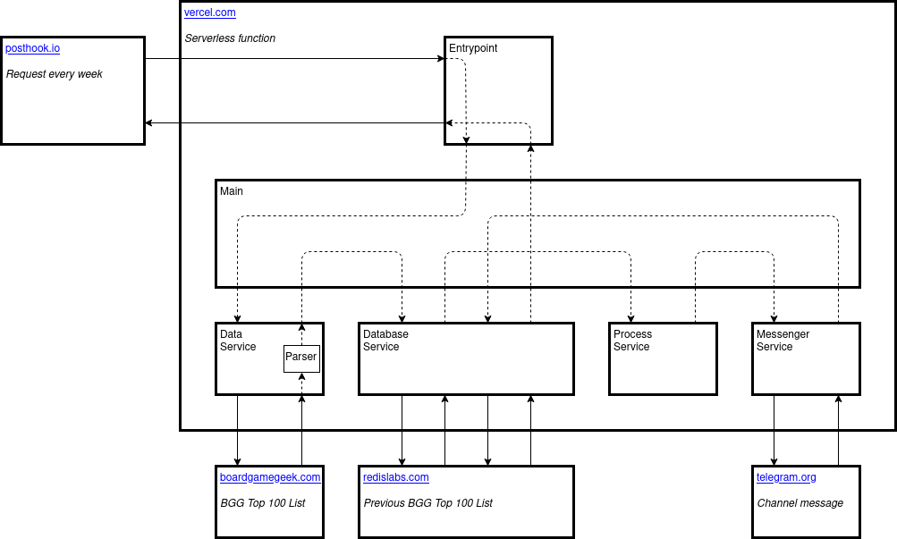

import A from '../../../src/components/a';

### Agenda<A id="agenda" />

- [Part I. For gamers](#part-i-for-gamers)
- [Part II. For developers](#part-ii-for-developers)
  - [Tools](#tools)
  - [Code](#code)
    - [Main](#code)
    - [Entrypoint](#entrypoint)
    - [Services](#services)

### Part I. For gamers<A id="part-i-for-gamers" /> [⬆️](#agenda)

If you use <a href="https://telegram.org" target="_blank">Telegram messenger</a> and like 🎲 board games, I have great news for you! You can get <a href="https://boardgamegeek.com/browse/boardgame" target="_blank">BoardGameGeek Top 100 List</a> with changes highlighted 📨 posted weekly!

I wanted to be aware of the 📈 best games ratings but it's not easy to follow the changes. And then I've found this page: <a href="https://boardgamegeek.com/thread/305522/bgg-top-50-statistics-geeklists-announcement-threa" target="_blank">BGG Top 50 Statistics GeekLists</a>. It's really 🔝 cool, but it's only the 50 best games and it updates monthly.

Anyway, I was inspired by it and I decided to create my statistics for 100 games in the convenient form - Telegram channel.

<a href="https://t.me/bggtop100" target="_blank">
  @bggtop100
</a>
<br />
<br />
Feel free to subscribe to get these updates every Saturday at 9:00 AM UTC ;)

You can check the channel preview <a href="https://t.me/s/bggtop100" target="_blank">here</a> even without Telegram.

### Part II. For developers<A id="part-ii-for-developers" /> [⬆️](#agenda)

How does it work?



#### Tools<A id="tools" /> [⬆️](#agenda)

The bot was created with <a href="https://nodejs.org" target="_blank">Node.js</a> and <a href="https://typescriptlang.org" target="_blank">TypeScript</a>.

It works as a serverless function on the <a href="https://vercel.com" target="_blank">Vercel</a> cloud platform, and the <a href="https://posthook.io" target="_blank">Posthook</a> service is used to involve this function every week.

The previous week's game list stored in the <a href="https://redislabs.com" target="_blank">Redis Labs</a> service <a href="https://redis.io" target="_blank">Redis</a> database.

#### Code<A id="code" /> [⬆️](#agenda)

##### Main<A id="main" /> [⬆️](#agenda)

There is only one function in the **Main** class:

```typescript
export class Main implements MainInterface {
  constructor(
    private readonly configuration: Configuration,
    private readonly dataService: DataService,
    private readonly databaseService: DataBaseService,
    private readonly processService: ProcessService,
    private readonly messengerService: MessengerService,
  ) {
    this.configuration = configuration;
    this.dataService = dataService;
    this.databaseService = databaseService;
    this.processService = processService;
    this.messengerService = messengerService;
  }

  async sendMessage(): Promise<void> {
```

It takes the games list from the data service (actually, it's BoardGameGeek site) and from the database (Redis) service.

```typescript
const newData = await this.dataService.getData();
const oldData = await this.databaseService.getData();
```

Then it formates it with help of a local process service.

```typescript
const message = this.processService.formatMessage({
  newData,
  oldData,
});
```

And sends it to the messenger (Telegram channel).

```typescript
await this.messengerService.sendMessage({
  chatId: this.configuration.channelId,
  text: message,
});
```

I've added the **isDevMode** configuration option to have the possibility to check the message without the database update.

```typescript
    if (!this.configuration.isDevMode) {
      await this.databaseService.setData(newData);
    }
  }
}
```

##### Entrypoint<A id="entrypoint" /> [⬆️](#agenda)

We use the **Main** class here, but there is some work we have to do before that.

```typescript
export default async (
  _req: NowRequest,
  res: NowResponse,
): any => {
  const {
    query: { token, channelId, isDevMode },
  } = _req;
```

First of all, it's necessary to check if we have all the values in the environment variables to start the work.

```typescript
if (process.env.TELEGRAM_TOKEN === undefined) {
  throw new ConfigParameterNotDefinedError('TELEGRAM_TOKEN');
}
if (process.env.APP_TOKEN === undefined) {
  throw new ConfigParameterNotDefinedError('APP_TOKEN');
}
if (process.env.CHANNEL_ID === undefined) {
  throw new ConfigParameterNotDefinedError('CHANNEL_ID');
}
if (process.env.REDIS_URL === undefined) {
  throw new ConfigParameterNotDefinedError('REDIS_URL');
}
```

There is a sort of authentication here. We can’t create the message for every anonymous request. That’s why we have a token to check. And only Post Hook service knows it.

```typescript
if (token !== process.env.APP_TOKEN) {
  return res.status(401).send(
    JSON.stringify({
      result: 'wrong token',
    }),
  );
}
```

To build the configuration we use environment variables (by default) and request options (to overwrite it). There are only two parameters: **channelId** and **isDevMode**.

```typescript
const configuration = {
  channelId: typeof channelId === 'string' ? channelId : process.env.CHANNEL_ID,
  isDevMode:
    typeof isDevMode === 'string'
      ? isDevMode === 'on'
      : process.env.IS_DEV_MODE === 'on',
};
```

To use this **Main** class function we have to provide also all the services instances.

```typescript
const main = new Main(
  configuration,
  new BGGService(),
  new RedisService(process.env.REDIS_URL),
  new MessageService(),
  new TelegramService(process.env.TELEGRAM_TOKEN),
);

try {
  await main.sendMessage();
} catch (error) {
  console.error('Unexpected error occurred: ', error.message);
}
```

That's it - we answer to the Posthook service request.

```typescript
  res.status(200).send(
    JSON.stringify({
      result: 'success',
    }),
  );
};
```

##### Services<A id="services" /> [⬆️](#agenda)

There are 4 services in the application:

1. DataService (BGGService)
2. DatabaseService (RedisService)
3. ProcessService (MessageService)
4. MessengerService (TelegramService)

**DataService (BGGService)** is used to get the latest data from the BoardGameGeek.

```typescript
export class BGGService implements DataService {
```

The data is fetched from the site's page and parsed with the **parsePage** function.

```typescript
  async getData(): Promise<Data> {
    const { data: page } = await axios.get(URL);

    const games = this.parsePage(page);

    return {
      games,
      date: new Date().toISOString(),
    };
  }
```

This is the function to parse data from the HTML page to the array of objects we can work with.

```typescript
  private parsePage = (
    page: string,
  ): Array<{
    rank: number;
    name: string;
    year: string;
  }> => {
```

In the beginning, we build a Document Object Model with all the elements from the string with the HTML page.

```typescript
const dom = new DOMParser({
  errorHandler: {
    warning: () => null,
    error: () => null,
    fatalError: () => null,
  },
}).parseFromString(page);
```

Then we get ranks and names with years using XPath selectors.

```typescript
const ranks = select(GAME_RANKS_X_PATH, dom).map(selectedValue =>
  selectedValue.textContent.trim(),
);
const namesYears = select(GAME_NAMES_YEARS_X_PATH, dom).map(selectedValue =>
  selectedValue.textContent.trim(),
);
```

Here we split names with years to names and years.

```typescript
const names: string[] = [];
const years: string[] = [];

namesYears.forEach(nameYear => {
  const endOfNameIndex = nameYear.indexOf('\n');
  const startOfYearIndex = nameYear.indexOf('\t(');

  if (endOfNameIndex === -1 || startOfYearIndex === -1) {
    names.push(nameYear);
    years.push('');

    return;
  }

  const name = nameYear.substring(0, endOfNameIndex);
  const year = nameYear
    .substring(startOfYearIndex + 1)
    .replace('(', '')
    .replace(')', '');

  names.push(name);
  years.push(year);
});
```

And now we have an array of games with all data we need.

```typescript
    return ranks.map((rank, i) => ({
      rank: Number(rank),
      name: names[i],
      year: years[i],
    }));
  };
}
```

**DatabaseService (RedisService)** includes two functions: to read the data and to write the data, nothing special here.

```typescript
export class RedisService implements DataBaseService {
  private redisPassword: string;
  private client: RedisClient;

  constructor(private redisUrl: string) {
    this.redisUrl = redisUrl;
    this.redisPassword = redisUrl.replace('redis://', '').split('@')[0];

    this.client = createClient(redisUrl, {
      auth_pass: this.redisPassword,
    });
  }

  async getData(): Promise<Data> {
    return new Promise((resolve, reject) => {
      this.client.get(KEY_NAME, (err: any, reply: string) => {
        const emptyData = {
          games: [],
          date: '',
        };

        if (err || reply === null) {
          return resolve(emptyData);
        }

        try {
          const data = JSON.parse(reply);
          resolve(data);
        } catch (error) {
          resolve(emptyData);
        }
      });
    });
  }

  async setData(data: Data): Promise<void> {
    return new Promise((resolve, reject) => {
      this.client.set(
        KEY_NAME,
        JSON.stringify(data),
        (err: any, reply: string) => {
          if (err) {
            return reject(err);
          }

          resolve();
        },
      );
    });
  }
}
```

**ProcessService (MessageService)** compares the old games' ranks with the new games' ranks and creates the message with full statistics and cool emojis:

```typescript
export class MessageService implements ProcessService {
  formatMessage({
    newData,
    oldData,
  }: {
    newData: Data;
    oldData: Data;
  }): string {
```

We are starting to create the message: the old and new dates are in the beginning.

```typescript
const date = this.getDateString('On date', newData.date);
const oldDate = this.getDateString('Changes from date', oldData.date);
```

We create empty arrays for the new games and the games with rank change. And we collect all the dropped games to the appropriate array.
And the special object for the games by year part.

```typescript
const newGames: Game[] = [];
const droppedGames: Game[] = oldData.games.filter(oldGame =>
  newData.games.every(newGame => newGame.name !== oldGame.name),
);
const increaseGames: {
  games: Game[];
  change: number;
} = {
  games: [],
  change: 0,
};
const decreaseGames: {
  games: Game[];
  change: number;
} = {
  games: [],
  change: 0,
};
const gamesByYear: {
  [year: string]: number;
} = {};
```

The main cycle to fill all the created arrays.

```typescript
    const gamesList = newData.games.reduce((list, game) => {
      const oldGame = oldData.games.find(
        old => old.name === game.name,
      );
```

To fill the games by year object.

```typescript
gamesByYear[game.year] = gamesByYear[game.year]
  ? gamesByYear[game.year] + 1
  : 1;

if (!oldGame) {
  newGames.push(game);

  return `${list}\n${this.formatGame(game, ' 🆕')}`;
}
```

If there is the same game in the previous list we calculate the rank change.

```typescript
const change = oldGame.rank - game.rank;
```

And check the highest rank increase...

```typescript
if (change > 0 && change >= increaseGames.change) {
  if (change > increaseGames.change) {
    increaseGames.change = change;
    increaseGames.games = [];
  }

  increaseGames.games.push(game);
}
```

or decrease.

```typescript
if (change < 0 && change <= decreaseGames.change) {
  if (change < decreaseGames.change) {
    decreaseGames.change = change;
    decreaseGames.games = [];
  }

  decreaseGames.games.push(game);
}
```

This part creates the rank change string with emojis.

```typescript
const changeString =
  change > 0 ? ` ⬆️ +${change}` : change < 0 ? ` ⬇️ ${change}` : '';
```

And creates the new list with the change info.

```typescript
      return `${list}\n${this.formatGame(
        game,
        changeString,
      )}`;
    }, '');
```

The new games and the games that were dropped from the list are formatted to string too.

```typescript
const newGamesString = this.getAdditionalList(
  '🆕 Game(s) new in Top 100',
  newGames,
);
const droppedGamesString = this.getAdditionalList(
  '❌ Game(s) dropped out of Top 100',
  droppedGames,
);
```

Also, the games with the highest rank increase/decrease.

```typescript
const increaseGamesString = this.getAdditionalList(
  `⬆️ Highest ranking increase${
    increaseGames.change > 0 ? ` (+${increaseGames.change})` : ''
  }`,
  increaseGames.games,
);
const decreaseGamesString = this.getAdditionalList(
  `⬇️ Highest ranking decrease${
    decreaseGames.change < 0 ? ` (${decreaseGames.change})` : ''
  }`,
  decreaseGames.games,
);
```

And creation the games by year string.

```typescript
const gamesByYearString = `📅 Games by Release Year:${Object.keys(
  gamesByYear,
).map(year => `\n${year}: ${gamesByYear[year]}`)}`;
```

There is joining everything in the one message string in the end.

```typescript
    return `${date}\n\n${oldDate}\n${gamesList}\n\n${newGamesString}\n\n${droppedGamesString}\n\n${increaseGamesString}\n\n${decreaseGamesString}\n\n${gamesByYearString}`;
  }
```

A function to format the date string.

```typescript
  private getDateString(
    text: string,
    date: string,
  ): string {
    const options = {
      timeZoneName: 'short',
      hour: 'numeric',
      minute: 'numeric',
    };
    const dateString = new Date(date).toLocaleString(
      'en-US',
      options,
    );

    return `${text}:\n${date.slice(0, 10)} ${dateString}`;
  }
```

A function to format additional lists (new games and others) to the string.

```typescript
  private getAdditionalList(
    text: string,
    games: Game[],
  ): string {
    const gamesString = games
      .map(game => this.formatGame(game))
      .join('\n');

    return `${text}:\n${gamesString || 'none'}`;
  }
```

This function is used to format a single game line.

```typescript
  private formatGame(
    game: {
      rank: number;
      name: string;
      year: string;
    },
    changeString = '',
  ): string {
    return `${game.rank}. ${game.name} (${game.year})${changeString}`;
  }
}
```

**MessengerService (TelegramService)** simply sends it to the channel.

```typescript
export class TelegramService implements MessengerService {
  constructor(private readonly token: string) {
    this.token = token;
  }

  async sendMessage({
    chatId,
    text,
  }: {
    chatId: string | number;
    text: string;
  }): Promise<void> {
    const chunks = this.stringToChunks(text, 4095);

    for (const chunk of chunks) {
      const message = {
        text: chunk,
        chat_id: chatId,
        disable_notification: true,
        parse_mode: 'Markdown',
      };

      try {
        const {
          data,
        }: {
          data: ISendMessageResult;
        } = await axios.post(
          `${TELEGRAM_API_URL}${this.token}/sendMessage`,
          message,
        );
      } catch (error) {
        console.log(
          'Error sending Telegram message',
          error,
        );
      }
    }
  }
```

We need **stringToChunks** because the Telegram message has a limit with **4096** symbols. If our message is too big, we send 2 (or more) messages.

```typescript
  private stringToChunks(
    str: string,
    size: number,
  ): string[] {
    const chunks: string[] = [];

    const chunksNumber = Math.ceil(str.length / size);

    for (let i = 0; i < chunksNumber; i++) {
      chunks.push(str.substring(i * size, (i + 1) * size));
    }

    return chunks;
  }
}
```
