import Game from '../../../src/components/game';
import A from '../../../src/components/a';

We like to play games and want to understand it better.

That's why we can split the games by categories:

- Euro/Ameritrash
- Setting (historical, cosmic, other)
- Players interaction (team, cooperative, asymmetric)
- ...

But the most interesting is mechanics.

There are a lot of really different <a href="https://boardgamegeek.com/browse/boardgamemechanic" target="_blank">mechanics</a> (the mechanics pictures are from this site) and <a href="https://boardgamegeek.com/browse/boardgamefamily" target="_blank">families</a> in board games.

If we familiarize ourselves with this we will find a game we will love faster and will try more new stuff.

Mechanics is very important. It makes the game really different from other games (not externally, but inside).

The games consist of decisions. Decisions, what actions to do, and why. Usually, there is a lot of primitive actions in the game (like get the resource, exchange something, etc). Mechanics defines actions every turn we can perform and the goal we will try to achieve with it.

We can split all mechanics into different categories to understand it better. For example:

1. **What can you do** - these mechanics define what set of actions can you perform at the moment
2. **Why do you do it** - basically, it's the games final goals, you will get the victory points or something like that if you achieve it successfully

The majority of games have at least one mechanics from each category.

The old games can have only one core mechanics. But modern games usually have a big 🥗 mix of different mechanics.

### Board game mechanics:<A id="list" />

1. [What can you do](#what-can-you-do)

- [Deck, Bag, and Pool Building](#deck-bag-and-pool-building)
- [Worker Placement](#worker-placement)
  - [Worker Placement, Different Worker Types](#worker-placement-different-worker-types)
  - [Worker Placement with Dice Workers](#worker-placement-with-dice-workers)
- [Drafting](#drafting)
  - [Card Drafting](#card-drafting)
  - [Action Drafting](#action-drafting)
- [I Cut, You Choose](#i-cut-you-choose)
- [Tile Placement](#tile-placement)
- [Simultaneous Action Selection](#simultaneous-action-selection)
- [Action Retrieval](#action-retrieval)
- [Action Points](#action-points)
- [Auction/Bidding](#auction-bidding)
  - [Auction: Fixed Placement](#auction-fixed-placement)
  - [Auction: Dutch](#auction-dutch)
  - [Auction: Turn Order Until Pass](#auction-turn-order-until-pass)
  - [Auction: Sealed Bid](#auction-sealed-bid)
- [Hand Management](#hand-management)
- [Tableau Building](#tableau-building)

2. [Why do you do it](#why-do-you-do-it)

- [Area Majority / Influence](#area-majority-influence)
- [Set Collection](#set-collection)
- [Pattern Building](#pattern-building)
- [End Game Bonuses](#end-game-bonuses)

## 1. What can you do<A id="what-can-you-do" /> [⬆️](#list)

### <a href="https://boardgamegeek.com/boardgamemechanic/2664/deck-bag-and-pool-building" name="deck-bag-and-pool-building" target="_blank">Deck, Bag, and Pool Building</a> [⬆️](#list)

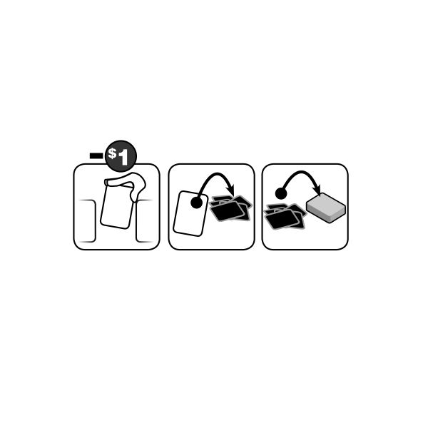

Deck-building is unique mechanics appeared first time in <Game gameName="Dominion" isSkipRank isSkipYear /> game.

The first time I heard **board game mechanics** - it was about this one.

Each player has his own collection (usually it's cards deck), he shuffles and then use only a few random elements (cards) each turn. When it ends the player shuffles it again and so on.

So cards represents action set player can perform. And the player will have possibility to perform all the actions (because he doesn't reshuffle it until it ends).

It's important to have this collection pretty clear because many elements can be useful only in the early stage of the game.

In old games like <Game gameName="Dominion" isSkipRank isSkipYear /> or <Game gameName="Star Realms" isSkipRank isSkipYear /> it can be almost only one mechanics.

But in other more complex games it can be only small part (like cows decks in <Game gameName="Great Western Trail" isSkipRank isSkipYear />)

<a
  href="https://boardgamegeek.com/boardgamemechanic/2664/deck-bag-and-pool-building/linkeditems/boardgamemechanic?pageid=1&sort=rank"
  target="_blank"
>
  Some high-rated games
</a>
: 
 

- <Game gameName="Gloomhaven" />
- <Game gameName="Great Western Trail" />
- <Game gameName="War of the Ring: Second Edition" />

### <a href="https://boardgamegeek.com/boardgamemechanic/2082/worker-placement" name="worker-placement" target="_blank">Worker Placement</a> [⬆️](#list)

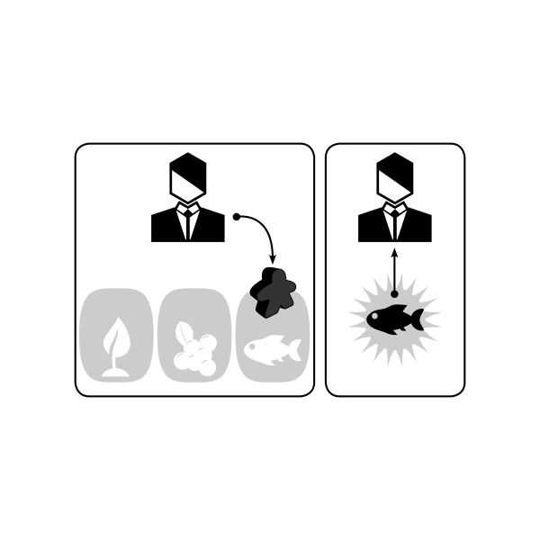

Worker placement is one of the most popular board game mechanics. Especially for the euro games.

There are different actions on the game board. And players have some markers - workers (usually meeples) to use these actions. Some actions can be used only once in the turn, so it's important to use all you need before other players take it.

<a
  href="https://boardgamegeek.com/boardgamemechanic/2082/worker-placement/linkeditems/boardgamemechanic?pageid=1&sort=rank"
  target="_blank"
>
  Some high-rated games
</a>
: 
 

- <Game gameName="A Feast for Odin" />
- <Game gameName="Viticulture Essential Edition" />
- <Game gameName="Caverna: The Cave Farmers" />

#### <a href="https://boardgamegeek.com/boardgamemechanic/2933/worker-placement-different-worker-types" name="worker-placement-different-worker-types" target="_blank">Worker Placement, Different Worker Types</a> [⬆️](#list)

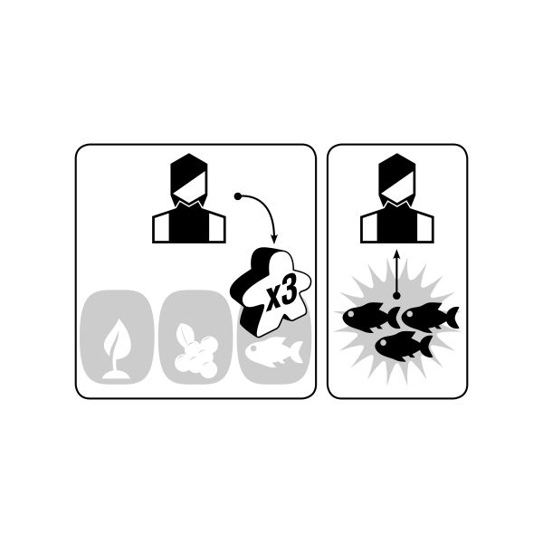

"All animals are equal, but some animals are more equal than others". In this worker placement variety players have different types of meeples, and there are actions where can be used only certain type.

Sometimes it's not static, for example in <Game gameName="Keyflower" isSkipRank isSkipYear /> first player can use any meeple on the tile, but other players can use only the same color meeple on this tile.

<a
  href="https://boardgamegeek.com/boardgamemechanic/2933/worker-placement-different-worker-types/linkeditems/boardgamemechanic?pageid=1&sort=rank"
  target="_blank"
>
  Some high-rated games
</a>
: 
 

- <Game gameName="Viticulture Essential Edition" />
- <Game gameName="Anachrony" />
- <Game gameName="Keyflower" />

#### <a href="https://boardgamegeek.com/boardgamemechanic/2935/worker-placement-dice-workers" name="worker-placement-with-dice-workers" target="_blank">Worker Placement with Dice Workers</a> [⬆️](#list)

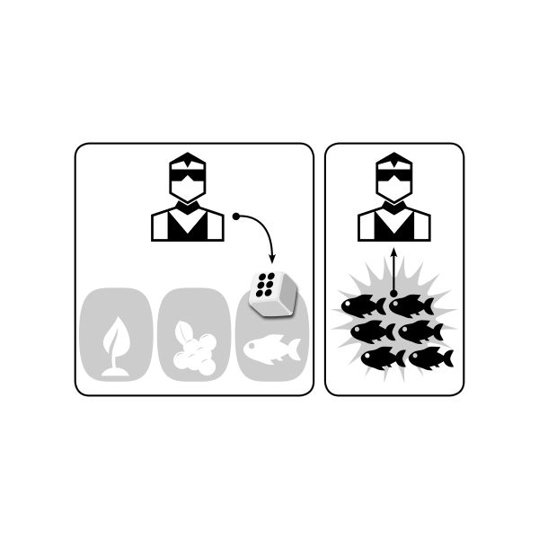

One more cool worker placement variety where players use dices as workers, and there are some restrictions or benefits to use dice with certain number on it on certain places.

<a
  href="https://boardgamegeek.com/boardgamemechanic/2935/worker-placement-dice-workers/linkeditems/boardgamemechanic?pageid=1&sort=rank"
  target="_blank"
>
  Some high-rated games
</a>
: 
 

- <Game gameName="The Castles of Burgundy" />
- <Game gameName="The Voyages of Marco Polo" />
- <Game gameName="Teotihuacan: City of Gods" />

### <a href="https://boardgamegeek.com/boardgamemechanic/2984/drafting" name="drafting" target="_blank">Drafting</a> [⬆️](#list)

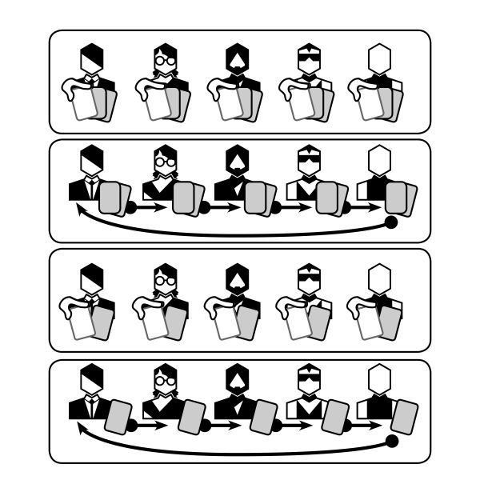

Drafting is really popular mechanics too. Each player has sort of set to choose and get something from it and then he pass this set to the next player. Usually it works simultaneously.

The main benefit of it - the players can be aware of (almost) all the possibilities.

Also, it's interesting here, you can get not you need but something your opponent need most of all and break his plans this way :)

<a
  href="https://boardgamegeek.com/boardgamemechanic/2984/drafting/linkeditems/boardgamemechanic?pageid=1&sort=rank"
  target="_blank"
>
  Some high-rated games
</a>
: 
 

- <Game gameName="Terraforming Mars" />
- <Game gameName="7 Wonders Duel" />
- <Game gameName="Wingspan" />

#### <a href="https://boardgamegeek.com/boardgamemechanic/2041/card-drafting" name="card-drafting" target="_blank">Card Drafting</a> [⬆️](#list)

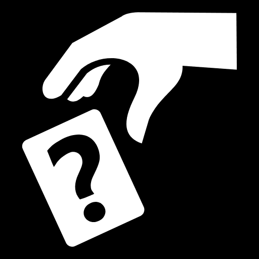

Card Drafting is the most popular drafting mechanics.

The most classical games with this mechanics (like <Game gameName="7 Wonders" isSkipRank isSkipYear /> or <Game gameName="Sushi Go!" isSkipRank isSkipYear />/<Game gameName="Sushi Go Party!" isSkipRank isSkipYear />) mix it with [Set Collection](#set-collection).

In other games it can be pretty small part (like choosing cards in <Game gameName="Terraforming Mars" isSkipRank isSkipYear />).

<a
  href="https://boardgamegeek.com/boardgamemechanic/2041/card-drafting/linkeditems/boardgamemechanic?pageid=1&sort=rank"
  target="_blank"
>
  Some high-rated games
</a>
: 
 

- <Game gameName="Terraforming Mars" />
- <Game gameName="Through the Ages: A New Story of Civilization" />
- <Game gameName="7 Wonders Duel" />

#### <a href="https://boardgamegeek.com/boardgamemechanic/2838/action-drafting" name="action-drafting" target="_blank">Action Drafting</a> [⬆️](#list)

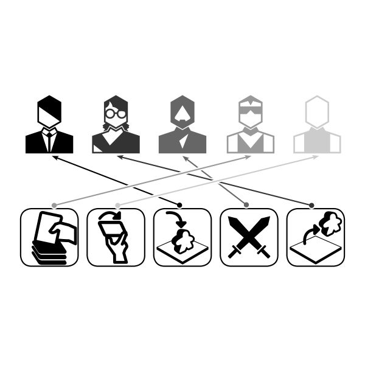

You can draft not only cards or tiles (like in <Game gameName="Azul" isSkipRank isSkipYear />), but the actions.

Each player can perform selected action (or sometimes all players can perform it but the active play has additional benefit performing it).

<a
  href="https://boardgamegeek.com/boardgamemechanic/2838/action-drafting/linkeditems/boardgamemechanic?pageid=1&sort=rank"
  target="_blank"
>
  Some high-rated games
</a>
: 
 

- <Game gameName="Twilight Imperium: Fourth Edition" />
- <Game gameName="Puerto Rico" />
- <Game gameName="Barrage" />

### <a href="https://boardgamegeek.com/boardgamemechanic/2906/i-cut-you-choose" name="i-cut-you-choose" target="_blank">I Cut, You Choose</a> [⬆️](#list)

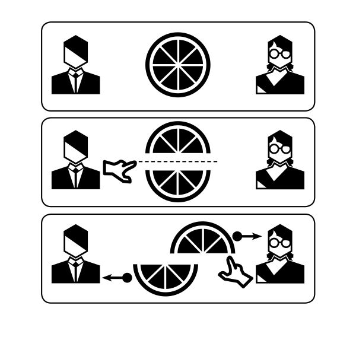

It's pretty unusual mechanics. I don't have many games use it. The main feature here is one player defines set of actions or elements and the next player can chose from it.

For example, in <Game gameName="Hanamikoji" isSkipRank isSkipYear /> each player make gifts, but he can't chose the gift directly. Instead of it he splits his gifts in to two parts and his opponent chose the part he use to make his gifts first. And then the active player gifts the rest.

It's important to cut it right way here. :)

<a
  href="https://boardgamegeek.com/boardgamemechanic/2906/i-cut-you-choose/linkeditems/boardgamemechanic?pageid=1&sort=rank"
  target="_blank"
>
  Some high-rated games
</a>
: 
 

- <Game gameName="Castles of Mad King Ludwig" />
- <Game gameName="Hanamikoji" />
- <Game gameName="San Marco" />

### <a href="https://boardgamegeek.com/boardgamemechanic/2002/tile-placement" name="tile-placement" target="_blank">Tile Placement</a> [⬆️](#list)

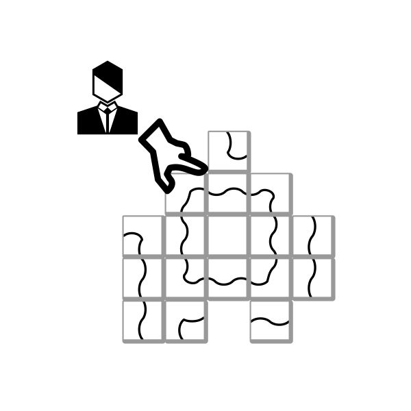

<Game gameName="Carcassonne" isSkipRank isSkipYear /> is a standard game with this
mechanics. It's not hard to guess - the players place tiles here.

In <Game gameName="Carcassonne" isSkipRank isSkipYear /> players can't chose the tile (must place the next one) but they can chose where to place it to get maximum benefit.

In the game process the map is being building. It's really cool mechanics.

<a
  href="https://boardgamegeek.com/boardgamemechanic/2002/tile-placement/linkeditems/boardgamemechanic?pageid=1&sort=rank"
  target="_blank"
>
  Some high-rated games
</a>
: 
 

- <Game gameName="Terraforming Mars" />
- <Game gameName="The Castles of Burgundy" />
- <Game gameName="A Feast for Odin" />

### <a href="https://boardgamegeek.com/boardgamemechanic/2020/simultaneous-action-selection" name="simultaneous-action-selection" target="_blank">Simultaneous Action Selection</a> [⬆️](#list)

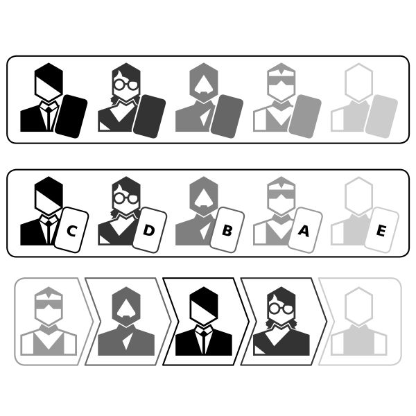

Each player has set of actions and secretly chose one from it. When all players are ready - they open their action and perform it.

The important thing here is players don't know what other players chose (in contrast with clockwise choosing).

Usually it's a small part of the game.

<a
  href="https://boardgamegeek.com/boardgamemechanic/2020/simultaneous-action-selection/linkeditems/boardgamemechanic?pageid=1&sort=rank"
  target="_blank"
>
  Some high-rated games
</a>
: 
 

- <Game gameName="Gloomhaven" />
- <Game gameName="Gloomhaven: Jaws of the Lion" />
- <Game gameName="Twilight Struggle" />

### <a href="https://boardgamegeek.com/boardgamemechanic/2839/action-retrieval" name="action-retrieval" target="_blank">Action Retrieval</a> [⬆️](#list)

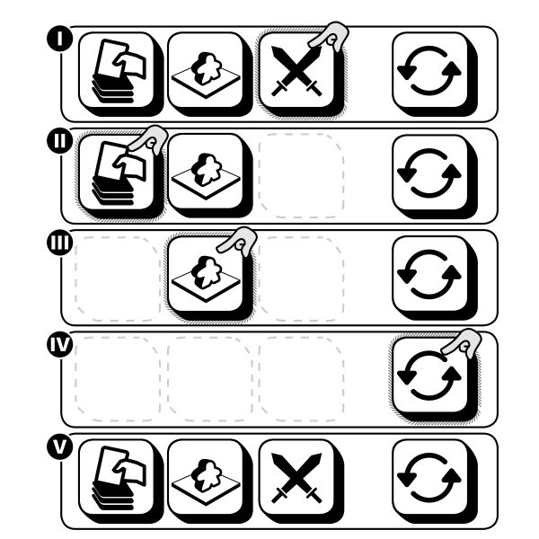

Each player has a set of actions her can perform, but when he performs it her can't do it again until he retrieve it.

If actions represented with cards it can be also the deck-building game like <Game gameName="Concordia" isSkipRank isSkipYear />.

<a
  href="https://boardgamegeek.com/boardgamemechanic/2839/action-retrieval/linkeditems/boardgamemechanic?pageid=1&sort=rank"
  target="_blank"
>
  Some high-rated games
</a>
: 
 

- <Game gameName="Gloomhaven" />
- <Game gameName="Spirit Island" />
- <Game gameName="Concordia" />

### <a href="https://boardgamegeek.com/boardgamemechanic/2001/action-points" name="action-points" target="_blank">Action Points</a> [⬆️](#list)

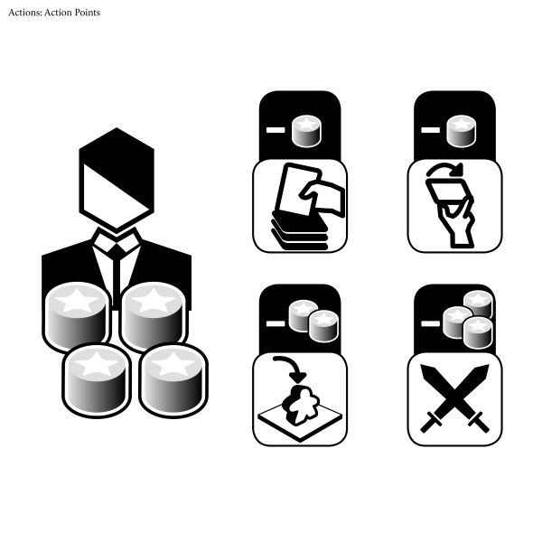

Players receive some amount of points and can spend it to the actions.

If we consider Action points as resources we can say "buy actions".

<a
  href="https://boardgamegeek.com/boardgamemechanic/2001/action-points/linkeditems/boardgamemechanic?pageid=1&sort=rank"
  target="_blank"
>
  Some high-rated games
</a>
: 
 

- <Game gameName="Pandemic Legacy: Season 1" />
- <Game gameName="Through the Ages: A New Story of Civilization" />
- <Game gameName="Arkham Horror: The Card Game" />

### <a href="https://boardgamegeek.com/boardgamemechanic/2012/auctionbidding" name="auction-bidding" target="_blank">Auction/Bidding</a> [⬆️](#list)

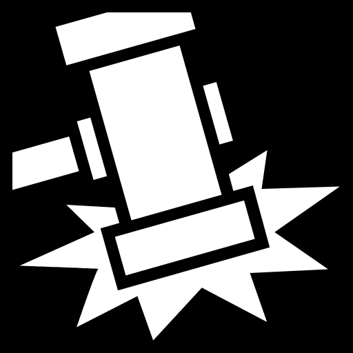

Each player makes a bid and the player with the biggest bid win something.

It can be some resources or something else.

Auction is not a new thing and is used in board games pretty often.

<a
  href="https://boardgamegeek.com/boardgamemechanic/2012/auctionbidding/linkeditems/boardgamemechanic?pageid=1&sort=rank"
  target="_blank"
>
  Some high-rated games
</a>
: 
 

- <Game gameName="Through the Ages: A New Story of Civilization" />
- <Game gameName="Power Grid" />
- <Game gameName="Through the Ages: A Story of Civilization" />

#### <a href="https://boardgamegeek.com/boardgamemechanic/2931/auction-fixed-placement" name="auction-fixed-placement" target="_blank">Auction: Fixed Placement</a> [⬆️](#list)

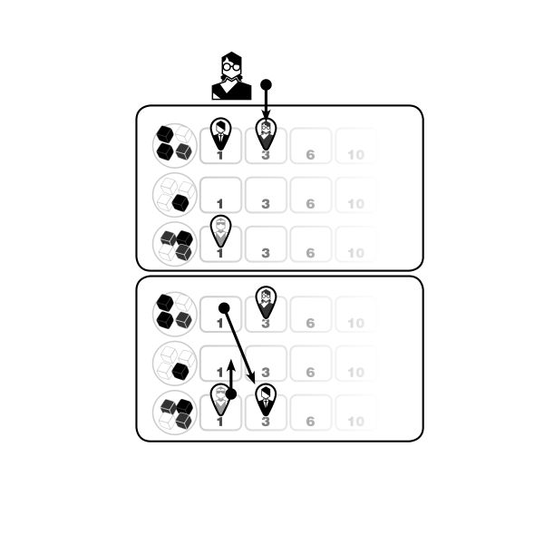

Fixed Placement is a multiple-lot auction with the rules about which lots players may bid on, and representing bids visually on a board or cards. A Fixed-Placement auction ends when every player passes and/or no player has the right to bid further. The highest bidder for each lot wins the lot.

In <Game gameName="Cyclades" isSkipRank isSkipYear /> players bid for the favors of the gods and then perform an action his god allows him to do. Different gods allow different actions.

<a
  href="https://boardgamegeek.com/boardgamemechanic/2931/auction-fixed-placement/linkeditems/boardgamemechanic?pageid=1&sort=rank"
  target="_blank"
>
  Some high-rated games
</a>
: 
 

- <Game gameName="Keyflower" />
- <Game gameName="Cyclades" />
- <Game gameName="Stockpile" />

#### <a href="https://boardgamegeek.com/boardgamemechanic/2924/auction-dutch" name="auction-dutch" target="_blank">Auction: Dutch</a> [⬆️](#list)

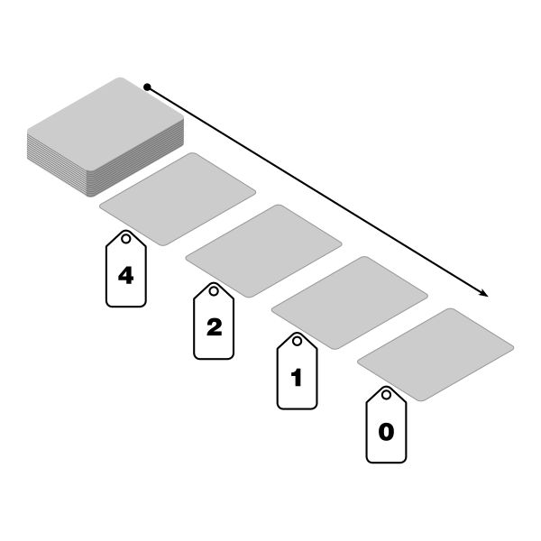

A simultaneous single-bid system in which the lot starts at a very high price, and then is gradually decreased by the auctioneer or other controlling mechanism, until someone agrees to claim the item at its current price, ending the auction. The first bidder to accept the current price is the winner, such that there are no ties. A Dutch Auction is sometimes also called a one-bid auction because of this feature that the first bid made is also the only bid in the auction.

<a
  href="https://boardgamegeek.com/boardgamemechanic/2924/auction-dutch/linkeditems/boardgamemechanic?pageid=1&sort=rank"
  target="_blank"
>
  Some high-rated games
</a>
: 
 

- <Game gameName="Through the Ages: A New Story of Civilization" />
- <Game gameName="Concordia" />
- <Game gameName="Through the Ages: A Story of Civilization" />

#### <a href="https://boardgamegeek.com/boardgamemechanic/2919/auction-turn-order-until-pass" name="auction-turn-order-until-pass" target="_blank">Auction: Turn Order Until Pass</a> [⬆️](#list)

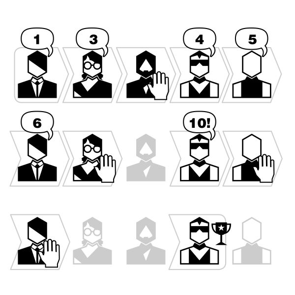

Starting with one player and going in turn order, players may raise the current bid or pass. When all players but one have passed, the player remaining in the auction is the winner.

Normally players that pass may not re-enter the auction. However, allowing re-entry is a variation that is not common.

<a
  href="https://boardgamegeek.com/boardgamemechanic/2919/auction-turn-order-until-pass/linkeditems/boardgamemechanic?pageid=1&sort=rank"
  target="_blank"
>
  Some high-rated games
</a>
: 
 

- <Game gameName="Power Grid" />
- <Game gameName="Power Grid Deluxe: Europe/North America" />
- <Game gameName="Modern Art" />

#### <a href="https://boardgamegeek.com/boardgamemechanic/2920/auction-sealed-bid" name="auction-sealed-bid" target="_blank">Auction: Sealed Bid</a> [⬆️](#list)

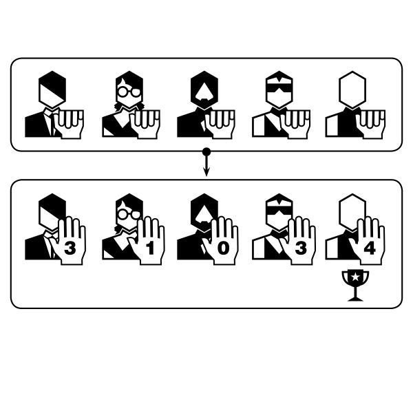

Players secretly make a bid. All bids are revealed simultaneously, and the high bidder wins.

<a
  href="https://boardgamegeek.com/boardgamemechanic/2920/auction-sealed-bid/linkeditems/boardgamemechanic?pageid=1&sort=rank"
  target="_blank"
>
  Some high-rated games
</a>
: 
 

- <Game gameName="Rising Sun" />
- <Game gameName="A Game of Thrones: The Board Game (Second Edition)" />
- <Game gameName="Modern Art" />

### <a href="https://boardgamegeek.com/boardgamemechanic/2040/hand-management" name="hand-management" target="_blank">Hand Management</a> [⬆️](#list)

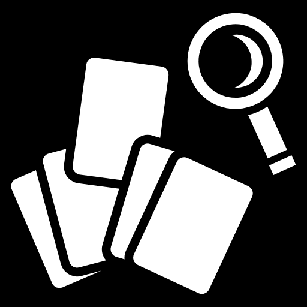

Probably there is one of the oldest mechanics in board games. You have some possibilities (cards) in your hand and you chose what to use.

Usually, it works with other mechanics, for example, the deck building.

And you can find it almost in every game.

<a
  href="https://boardgamegeek.com/boardgamemechanic/2040/hand-management/linkeditems/boardgamemechanic?pageid=1&sort=rank"
  target="_blank"
>
  Some high-rated games
</a>
: 
 

- <Game gameName="Gloomhaven" />
- <Game gameName="Pandemic Legacy: Season 1" />
- <Game gameName="Brass: Birmingham" />

### <a href="https://boardgamegeek.com/boardgamefamily/27646/mechanism-tableau-building" name="tableau-building" target="_blank">Tableau Building</a> [⬆️](#list)

**Tableau building** is something between **What can you do** and **Why do you do it** categories. And it's really popular.

Each player has a tableau and works with it. Usually, it has some places for resources the player can collect. And (what is most important) some ways to improve it.

For example, in <Game gameName="Great Western Trail" isSkipRank isSkipYear /> and <Game gameName="Scythe" isSkipRank isSkipYear /> players can rid off some wood cubes to achieve the new possibilities.

It is the process to enable performing new or more powerful actions as well as the goal (because it can give points at the end of the game).

And it's similar to **Engine building** mechanics where players can do it without tableau but with cards. But you improve your actions set in both mechanics.

<a
  href="https://boardgamegeek.com/boardgamefamily/27646/mechanism-tableau-building/linkeditems/boardgamefamily?pageid=1&sort=rank"
  target="_blank"
>
  Some high-rated games
</a>
: 
 

- <Game gameName="Terraforming Mars" />
- <Game gameName="Through the Ages: A New Story of Civilization" />
- <Game gameName="Gaia Project" />

## 2. Why do you do it<A id="why-do-you-do-it" /> [⬆️](#list)

### <a href="https://boardgamegeek.com/boardgamemechanic/2080/area-majority-influence" name="area-majority-influence" target="_blank">Area Majority / Influence</a> [⬆️](#list)

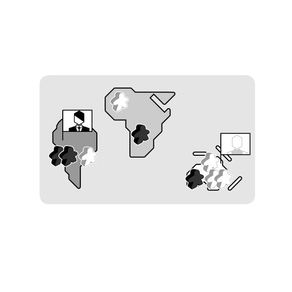

This is a really great mechanics. The players occupy space and get bonuses for it.

<Game gameName="Twilight Struggle" isSkipRank isSkipYear /> is a good example of
games with this mechanics. The players increase their influence in different countries
and get victory points for it. It's hard to have influence everywhere, but it's important
to have it in certain places at a certain time to get the points.
 
 
<a
  href="https://boardgamegeek.com/boardgamemechanic/2080/area-majority-influence/linkeditems/boardgamemechanic?pageid=1&sort=rank"
  target="_blank"
>
  Some high-rated games
</a>
: 
 

- <Game gameName="Twilight Imperium: Fourth Edition" />
- <Game gameName="Star Wars: Rebellion" />
- <Game gameName="Twilight Struggle" />

### <a href="https://boardgamegeek.com/boardgamemechanic/2004/set-collection" name="set-collection" target="_blank">Set Collection</a> [⬆️](#list)

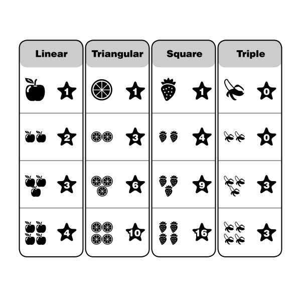

It's a common mechanics. The players collect the sets to get the points.

At first glance it looks pretty peaceful: each player collects something he needs.

But as always you can not only collect something you need but collect something your opponent needs most of all (like certain trees in <Game gameName="Arboretum" isSkipRank isSkipYear />).

<a
  href="https://boardgamegeek.com/boardgamemechanic/2004/set-collection/linkeditems/boardgamemechanic?pageid=1&sort=rank"
  target="_blank"
>
  Some high-rated games
</a>
: 
 

- <Game gameName="Pandemic Legacy: Season 1" />
- <Game gameName="Terraforming Mars" />
- <Game gameName="Great Western Trail" />

### <a href="https://boardgamegeek.com/boardgamemechanic/2048/pattern-building" name="pattern-building" target="_blank">Pattern Building</a> [⬆️](#list)

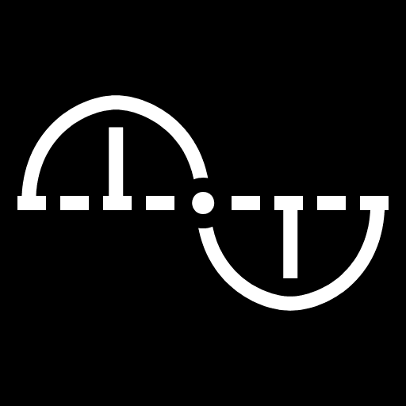

It's pretty similar to the set collection but the players not only collect the items here but place it in specific patterns in order to gain specific or variable game results.

<Game gameName="Azul" isSkipRank isSkipYear /> is a really amazing pattern building
game where players need a different number of tiles each color to get fill the palace
wall better.
 
 
<a
  href="https://boardgamegeek.com/boardgamemechanic/2048/pattern-building/linkeditems/boardgamemechanic?pageid=1&sort=rank"
  target="_blank"
>
  Some high-rated games
</a>
: 
 

- <Game gameName="A Feast for Odin" />
- <Game gameName="Azul" />
- <Game gameName="The Isle of Cats" />

### <a href="https://boardgamegeek.com/boardgamemechanic/2875/end-game-bonuses" name="end-game-bonuses" target="_blank">End Game Bonuses</a> [⬆️](#list)

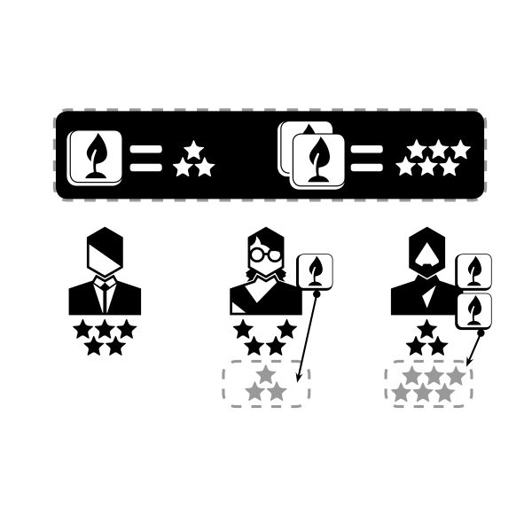

This is popular additional mechanics in many games.

You have sort of goals and if you achieve it you will give the bonuses (usually victory points).

Sometimes it works for all the players. Sometimes only the first one gets the bonuses.

In <Game gameName="Terraforming Mars" isSkipRank isSkipYear /> there are two kind of bonuses:

1. Some bonuses you can get if you fulfill the condition and pay for it (milestones).
2. Other bonuses you can get fulfilling the condition only if you or somebody else paid to fund it before (awards).
   And yes, you can fund it but somebody else achieves it instead of you. :)

<a
  href="https://boardgamegeek.com/boardgamemechanic/2875/end-game-bonuses/linkeditems/boardgamemechanic?pageid=1&sort=rank"
  target="_blank"
>
  Some high-rated games
</a>
: 
 

- <Game gameName="Terraforming Mars" />
- <Game gameName="Gaia Project" />
- <Game gameName="Terra Mystica" />

---

Also, there are some interesting common game elements without the name.

For example, many games have the time when you should change your strategy. You can work on development but after this moment you should gain victory points as soon as possible.
And each player decides when the time for this is right.

It's popular for the games when the players influences the game pace.

---

The page logo is Terraforming Mars game. How many mechanics can you find there? :)
