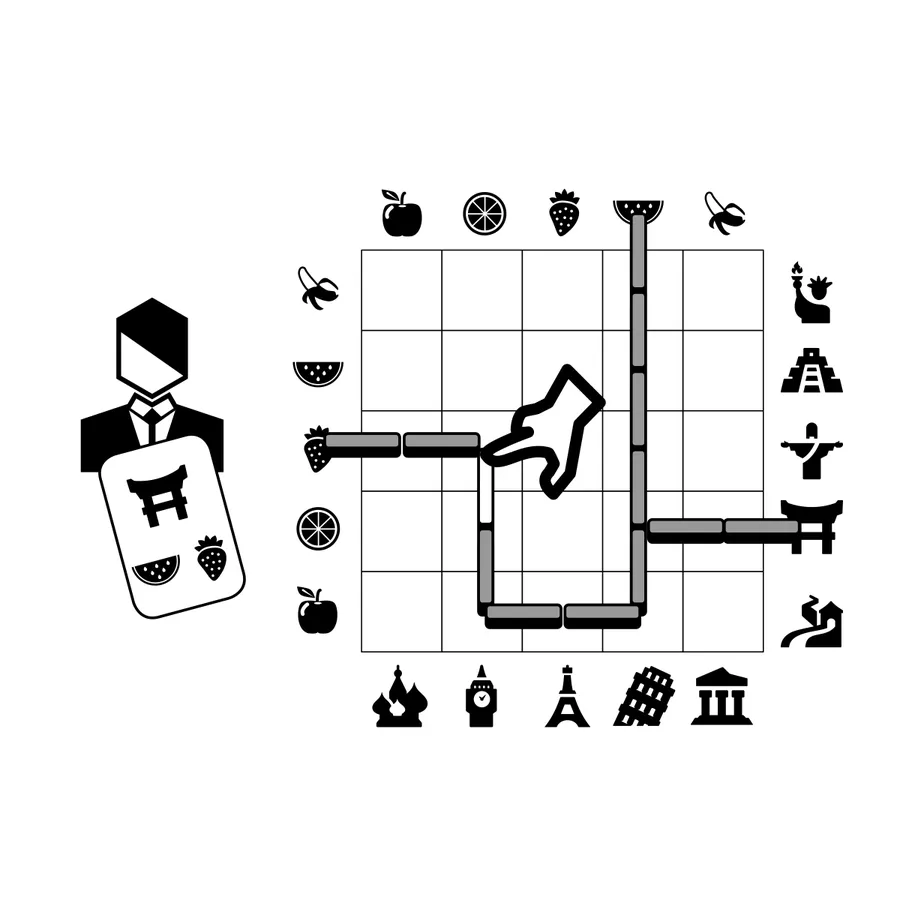

import Game from '../../../src/components/game';
import A from '../../../src/components/a';

Any euro board game! The game that doesn't exist or does exist as part of many other games.

What is a euro board game? This is a really big class of board games with indirect players interaction, pretty abstract physical components, less luck and conflict and require more 🤔 thought and planning.

I hated it when I started to play board games but now I like it more than any other genre.

Despite the game being abstract usually, the titles of actions or cards fit the game theme really well. It's possible to play many games without noticing it, but it's big work to design it. So, pay attention to the details.

Usually, the main idea is the game to work on the development losing the victory points and at some point to switch to the gaining victory points losing the development. The difficult part is to define ⌛ when to perform this switch.

I tried to accumulate all the typical mechanics and features related to the popular Euro board games on this page. If you don't familiar with modern board games, it can be a good 📗 manual to have a quick start.

This page is a little bit similar to <a href="../board-game-mechanics" target="_blank">this one</a>. Initially, I tried to make it more euro games oriented but it looks more like a Part II now.

The idea of this page came to me when we played in the <Game gameName="Barrage" isSkipRank /> board game with a beginner board gamer. It was pretty hard for her because there were a lot of common details all experienced players already knew. Moreover, an experienced player can glance at the list of mechanics on <a href="https://boardgamegeek.com" target="_blank">boardgamegeek.com</a> and form a first impression of the game.

Let's go through these details.

By the way, sometimes (especially if the game is pretty 👴 old) some points may be added with an expansion.

### Agenda<A id="agenda" />

- [Setup](#setup)
  - [Modular board](#modular-board)
  - [Variable set-up](#variable-set-up)
  - [Variable player powers](#variable-player-powers)
  - [Variable start resources](#variable-start-resources)
  - [Turn order compensation](#turn-order-compensation)
- [Actions](#actions)
  - [Rounds](#rounds)
  - [Events](#events)
  - [Turn order](#turn-order)
    - [Turn order: Progressive](#turn-order-progressive)
    - [Turn order: Pass order](#turn-order-pass-order)
    - [Turn order: Stat-based](#turn-order-stat-based)
    - [Turn order: Claim action](#turn-order-claim-action)
    - [Turn Order: Role order](#turn-order-role-order)
    - [Turn Order: Auction](#turn-order-auction)
    - [Turn order: Random](#turn-order-random)
    - [Time track](#time-track)
    - [Lose a turn](#lose-a-turn)
  - [Victory Points as a resource](#victory-points-as-a-resource)
  - [Increase value of unchosen resources](#increase-value-of-unchosen-resources)
  - [Automatic resource growth](#automatic-resource-growth)
  - [Tech trees / Tech tracks](#tech-trees-tech-tracks)
  - [Point to point movement](#point-to-point-movement)
  - [Rondel](#rondel)
  - [Network and route building](#network-and-route-building)
  - [Score-and-Reset game](#score-and-reset-game)
  - [Income](#income)
  - [Market](#market)
  - [Loans](#loans)
- [Game end](#game-end)
  - [End game conditions (triggers)](#end-game-conditions-triggers)

### Setup<A id="setup" /> [⬆️](#agenda)

This part is about preparation to the game.

#### <a href="https://boardgamegeek.com/boardgamemechanic/2011/modular-board" name="modular-board" target="_blank">Modular board</a> [⬆️](#agenda)

Many games have a board and sometimes it's modular. It gives the game more replayability. For example, <Game gameName="Spirit Island" isSkipRank />.

#### <a href="https://boardgamegeek.com/boardgamemechanic/2897/variable-set" name="variable-set-up" target="_blank">Variable set-up</a> [⬆️](#agenda)

This one is similar to the previous but not about the board tiles it's about the cards, actions (<Game gameName="The Voyages of Marco Polo" isSkipRank />) or end-game bonuses (<Game gameName="Underwater Cities" isSkipRank />) allowed to use.

#### <a href="https://boardgamegeek.com/boardgamemechanic/2015/variable-player-powers" name="variable-player-powers" target="_blank">Variable player powers</a> [⬆️](#agenda)

Each player has special Actions that only they can perform, or that modify standard actions or rules. It adds a kind of a role for each player. Each player has its own strong (and/or weak) point and should consider it. Also, it prevents players from trying to copy each other strategies and make each game more unique (for different powers variations).

It can be drafted or even bought with the 🔨 auction system (it really helps to equalize the unbalanced powers, <Game gameName="Lorenzo il Magnifico" isSkipRank /> is an example). Even if the game doesn't have it by default it can be used as a homerule.

#### Variable start resources<A id="variable-start-resources" /> [⬆️](#agenda)

It can be considered as a subsection of the previous one. Each player has different starting resources in the game. Sometimes, it depends on the role. Sometimes it's random or even can be drafted.

In some games, it can define who will be the 1️⃣ first player (for example, start resources can have an "initiative" number on it, and the player with less number (the weakest resource) will be a first player) - this mechanics is used in <Game gameName="Tekhenu: Obelisk of the Sun" isSkipRank />. Otherwise, the first player in the game is random or the game rules have a funny way to define it.

In some games start resources are added to the game in the expansion to 🚀 accelerate the game because without it first rounds are pretty fast and boring.

#### Turn order compensation<A id="turn-order-compensation" /> [⬆️](#agenda)

This is a really popular thing in the euro games. It can be implemented with start resources cards (like in the previous example) or simply each next player (according to turn order) can get one more 🪵 resource - usually money (comparing with a previous player), like in <Game gameName="Concordia" isSkipRank />.

### Actions<A id="actions" /> [⬆️](#agenda)

#### Rounds<A id="rounds" /> [⬆️](#agenda)

The game consists of rounds and rounds consist of players' moves. In some games, some moves are simultaneous (and usually it's 🥷 hidden, like choosing a card or some tokens and opening them at the same time).

But usually, moves are performed according to the turn order and here we have some options.

#### <a href="https://boardgamegeek.com/boardgamemechanic/2850/events" name="events" target="_blank">Events</a> [⬆️](#agenda)

But before the actual turns, round starts with events. It's a special deck of cards with actions that occur outside the control of players that cause an immediate effect, change the state of the game, or impact subsequent actions.

#### Turn order<A id="turn-order" /> [⬆️](#agenda)

##### <a href="https://boardgamegeek.com/boardgamemechanic/2828/turn-order-progressive" name="turn-order-progressive" target="_blank">Turn order: Progressive</a> [⬆️](#agenda)

Probably, the simplest one. Players perform their actions clockwise around the table. At the end of the round, the first player token (usually it's a nice 🐣 cute element in the game) passes to the next player, who becomes the new first player for that round.

##### <a href="https://boardgamegeek.com/boardgamemechanic/2830/turn-order-pass-order" name="turn-order-pass-order" target="_blank">Turn order: Pass order</a> [⬆️](#agenda)

This option is more interesting. The first player who passes becomes the new first player for the next round. Sometimes the fewer actions compared to other players are also rewarded with resources, money (for example, in <Game gameName="Clans of Caledonia" isSkipRank />) or even victory points (<Game gameName="Res Arcana" isSkipRank />) in the game.

##### <a href="https://boardgamegeek.com/boardgamemechanic/2826/turn-order-stat-based" name="turn-order-stat-based" target="_blank">Turn order: Stat-based</a> [⬆️](#agenda)

As for me, this way is the most strategic. There is a special turn order track in the game, and each player can change his position by special action or by some round results (like in <Game gameName="Barrage" isSkipRank />). Also, round results can be converted to other kinds of bonuses like victory points or resources sometimes.

So, sometimes it's better to be the first one in the round, sometimes - the last one. And players can 🧑‍💼 manage it! It works pretty well in <Game gameName="La Granja" isSkipRank />.

##### <a href="https://boardgamegeek.com/boardgamemechanic/2829/turn-order-claim-action" name="turn-order-claim-action" target="_blank">Turn order: Claim action</a> [⬆️](#agenda)

The difference from the previous point is there is no track but there is only one action to become a first player next round. Usually, it's pretty 💰 expensive especially if the game doesn't have a lot of actions but it can be worth it.

##### <a href="https://boardgamegeek.com/boardgamemechanic/2833/turn-order-role-order" name="turn-order-role-order" target="_blank">Turn order: Role order</a> [⬆️](#agenda)

Some games consist of 🎭 roles (similar to **Variable player powers** but for each round). And each role has its order for the turn, which means the player's order depends on his role in this round.

It can be combined with the **Turn order: Pass order** approach, for example, in <Game gameName="Viticulture Essential Edition" isSkipRank /> the player who passed earlier can choose his turn order connected to some bonus for the next round.

##### <a href="https://boardgamegeek.com/boardgamemechanic/2827/turn-order-auction" name="turn-order-auction" target="_blank">Turn order: Auction</a> [⬆️](#agenda)

Players bid for turn order. A variety of auction mechanisms may be used. It's similar to **Turn order: Stat-based** but usually, it happens at the end of the round and the type of action is an auction.

##### <a href="https://boardgamegeek.com/boardgamemechanic/2985/turn-order-random" name="turn-order-random" target="_blank">Turn order: Random</a> [⬆️](#agenda)

The most fun way to choose who is going to be the first player in the round is 🎲 random and there are some games with this mechanics!

##### <a href="https://boardgamegeek.com/boardgamemechanic/2663/time-track" name="time-track" target="_blank">Time track</a> [⬆️](#agenda)

In the games of this type there is a special resource - the ⏱️ time and kind of track to represent it. The next player is the one who is the last on this track. It means the same player can make several moves in the row sometimes! <Game gameName="Patchwork" isSkipRank /> is a really solid example.

##### <a href="https://boardgamegeek.com/boardgamemechanic/2836/lose-turn" name="lose-a-turn" target="_blank">Lose a turn</a> [⬆️](#agenda)

And the last option here is to lose the possibility to make a move in some games. Usually, it's combined with some type above.

#### <a href="https://boardgamegeek.com/boardgamemechanic/2874/victory-points-resource" name="victory-points-as-a-resource" target="_blank">Victory Points as a resource</a> [⬆️](#agenda)

I really like this point. It looks very natural to me.

As I mentioned above, resources are not only money or wood, it can also be a time, for example. But the ⭐ victory points also can be a resource in the game, it means you can spend it to get something else.

But this is the main goal of the game, why should anybody do it? Because you can get more later.

It makes the game less family-type because people don't like to lose anything. That's why sometimes it works a little bit different way: all the players except the current get points. But the sense is the same.

In <Game gameName="Terra Mystica" isSkipRank /> you can spend victory points to get the energy - a useful resource in the game.

#### <a href="https://boardgamegeek.com/boardgamemechanic/2914/increase-value-unchosen-resources" name="increase-value-of-unchosen-resources" target="_blank">Increase value of unchosen resources</a> [⬆️](#agenda)

If players do not select certain actions (in <Game gameName="Puerto Rico" isSkipRank />) or resources, then they increase in value (for the next round).

#### <a href="https://boardgamegeek.com/boardgamemechanic/2903/automatic-resource-growth" name="automatic-resource-growth" target="_blank">Automatic resource growth</a> [⬆️](#agenda)

It can work in couple with a previous one - the automatic increase of a resource triggered by a particular, conditional, deterministic game state (for example, new round).

#### <a href="https://boardgamegeek.com/boardgamemechanic/2849/tech-trees-tech-tracks" name="tech-trees-tech-tracks" target="_blank">Tech trees / Tech tracks</a> [⬆️](#agenda)

Now one more common mechanics.

There are some tracks (or tree) and players can update their position there. Depending on it new actions become available to these players, or existing actions are improved.

These are often themed as 🗜️ technologies but do not need to be.

#### <a href="https://boardgamegeek.com/boardgamemechanic/2078/point-point-movement" name="point-to-point-movement" target="_blank">Point to point movement</a> [⬆️](#agenda)

This one and the next 2 sections are about using the board.

On a board of a game with point-to-point ➡️ movement, there are certain spots that can be occupied by markers. These points are connected by lines, and movement can only happen along these lines. It is not enough that two points are next to or close to each other; if there is no connecting line between them, a player cannot move his or her piece from one to the other.

The position allows the player to add some components to the 🗺️ map or to perform some actions related to it.

In <Game gameName="Great Western Trail" isSkipRank /> you can perform an action where your cowboy stops, for example but in <Game gameName="Orléans" isSkipRank /> you can get resource by moving and build your components in the spots.

#### <a href="https://boardgamegeek.com/boardgamemechanic/2813/rondel" name="rondel" target="_blank">Rondel</a> [⬆️](#agenda)

The available actions are represented as pie wedges in a 🔃 circle. Each player has one or more tokens on Rondel’s wedges. On their turn, they may move their token around the Rondel and perform the action indicated by the wedge where they stop. It is typically more costly to move further around the Rondel.

I really like this element in <Game gameName="Teotihuacan: City of Gods" isSkipRank />! You have so many options but you are so restricted at the same time.

#### <a href="https://boardgamegeek.com/boardgamemechanic/2081/network-and-route-building" name="network-and-route-building" target="_blank">Network and route building</a> [⬆️](#agenda)

The game involves the development of connected 🕸️ routes and nodes, often represented as routes between destinations. And usually, it's used to get the benefits. <Game gameName="Brass: Birmingham" isSkipRank /> is the best example here.

#### <a href="https://boardgamegeek.com/boardgamemechanic/2823/score-and-reset-game" name="score-and-reset-game" target="_blank">Score-and-Reset game</a> [⬆️](#agenda)

This is really interesting thing. Let's start from the victory points system. Usually the player with the most points wins. But how many points does each player have?

Some games have a special notepad with all the points categories. So you will know it only at the end of the game.

Other games have a victory points track, but usually, it's not a final points number there. At the end of the game, each player will add a lot of points and the results can be vastly changed.

Both approaches have their own pros and cons. Different players prefer different approaches more, to know the 📊 situation better or not to loose a hope to win)

Some games follow the second approach but make a step further. They not only have a score in the middle of the game but also reset a game state to allow players to start almost from scratch (some results are usually still there, in this case, the first part of the game can be considered also as a preparation for the second part).

It can happen or not in <Game gameName="Pax Pamir: Second Edition" isSkipRank /> depends on some conditions.

#### <a href="https://boardgamegeek.com/boardgamemechanic/2902/income" name="income" target="_blank">Income</a> [⬆️](#agenda)

Almost every game has it as a phase. Players spend their resources during the rounds but before or after each round they have the possibility to get the 💰 income according to their progress to spend it again.

But there is an opposite to income. When the players should spend some resources at the end of some rounds, like 🍲 feeding the farmers in <Game gameName="Agricola (Revised Edition)" isSkipRank />. And usually, there is a big penalty if players can't do it.

#### <a href="https://boardgamegeek.com/boardgamemechanic/2900/market" name="market" target="_blank">Market</a> [⬆️](#agenda)

Players may buy from or sell resources to Markets, where 💱 prices and quantities can vary. And it's really nice way for strong but indirect interaction! I like how it works in <Game gameName="Glen More II: Chronicles" isSkipRank />

#### <a href="https://boardgamegeek.com/boardgamemechanic/2904/loans" name="loans" target="_blank">Loans</a> [⬆️](#agenda)

This mechanics allows players to take some resources (usually money) from the bank to accelerate the development and then 💸 return more (or the same but spending some other resources, like <Game gameName="Anachrony" isSkipRank /> - the players has to travel in time).

### Game end<A id="game-end" /> [⬆️](#agenda)

#### End game conditions (triggers)<A id="end-game-conditions-triggers" /> [⬆️](#agenda)

Either the game has a fixed number of rounds, or the game has some condition(s) (trigger(s)) for its end. In the first approach, it's easier to predict the game's end and to plan the actions.

But with the second one, the players can affect the game end. It can be a part of the strategy! If the player knows he is above he is interested to finish the game ⏩ faster until other players overtook him. It's kind of race for him now.

---

If you have never played euro board games and read till this place you are fully prepared now! It's a good time to give it a try ;)
