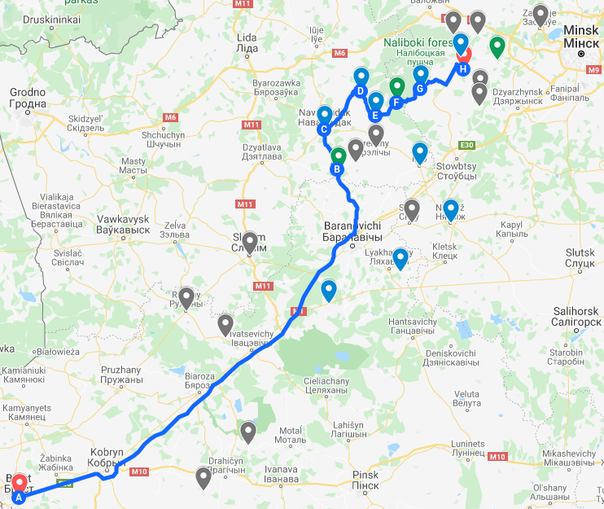
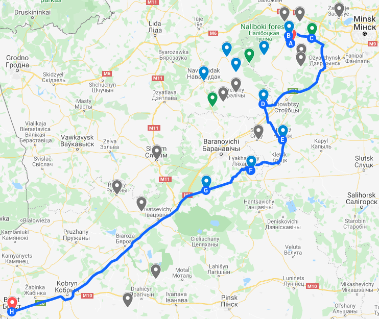

import CloudinaryImage from '../../../src/components/cloudinary-image';
import A from '../../../src/components/a';

### Agenda<A id="agenda" />

- [Intro](#intro)
- [From Brest to Naliboki forest](#from-brest-to-naliboki-forest)
  - [Sviciaz lake](#sviciaz-lake)
  - [Navahrudak](#navahrudak)
  - [Lubcha castle](#lubcha-castle)
  - [Hraptovichy palace in Shchorsy](#hraptovichy-palace-in-shchorsy)
  - [Kroman lake](#kroman-lake)
  - [Naliboki agrotown](#naliboki-agrotown)
- [Elagma Shale guest house in Naliboki forest](#elagma-shale-guest-house-in-naliboki-forest)
- [From Naliboki forest to Brest](#from-naliboki-forest-to-brest)
  - [Dzyarzhynskaya hara](#dzyarzhynskaya-hara)
  - [Mir castle](#mir-castle)
  - [Nesvizh castle](#nesvizh-castle)
  - [Hrusauka manor](#hrusauka-manor)
  - [Milavidy memorial complex](#milavidy-memorial-complex)

### Intro<A id="intro" /> [⬆️](#agenda)

Winter is not the best time for traveling, but you can see places underneath with a completely different perspective. So, here is our plan:

- 🟢 Green marks - nature points
- 🔵 Blue marks - historical points
- ⚫ Grey marks - missed points (next time)

### From Brest to Naliboki forest<A id="from-brest-to-naliboki-forest" /> [⬆️](#agenda)

#### Sviciaz lake<A id="sviciaz-lake" /> [⬆️](#agenda)

Sviciaz lake was the first nature point during our trip. Don't mix it up with the Ukrainian lake with the same name 250 km south-west.

This is the beautiful lake in the forest. There are a lot of legends related to this lake. For example, the legend of the origin:

> In the XIII century the town of Svityaz, ruled by Prince Turan, stood on the site of the lake. During the war with the Russian (Volyn) princes Mindauh called Svityazh's squad to help defend Navahrudak. Turan, obeying his duty, left the city for women, the elderly, and children.
>
> When the enemy army approached Svityaz, the inhabitants decided to resist, but not being able to hold the city, they set fire to their houses. At this point, the city collapsed into a lake that formed in its place. All the inhabitants turned into flowers, and the enemies who touched them died. So the inhabitants of Svityaz escaped the shame of captivity.

#### Navahrudak<A id="navahrudak" /> [⬆️](#agenda)

<A href="https://en.wikipedia.org/wiki/Novogrudok" text="Navahrudak" /> is a cozy
town on the hills with 🏰 castle ruins. It is a possible first capital of the <A
  href="https://en.wikipedia.org/wiki/Grand_Duchy_of_Lithuania"
  text="Grand Duchy of Lithuania"
/>
.
 
 

<CloudinaryImage
  link="v1610041298/maxhere/from-brest-to-naliboki-forest-and-back/20210227_125545.jpg"
  alt="the road to Navahrudak castle ruins"
/>

The <A href="https://en.wikipedia.org/wiki/Navahrudak_Castle" text="castle in Navahrudak" /> was one of the key strongholds of the <A href="https://en.wikipedia.org/wiki/Grand_Duchy_of_Lithuania" text="Grand Duchy of Lithuania" />.

<CloudinaryImage
  link="v1610041298/maxhere/from-brest-to-naliboki-forest-and-back/20210227_124930.jpg"
  alt="Navahrudak castle ruins"
/>

The ⛪ Roman Catholic Transfiguration Church (1712–23, includes surviving chapels of an older gothic building), where <A href="https://en.wikipedia.org/wiki/Adam_Mickiewicz" text="Adam Mickiewicz" /> was baptised.

<CloudinaryImage
  link="v1610041298/maxhere/from-brest-to-naliboki-forest-and-back/20210227_125144.jpg"
  alt="the view from the Navahrudak castle hill to Transfiguration Roman Catholic Church"
/>

According to ⛏️ archaeological research conducted in Navahrudak in the 1960s, the settlement on the territory of modern Navahrudak arose at the end of the 10th century, and the fortifications by the middle of the 11th century.

<CloudinaryImage
  link="v1610041298/maxhere/from-brest-to-naliboki-forest-and-back/20210227_124733.jpg"
  alt="the view from the Navahrudak castle hill"
/>

#### Lubcha castle<A id="lubcha-castle" /> [⬆️](#agenda)

<A href="https://en.wikipedia.org/wiki/Lubcha_Castle" text="Lubcha castle" /> was
a <A
  href="https://en.wikipedia.org/wiki/Radziwi%C5%82%C5%82_family"
  text="Radziwiłł family"
/> residential castle on the left bank of the <A
  href="https://en.wikipedia.org/wiki/Neman"
  text="Neman"
/> river at <A href="https://en.wikipedia.org/wiki/Lubcha" text="Lubcha" /> town.
 
 

<CloudinaryImage
  link="v1610041298/maxhere/from-brest-to-naliboki-forest-and-back/20210227_133515.jpg"
  alt="the Lubcha barbican outside"
/>

The castle was built in 1581 as a fortified residence of <A href="https://en.wikipedia.org/wiki/Jan_Kiszka" text="Jan Kiszka" />, a powerful Calvinist magnate. It had timber walls, a single stone tower, and was surrounded by moats on three sides, the fourth side protected by the river.

<CloudinaryImage
  link="v1610041298/maxhere/from-brest-to-naliboki-forest-and-back/20210227_133813.jpg"
  alt="the Neman river"
/>

Lubcha later passed to <A href="https://en.wikipedia.org/wiki/Janusz_Radziwi%C5%82%C5%82_(1612%E2%80%931655)" text="Janusz Radziwiłł" />, who expanded the castle by adding three stone towers.

<CloudinaryImage
  link="v1610041298/maxhere/from-brest-to-naliboki-forest-and-back/20210227_134036.jpg"
  alt="the Lubcha barbican inside"
/>

In 1655 it was taken and devastated by the rebellious Cossacks under Ivan Zolotarenko.

Only the barbican and one other tower were left standing after the Cossack incursion. The deserted estate changed owners several times, remaining untenanted until the mid-19th century, when a Gothic Revival palace was built on the grounds.

The Lubcha estate suffered much damage during both world wars. The palace was reduced to a shell in 1914 and was remodeled into a 🏫 school building by the Soviets in 1947.

<CloudinaryImage
  link="v1610041298/maxhere/from-brest-to-naliboki-forest-and-back/20210227_134054.jpg"
  alt="the palace was remodeled into a school"
/>

In the early 21st century, some of the 🧱 castle walls were rebuilt by a team of volunteers.

#### Hraptovichy palace in Shchorsy<A id="hraptovichy-palace-in-shchorsy" /> [⬆️](#agenda)

The main attraction of the village of Shchorsy are fragments of an extensive palace complex with a large park and ponds. Most of the buildings that belonged to the palace and park complex in the village of Shchorsy were built in the second half of the 18th and 19th centuries.

The palace itself, built in 1776, has not survived to this day, only the cellars remained. In addition to the palace itself, in the 19th century there were many different economic, residential and administrative buildings. Many of these secondary buildings have been preserved to some extent to this day.

Unfortunately, we didn't stop here to take a photo and had a quick look from the road. Probably it's not the best place to visit in ❄️ winter.

#### Kroman lake<A id="kroman-lake" /> [⬆️](#agenda)

It was the hardest part of our trip. The unpaved road with snow and mud started. In the beginning, we thought it should be not really long part. Then we couldn't stop to turn the car back. And then we had stuck trying to miss the car of local fishermen, and pushed the car with hands!

We couldn't go too slowly afraid to stuck again, and couldn't go too fast because there were a lot of water pits under the snow.

That's why we saw the lake only through the trees and didn't have a stop there.

But we saw a 🦌 deer here in wildwood!

And that's why we have to change a route a little bit to go through the <A href="https://en.wikipedia.org/wiki/Nalibaki" text="Naliboki agrotown" />.

#### Naliboki agrotown<A id="naliboki-agrotown" /> [⬆️](#agenda)

During the times of the Polish–Lithuanian Commonwealth, since 1555 the settlement belonged to the <A href="https://en.wikipedia.org/wiki/Radziwi%C5%82%C5%82_family" text="family of the Radziwiłł" /> magnates. Eventually, it has grown into a miasteczko. Since 1722 it was the home of a glass factory founded by <A href="https://en.wikipedia.org/wiki/Anna_Radziwi%C5%82%C5%82_(nobility)" text="Anna Radziwiłł" />, closed in 1862.

After the <A href="https://en.wikipedia.org/wiki/Second_Partition_of_Poland" text="Second Partition of Poland" />, since 1793 it belonged to the Russian Empire. In 1896 it was part of Powiat oszmiański Vilna Governorate, Russian Empire.

### Elagma Shale guest house in Naliboki forest<A id="elagma-shale-guest-house-in-naliboki-forest" /> [⬆️](#agenda)

This cozy place was the final destination. It's a small 4-persons max <A href="https://www.airbnb.com/rooms/45323131" text="guest house" /> with a beautiful view of the <A href="https://en.wikipedia.org/wiki/Naliboki_forest" text="Naliboki forest" />.

<CloudinaryImage
  link="v1610041298/maxhere/from-brest-to-naliboki-forest-and-back/20210227_154242.jpg"
  alt="a bed under the roof"
/>

With a warm stove this 🥶 cold winter.

<CloudinaryImage
  link="v1610041298/maxhere/from-brest-to-naliboki-forest-and-back/20210227_154901.jpg"
  alt="warm stove"
/>

And 🥓 delicious treats "Vjendzhanyja prysmaki" after long way.

<CloudinaryImage
  link="v1610041298/maxhere/from-brest-to-naliboki-forest-and-back/20210227_165520.jpg"
  alt="Vjendzhanyja prysmaki and Naliboki forest"
/>

Have you tried ale with juniper before? I haven't, until this trip. And it's one of the tastiest ale I have ever tried!

What can create even better atmosphere? Yes, 🎲 board games.

<CloudinaryImage
  link="v1610041298/maxhere/from-brest-to-naliboki-forest-and-back/20210227_195550.jpg"
  alt="Playing Love Letter"
/>

<CloudinaryImage
  link="v1610041298/maxhere/from-brest-to-naliboki-forest-and-back/20210227_203023.jpg"
  alt="Elagma Shale in the evening"
/>

<CloudinaryImage
  link="v1610041298/maxhere/from-brest-to-naliboki-forest-and-back/20210228_093342.jpg"
  alt="Draniki, fried potato pancakes - a popular Belarusian dish"
/>

There was an interesting sauce for 🥞 pancakes: sour cream with cinnamon. Tasty!

<CloudinaryImage
  link="v1610041298/maxhere/from-brest-to-naliboki-forest-and-back/20210228_093352.jpg"
  alt="Pancakes and eggs with fried pork rinds"
/>

### From Naliboki Forest to Brest<A id="from-naliboki-forest-to-brest" /> [⬆️](#agenda)

#### Dzyarzhynskaya hara<A id="dzyarzhynskaya-hara" /> [⬆️](#agenda)

There is nothing special here. Just ⛰️ <A href="https://en.wikipedia.org/wiki/Dzyarzhynskaya_Hara" text="the highest point in Belarus" />. It is 345 meters (1,130 ft) above sea level and is located west of Minsk, near Dzyarzhynsk, in the village Skirmuntava.

<CloudinaryImage
  link="v1610041298/maxhere/from-brest-to-naliboki-forest-and-back/20210228_105331.jpg"
  alt="Dzyarzhynskaya hara is 345 meters above the sea level"
/>

#### Mir castle<A id="mir-castle" /> [⬆️](#agenda)

<A href="https://en.wikipedia.org/wiki/Mir_Castle_Complex" text="Mir castle" /> probably
is one of the two most popular historical places in Belarus.
 
 

<CloudinaryImage
  link="v1610041298/maxhere/from-brest-to-naliboki-forest-and-back/20210228_121240.jpg"
  alt="Mir castle outside"
/>

Built at the beginning of the 16th century by a tycoon, the castle became the first private property castle on the lands of Belarus.

<CloudinaryImage
  link="v1610041298/maxhere/from-brest-to-naliboki-forest-and-back/20210228_121549.jpg"
  alt="Mir castle tower"
/>

Since 1568, the castle was owned by the <A href="https://en.wikipedia.org/wiki/Radziwi%C5%82%C5%82_family" text="Radziwiłł family" /> (until 1828), then the Wittgensteins (until 1891). The last owners of the castle were the princes <A href="https://en.wikipedia.org/wiki/Svyatopolk-Mirsky" text="Svyatopolk-Mirsky" /> (until 1939), after which, with the advent of the Soviets, the castle became state property.  

<CloudinaryImage
  link="v1610041298/maxhere/from-brest-to-naliboki-forest-and-back/20210228_121606.jpg"
  alt="Mir castle courtyard"
/>

Mir castle is the most eastern Gothic building, as well as the largest and only non-cult object of the few surviving examples of the original <A href="https://en.wikipedia.org/wiki/Belarusian_Gothic" text="Belarusian Gothic" />.

#### Nesvizh castle<A id="nesvizh-castle" /> [⬆️](#agenda)

<A href="https://en.wikipedia.org/wiki/Nesvizh_Castle" text="Nesvizh castle" /> is
one of the two most popular historical places in Belarus together with <A
  href="https://en.wikipedia.org/wiki/Mir_Castle_Complex"
  text="Mir castle"
/>
.
 
 

There are a lot of info about it. But in two words the castle is a residential castle of the <A href="https://en.wikipedia.org/wiki/Radziwi%C5%82%C5%82_family" text="Radziwiłł family" />.

<CloudinaryImage
  link="v1610041298/maxhere/from-brest-to-naliboki-forest-and-back/20210228_130402.jpg"
  alt="Nesvizh castle outside the moat"
/>

It was built in the 16th and 17th centuries and maintained by the <A href="https://en.wikipedia.org/wiki/Radziwi%C5%82%C5%82_family" text="Radziwiłł family" /> until 1939.  

<CloudinaryImage
  link="v1610041298/maxhere/from-brest-to-naliboki-forest-and-back/20210228_130813.jpg"
  alt="Nesvizh castle courtyard"
/>

#### Hrusauka manor<A id="hrusauka-manor" /> [⬆️](#agenda)

It was one of the most interesting stops of our trip. Maybe, also because of the man who was not far from the manor and escorted us inside, telling the history of this place.

<CloudinaryImage
  link="v1610041298/maxhere/from-brest-to-naliboki-forest-and-back/20210228_143827.jpg"
  alt="the Hrusauka manor outside"
/>

This estate belonged to the Rejtan family. On 20 August 1742, <A href="https://en.wikipedia.org/wiki/Tadeusz_Rejtan" text="Tadeusz Rejtan" /> was born here. Rejtan is remembered for a dramatic gesture he made in September 1773, as a deputy of the <A href="https://en.wikipedia.org/wiki/Partition_Sejm" text="Partition Sejm" />. There, Rejtan tried to prevent the legalization of the first partition of Poland, a scene that has been immortalized in the painting <A href="https://en.wikipedia.org/wiki/Rejtan_(painting)" text="Rejtan" /> by <A href="https://en.wikipedia.org/wiki/Jan_Matejko" target="Jan Matejko" />:

> Kill me, do not kill the Fatherland!

<CloudinaryImage
  link="v1610041298/maxhere/from-brest-to-naliboki-forest-and-back/20210228_144414.jpg"
  alt="the Hrusauka manor rooms"
/>

Tadeusz Rejtan never married. He spent the rest of his days in a small estate at Hruszówka, where he died on 8 August 1780. His mental health had deteriorated; according to some due to distress with the loss of a part of his homeland.

<CloudinaryImage
  link="v1610041298/maxhere/from-brest-to-naliboki-forest-and-back/20210228_144520.jpg"
  alt="the Hrusauka manor inside"
/>

He is said to have been escorted by his brothers from Warsaw on 19 March 1775 after he had a fit, and was locked in a small family's mansion which he would never leave up till his death.

<CloudinaryImage
  link="v1610041298/maxhere/from-brest-to-naliboki-forest-and-back/20210228_144607.jpg"
  alt="the Hrusauka manor ceiling"
/>

Eventually, he committed suicide, cutting himself with glass (most detailed accounts say he swallowed it, to prevent being taken by pursuing Russian soldiers). His exact place of burial is unknown, and exhumation in Hruszówka in 1930 failed to conclusively find his grave.

<CloudinaryImage
  link="v1610041298/maxhere/from-brest-to-naliboki-forest-and-back/20210228_144608.jpg"
  alt="the Hrusauka manor ceiling"
/>

#### Milavidy Memorial Complex<A id="milavidy-memorial-complex" /> [⬆️](#agenda)

This is the last point of our trip - a memorial complex in few kilometers from the Milavidy village, it was a battle during the January Uprising here in 1863.

<A
  href="https://en.wikipedia.org/wiki/January_Uprising"
  text="The January Uprising"
/> (the Polish Uprising 1963-1964) was an insurrection against the Russian Empire
aimed at the restoration of the Polish–Lithuanian Commonwealth.
 
 

<A
  href="https://en.wikipedia.org/wiki/Konstanty_Kalinowski"
  text="Kastus Kalinowski"
/> (1838–1864), was one of the leaders of Lithuanian and Belarusian national revival
and the leader of the January Uprising in the lands of the former <A
  href="https://en.wikipedia.org/wiki/Grand_Duchy_of_Lithuania"
  text="Grand Duchy of Lithuania"
/>
. 
 

<CloudinaryImage
  link="v1610041298/maxhere/from-brest-to-naliboki-forest-and-back/20210228_155630.jpg"
  alt="a stone with Kastus Kalinowski portrait"
/>

<CloudinaryImage
  link="v1610041298/maxhere/from-brest-to-naliboki-forest-and-back/20210228_155647.jpg"
  alt="a stone with memorial plaque and inscription in Belarusian was erected in 1990"
/>

It began on 22 January 1863 and continued until the last insurgents were captured by the Russian forces in 1864. It was the longest insurgency in post-partition Poland.

<CloudinaryImage
  link="v1610041298/maxhere/from-brest-to-naliboki-forest-and-back/20210228_155806.jpg"
  alt="memorial chapel was built in 1933 in honor of the Kalinowski rebels"
/>

After the battle, the bodies of the fighters were 🪦 buried in two mass graves on opposite sides of the road near the forest.
