import Game from '../../../src/components/game';

Some 🕰️ time ago I thought that games with the wider players' number range are better. You can play the same game either with only one rival or in a big company.
But then I realized each game has the optimal player number because it's not easy to design a perfect scalable game. And if the players number is fixed (to keep better balance) it's usually only 👭 2 players.

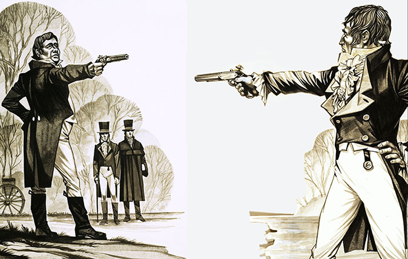

But this is not the only reason why this page is about the games for only two players. Usually, it’s not easy to find enough players for the game. If the game is complicated all the players have to be experienced. But you always can find 1 opponent to play.

And if we are talking about ⚔️ war games, I noticed it happens if three (or more) players play a  game with high interaction and the first two players start to fight each other then third (or other players) can win easily.

### The list of duel board games in my collection:<a name="list" />

- [<Game gameName="Twilight Struggle" isText /> (🇺🇸 Ananda Gupta, 🇺🇸 Jason Matthews)](#twilight-struggle)
- [<Game gameName="7 Wonders Duel" isText /> (🇫🇷 Antoine Bauza, 🇫🇷 → 🇨🇭 Bruno Cathala)](#7-wonders-duel)
- [<Game gameName="Patchwork" isText /> (🇩🇪 Uwe Rosenberg)](#patchwork)
- [<Game gameName="Star Realms" isText /> (🇺🇸 Robert Dougherty, 🇺🇸 Darwin Kastle)](#star-realms)
- [<Game gameName="Jaipur" isText /> (🇨🇭 Sébastien Pauchon)](#jaipur)
- [<Game gameName="Hanamikoji" isText /> (🇯🇵 Kota Nakayama)](#hanamikoji)
- [<Game gameName="Battle Line" isText /> (🇩🇪 → 🇬🇧 Reiner Knizia)](#battle-line)
- [<Game gameName="Hive" isText /> (🇬🇧 John Yianni)](#hive)
- [<Game gameName="Lost Cities" isText /> (🇩🇪 → 🇬🇧 Reiner Knizia)](#lost-cities)

[bonus](#arboretum)

### <Game gameName="Twilight Struggle" /> (<a href="https://boardgamegeek.com/boardgamedesigner/3876/ananda-gupta" target="_blank">🇺🇸 Ananda Gupta</a>, <a href="https://boardgamegeek.com/boardgamedesigner/3877/jason-matthews" target="_blank">🇺🇸 Jason Matthews</a>)<a name="twilight-struggle" /> [⬆️](#list)
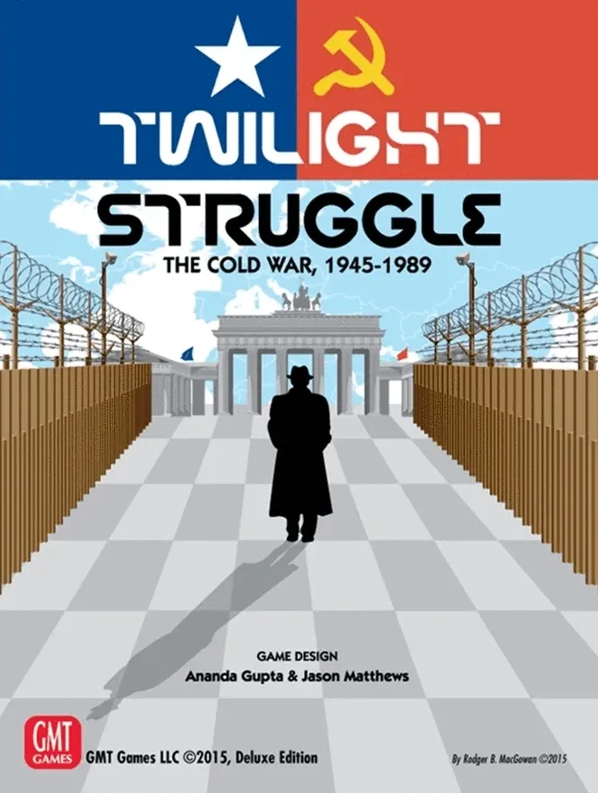

<Game gameName="Twilight Struggle" isSkipRank isSkipYear /> is the heaviest game in this list. The game box says it takes 3 - 4 hours to play it.
It's the <a href="https://boardgamegeek.com/wargames/browse/boardgame?sort=rank&rankobjecttype=family&rankobjectid=4664&rank=1#1" target="_blank">Top 1 War Game according to BoardGameGeek</a>.
It's not really funny for the first plays, but then it becomes better and better, and you see less and less random there.
  
The game is about The Cold War period, and players try on the role of the USA and the USSR. The game is very atmospheric. You try to manage the whole map and don't lose points in each 🗺️ region. You don't fight in this game, but do increase your influence in different countries to control it. And you interact more than in the fight.
  
There are cards with events (beneficial for the USA, for the USSR, or for both countries) in the game and it works interesting way. You can use points from the card with your or neutral event or play it as an event. But event from the card beneficial for your opponent happens automatically if you play this card. Many events can be played only once so if you choose points from your event it doesn't play and will appear again after reshuffling the deck.
  
Half of the rule book is info about the historical events. And the events works great in the game because there are three periods of war and each event belongs to one of these periods - can be played in this period or later.
  
This cult board game held the first place on BoardGameGeek for many years.

### <Game gameName="7 Wonders Duel" /> (<a href="https://boardgamegeek.com/boardgamedesigner/9714/antoine-bauza" target="_blank">🇫🇷 Antoine Bauza</a>, <a href="https://boardgamegeek.com/boardgamedesigner/1727/bruno-cathala" target="_blank">🇫🇷 → 🇨🇭 Bruno Cathala</a>)<a name="7-wonders-duel" /> [⬆️](#list)
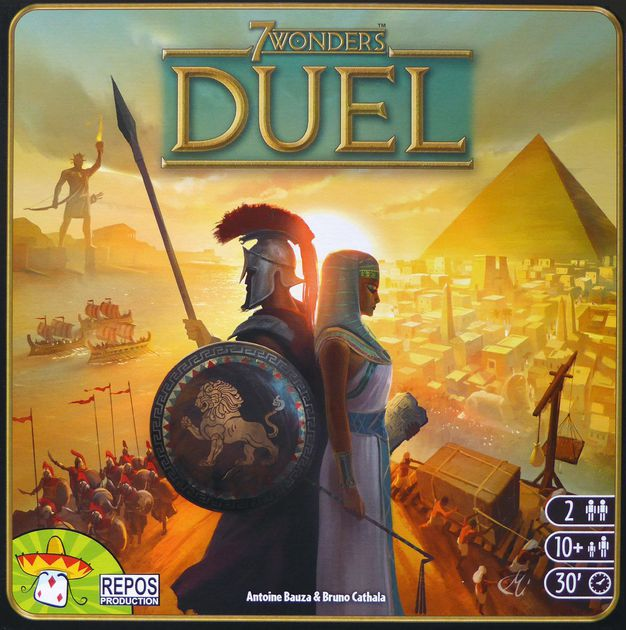

<Game gameName="7 Wonders Duel" isSkipRank isSkipYear /> is a 2 players variant of the famous <Game gameName="7 Wonders" isSkipRank isSkipYear /> game. The "base" game is only for 3-7 players (best: 4-5). But it's not the only difference between the games.
  
Designers added many cool improvements. The actions now are not simultaneous but there are 3 ways to win the game:
  

1. Victory Points at the end of the game.
2. Military victory.
3. Science victory.

There is no more classic draft here - players take cards from the table (some cards are face-down, others are face-up, both can be covered by others).

A really cool thoughtful modern game about science, war, and, of course, wonders. Definitely one of the best duel games.

### <Game gameName="Patchwork" /> (<a href="https://boardgamegeek.com/boardgamedesigner/10/uwe-rosenberg" target="_blank">🇩🇪 Uwe Rosenberg</a>)<a name="patchwork" /> [⬆️](#list)
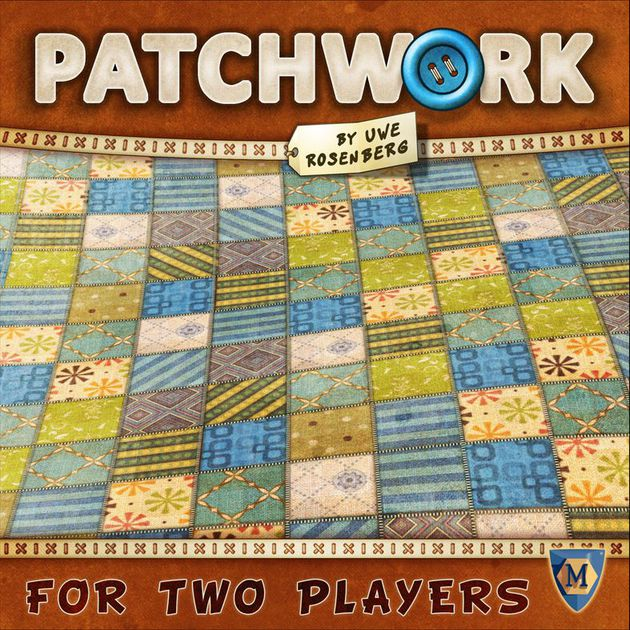

<Game gameName="Patchwork" isSkipRank isSkipYear /> is a game where interesting mechanics intertwined with a cozy setting. Both players have patchwork quilt and 🧵 place patches on it to fill it as much as possible.
  
Who doesn't know about the Tetris game? <Game gameName="Patchwork" isSkipRank isSkipYear /> is kind of Tetris, but you are not on a hurry here.
  
Also, you have to manage two resources at the same time: the buttons and the time. You spend both to buy and place patches, but if you spend too much time - your opponent will have the possibility to make more moves because the player who spends less ⌛ time takes the next turn in this game.

### <Game gameName="Star Realms" /> (<a href="https://boardgamegeek.com/boardgamedesigner/4113/robert-dougherty" target="_blank">🇺🇸 Robert Dougherty</a>, <a href="https://boardgamegeek.com/boardgamedesigner/4059/darwin-kastle" target="_blank">🇺🇸 Darwin Kastle</a>)<a name="star-realms" /> [⬆️](#list)
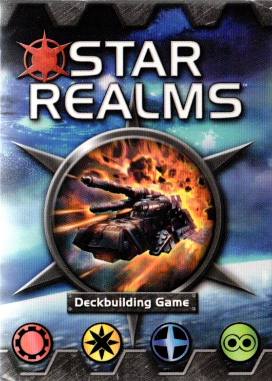

I didn't like <Game gameName="Star Realms" isSkipRank isSkipYear /> right away. We had already played <Game gameName="Dominion" isSkipRank isSkipYear /> and I thought why we need one more deck-building if there is already a top deck-building game?

A few years later I decided to give it a second chance. First of all, it's cheap. And it's has a good rating. And we liked it. The game is similar to <Game gameName="Dominion" isSkipRank isSkipYear /> but it's different - you feel really different when you play it. It's easy to start playing it but still interesting after time.

It's a fast-paced 🚀 spaceship combat game. The cards you can buy are not fixed like in <Game gameName="Dominion" isSkipRank isSkipYear /> and the interaction is more direct here. Also, there are fractions in the game, it allows you to create different combos.

You can play with more people if you have two game copies and there are a lot of expansions for this game if the base will become boring (but it's not our case yet).

### <Game gameName="Jaipur" /> (<a href="https://boardgamegeek.com/boardgamedesigner/6736/sebastien-pauchon" target="_blank">🇨🇭 Sébastien Pauchon</a>)<a name="jaipur" /> [⬆️](#list)
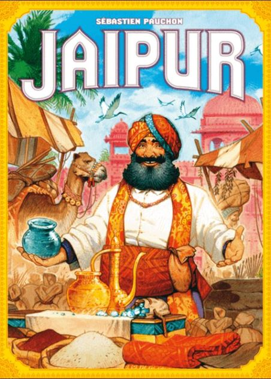

<Game gameName="Jaipur" isSkipRank isSkipYear /> is a game about trades in the city of Jaipur, the capital of Rajasthan. It's a fast-paced, a blend of tactics, risk, and luck.
  
You are trying to sell goods before your opponent because it will be a better deal. Also, you exchange goods before that. The game is filled with bargaining spirit. You are always facing a decision: to sell the goods you have, to take 1 good from the market, to take all the 🐪 camels from the market or to exchange 2 or more goods from the market with your goods or camels. And to get the best benefit of it!
  
A pretty simple but a high quality game.

### <Game gameName="Hanamikoji" /> (<a href="https://boardgamegeek.com/boardgamedesigner/74989/kota-nakayama" target="_blank">🇯🇵 Kota Nakayama</a>)<a name="hanamikoji" /> [⬆️](#list)
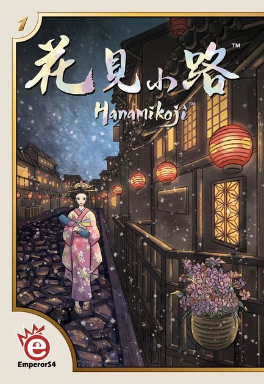

<Game gameName="Hanamikoji" isSkipRank isSkipYear /> is a little bit strange game. The main reason is the "I Cut, You Choose" mechanics.
  
There are 7 Geishas and you earn the favor by making presents. But you can choose direct only one present from your side (the "secret" action). Your other presents are chosen by your opponent. And 🔀 visa versa.
  
Maybe it's somehow related to the 🇯🇵 Japanese culture when you offer your opponent to make the choice instead of you. I don't know. But it's interesting!
  
Also, the game has an amazing atmosphere - it's slow and brooding.

### <Game gameName="Battle Line" /> (<a href="https://boardgamegeek.com/boardgamedesigner/2/reiner-knizia" target="_blank">🇩🇪 → 🇬🇧 Reiner Knizia</a>)<a name="battle-line" /> [⬆️](#list)
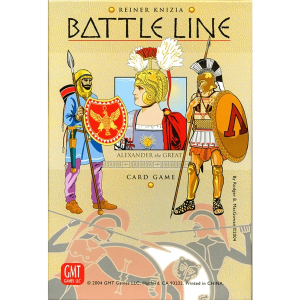

I didn't want to buy the <Game gameName="Battle Line" isSkipRank isSkipYear /> game after I had read the game description. It's the ♠️ Poker plagiarism! But again, the cheap price and the good rating (and the cult designer name) did their job. And I wasn't wrong.

In <a href="https://gaga.ru/game/batalia" target="_blank">Russian localization</a>, it's named The Battle but it's not completely correct. There is a "battle line" here and each player tries to win by taking 5 of 9 ⛳ flags or 3 adjacent flags. It can be done by placing into 3 card poker-type hands on either side of the flag. And the most interesting part is each player proves that he wins the current flag using open information on the table.

I have the game with tactics cards and it makes it much more interesting and versatile.

### <Game gameName="Hive" /> (<a href="https://boardgamegeek.com/boardgamedesigner/1078/john-yianni" target="_blank">🇬🇧 John Yianni</a>)<a name="hive" /> [⬆️](#list)
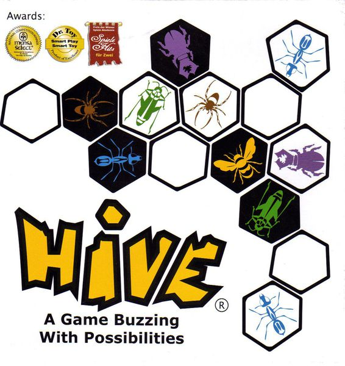

<Game gameName="Hive" isSkipRank isSkipYear /> is an abstract game. There are no dices or decks of cards here - absolutely no random, like chess. The rules are simple: each player has a set of 🕷️ insects and each insect works it's own way. But there is a lot of things to think about here.
  
Each player has the 🐝 queen and the main goal is to surround the opponent's queen by other insects. Players place their insects or move already placed. It's a really smart game when you should think many moves forward and not only attack another queen but protect your own.
  
The game is not restricted by a board and can be played anywhere on any flat surface. And the components are amazing here! And the game is so small you can put it in the pocket.

### <Game gameName="Lost Cities" /> (<a href="https://boardgamegeek.com/boardgamedesigner/2/reiner-knizia" target="_blank">🇩🇪 → 🇬🇧 Reiner Knizia</a>)<a name="lost-cities" /> [⬆️](#list)
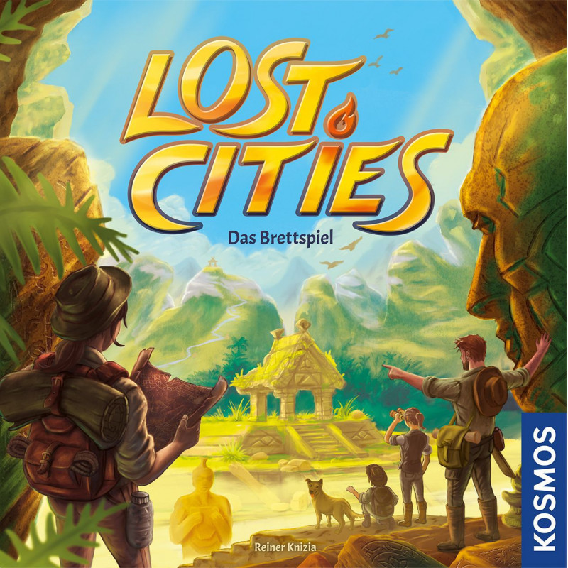

<Game gameName="Lost Cities" isSkipRank isSkipYear /> is the first game from this list I have played and the second game by <a href="https://boardgamegeek.com/boardgamedesigner/2/reiner-knizia" target="_blank">🇩🇪 → 🇬🇧 Reiner Knizia</a> in this list. A really elegant and simple game, but it doesn't get boring over time.
  
The game is about 🦖 expeditions. Each player decides which expedition he wants to start. And if he started it he can get points if he places enough cards on this expedition or loses the points in another case. But usually, there are not enough cards in hand in the time the expedition is started. And the player can place the cards only in the order. That's why every decision is very hard.
  
You always have cards with big 🔢 numbers at the beginning of the game and small cards in the end. And the required card always comes immediately after it has become unnecessary).

### <Game gameName="Arboretum" /> (<a href="https://boardgamegeek.com/boardgamedesigner/53889/dan-cassar" target="_blank">🇺🇸 Dan Cassar</a>)<a name="arboretum" /> [⬆️](#list)
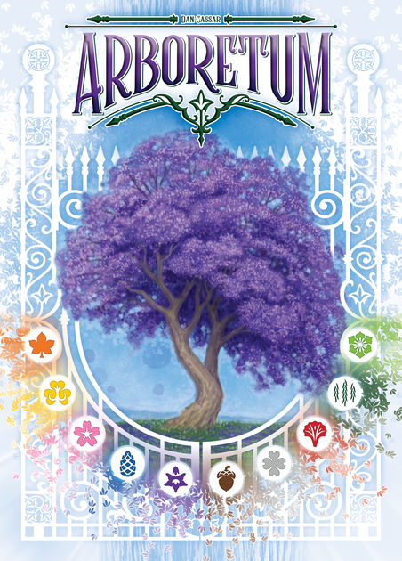

<Game gameName="Arboretum" isSkipRank isSkipYear /> is <strong>not a two players board game</strong>. But I can't make list with <Game gameName="Lost Cities" isSkipRank isSkipYear /> but without <Game gameName="Arboretum" isSkipRank isSkipYear /> (that's why it's a bonus for this page). These games are very similar to me 🤔. In both games, you can choose where to draw the card to control the game pace and the game end.
  
But <Game gameName="Arboretum" isSkipRank isSkipYear /> has some interesting features. You have to manage few things in the game: you build alleys (by placing the cards in front of you) to collect more points at the end of the game, but in the same time you leave the cards with the same trees in your hand because the points for each tree will collect only the player who has the biggest points for this kind of 🌳 tree in his hand.
  
In this game, you play not only for yourself but against the others because the player with the most points wins.
  

---

Also, if the game is not for only two players doesn't mean that it's not the best for two players. For example we often play <Game gameName="Race for the Galaxy" isSkipRank isSkipYear /> or <Game gameName="Azul" isSkipRank isSkipYear />. And I think these games are the most ⚖️ balanced for only 2 players.

---

Almost all the games has the <a href="../digital-board-games" target="_blank">digital implementation</a>. Feel free to check ;)
