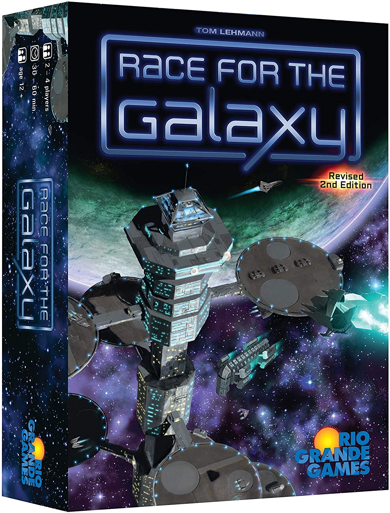
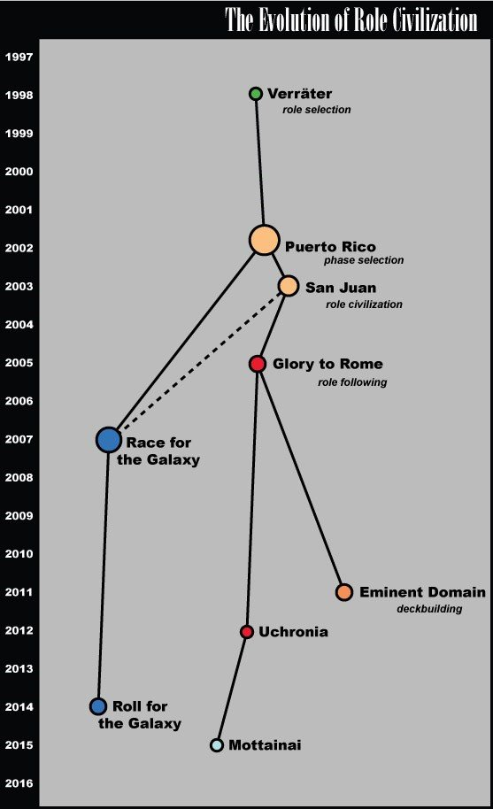
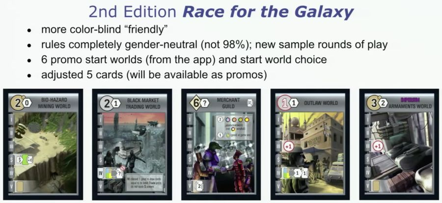
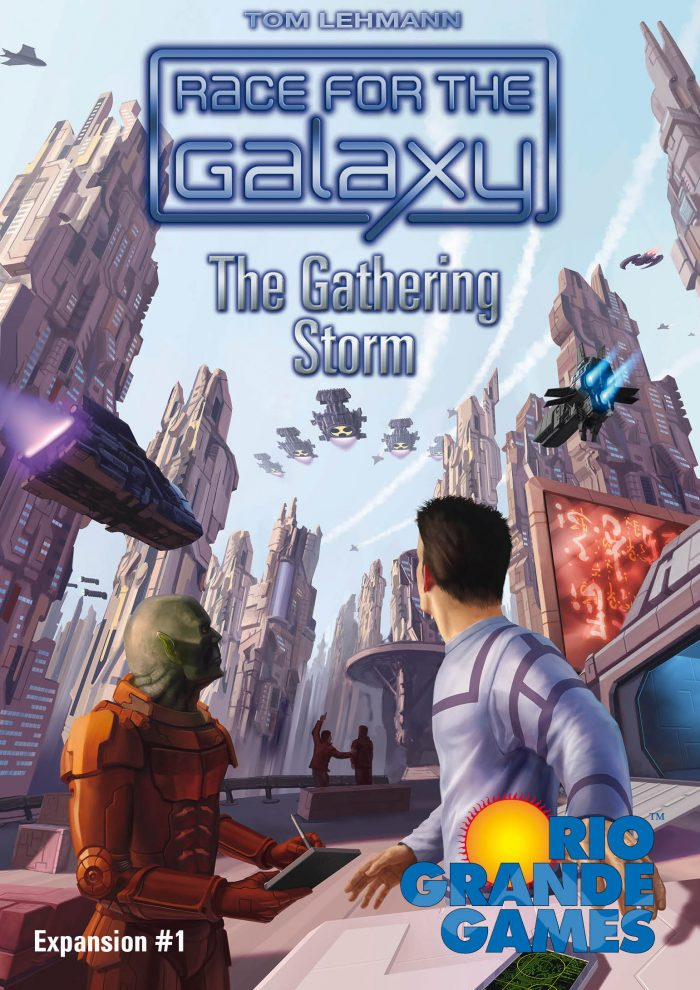
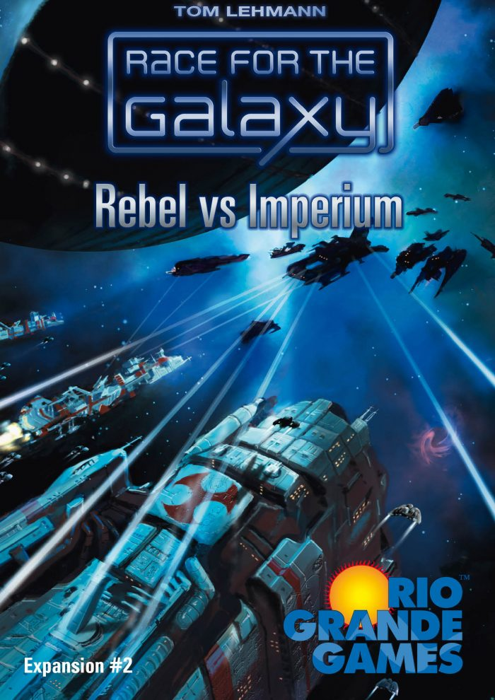
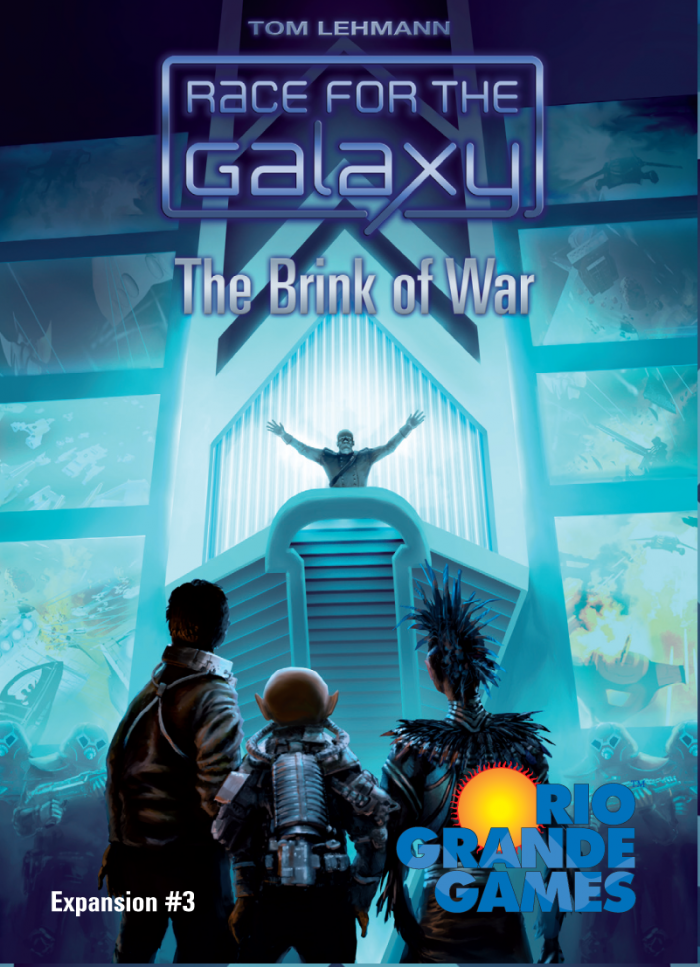
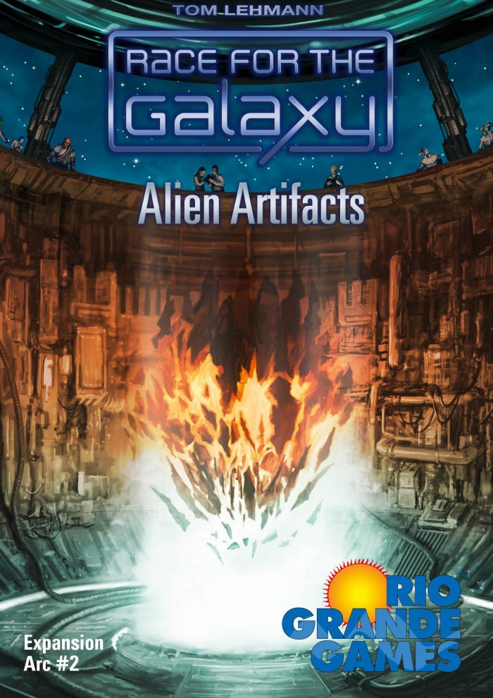
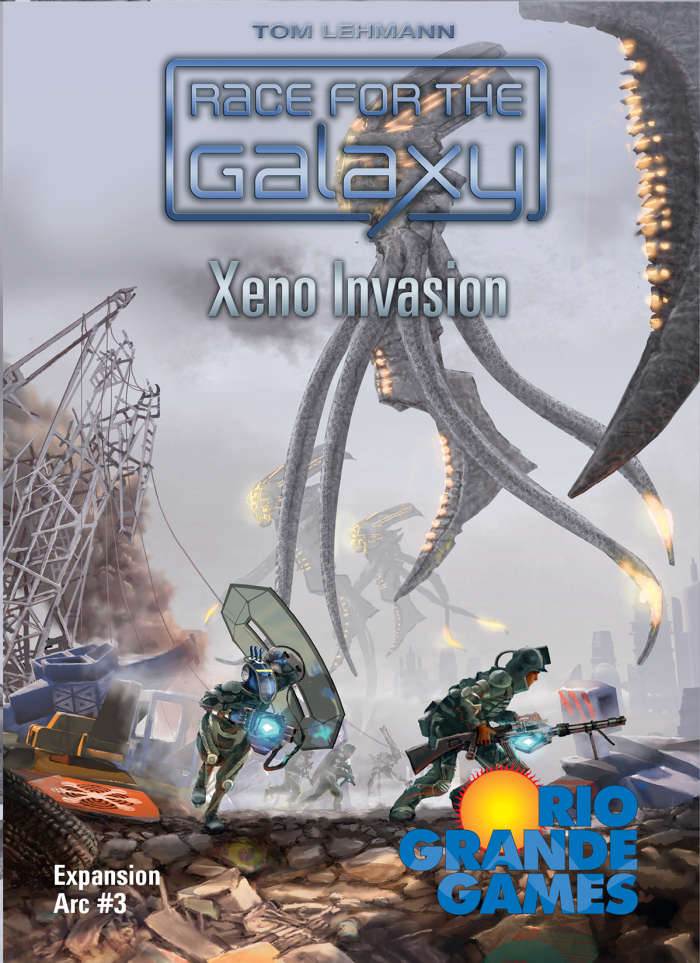

import Game from '../../../src/components/game';
import Designer from '../../../src/components/designer';
import A from '../../../src/components/a';

### Agenda<A id="agenda" />

- [Agenda](#agenda)
- [Intro](#intro)
- [General info](#general-info)
- [Cards](#cards)
- [Cards Sifting](#cards-sifting)
- [The Goal](#the-goal)
- [Race for the Galaxy, Puerto Rico and San Juan](#race-for-the-galaxy-puerto-rico-and-san-juan)
- [Simultaneous actions](#simultaneous-actions)
- [Design](#design)
- [More](#more)
  - [Switching cost](#switching-cost)
  - [Player types](#player-types)
- [What's next?](#what-s-next)
  - [2nd Edition](#2nd-edition)
  - [Expansions](#expansions)
  - [Other games](#other-games)

### Intro<A id="intro" /> [⬆️](#agenda)

As far as I remember I tried it the first time in 2017. It was the end of the evening, we had been playing a few games and were tired. It was not the best choice for our condition. We hardly understood the rules (there are a lot of different icons on the cards and strange mechanics), played it, and forgot it. Nobody really liked it.

But some time ago I caught sight of this game again and decided to give it the second try - it happens that cool things don't look so at first glance. Fortunately, there are a lot of ways to play it without the game itself (<a href="https://boardgamearena.com/gamepanel?game=raceforthegalaxy" target="_blank">Web</a>, mobile (<a href="https://play.google.com/store/apps/details?id=com.templegatesgames.RaceAndroid" target="_blank">Android</a>/<a href="https://apps.apple.com/us/app/race-for-the-galaxy/id1190675052" target="_blank">iOS</a>), and desktop (<a href="https://store.steampowered.com/app/579940/Race_for_the_Galaxy" target="_blank">Steam</a>/<a href="http://keldon.net/rftg" target="_blank">open-source with AI</a>) versions).

And I liked it so much, so decided to buy a copy! It was not easy to find it in 2020, but I did it.

But what is so special about this game? Let me try to explain. I got the inspiration to write about it from this video where the game designer explains how he was working on it:

<iframe
  width="560"
  height="315"
  src="https://www.youtube.com/embed/JcyyeAww2wc"
  frameborder="0"
  allow="accelerometer; autoplay; encrypted-media; gyroscope; picture-in-picture"
  allowfullscreen
></iframe>

### General info<A id="general-info" /> [⬆️](#agenda)

It's a kind of euro card game for 2-4 players with no much interaction. It was designed by <Designer name="thomas-lehmann" /> and published in 2007.

The main mechanics are: **Tableau Building**, **Hand Management** and **Cards Sifting**.

### Cards<A id="cards" /> [⬆️](#agenda)

One of the most interesting thing here is that cards can be used in 3 different ways:

1. Face up it can be development or world, you can develop or settle it and add to your tableau to use its properties and/or victory points at the end of the game.
2. Face down it can be money - you will pay with it for development or peace worlds if you want to add it to your tableau.
3. Face down it can be goods (4 different kinds) - you can produce it on producing or (sometimes) windfall worlds and then sell (for money - cards) or consume (for victory points or/and money - cards) it.

It's a card game, there are only cards and victory points as components. But these different ways of using cards makes it more similar to the usual euro games. But you can still play it fast (~7 mins online)!

Also, that allows cards in hand to represent an opportunity. This means the cost isn't the resources spent only, but what you could have done instead. And this opportunity cost is big here because you can't use the cards you used to pay later.

That's why it's possible to have zero-cost cards but it is not always profitable to play it because you build it instead of some other card that might be more useful.

### Cards Sifting<A id="cards-sifting" /> [⬆️](#agenda)

Players typically draw 30-50 cards in a game but build only 8-12 of them. This 'card-sifting' allows for variety that supports many different strategies - you can throw away cards that don't fit your strategy using it to pay for other cards (91 of 114 cards are unique).

<Designer name="thomas-lehmann" /> compares 'card-sifting' to other variety approaches:
 
 

1. Deck construction - need a deck to play.
2. Drafting - breaks up play or must be done before play.
3. Deck building - uses only a subset each game.

Deck sifting integrates variety into the gameplay and adds hand management decisions.

You can make an early "big" purchase but then you will not be able to do anything several rounds until you will have other cards.

Furthermore, if you have cards that you want to save for the end of the game, it's like a boat anchor in your hand, because you can't spend them to pay for something else.

### The Goal<A id="the-goal" /> [⬆️](#agenda)

There are two different ways to end the game:

1. 12+ cards in any empire
2. Empty the VP pool

The player with most victory points (VP) (and cards if VP are equal) wins. Scoring:

1. VP chips
2. VP values of empire cards
3. VP bonuses from the 6-cost developments

So this is the "Race". In <a href="https://hobbyworld.ru/borba-za-galaktiku" target="_blank">Russian localization</a>, it's a "Struggle". As for me, "Race" fits better because every player can influence on game's end when his position is better than others. To finish first.

That means players control game pace / ending and choose different strategic:

- tableau rush vs density?
- fast, small vs larger produce/consume engines?
- invest in a VP engine or develop/settle discounts?

### <Game gameName="Race for the Galaxy" isSkipRank isSkipYear />, <Game gameName="Puerto Rico" isSkipRank isSkipYear /> and <Game gameName="San Juan" isSkipRank isSkipYear /><A id="race-for-the-galaxy-puerto-rico-and-san-juan" /> [⬆️](#agenda)

<Designer name="andreas-seyfarth" /> is designer of a very popular euro game <Game
  gameName="Puerto Rico"
  isSkipRank
  isSkipYear
/>
. 
 

<Designer name="stefan-bruck" /> - the publisher of the game, wanted to produce a
card game to capitalize on <Game gameName="Puerto Rico" isSkipRank isSkipYear /> success
but <Designer name="andreas-seyfarth" /> prototype wasn't working.
 
 

He contacted <Designer name="thomas-lehmann" /> and asked him to be a backup designer for <Game gameName="Puerto Rico" isSkipRank isSkipYear /> card game. Then <Designer name="stefan-bruck" /> combined <Designer name="andreas-seyfarth" /> and <Designer name="thomas-lehmann" /> prototypes with his own ideas to form <Game gameName="San Juan" isSkipRank isSkipYear />.

But <Designer name="thomas-lehmann" /> wanted to see the game he designed published. He continued work, added ideas from his unpublished collectible card game **Duel for the Stars**, some new ideas, and created <Game gameName="Race for the Galaxy" isSkipRank isSkipYear />.

This picture is from the <a href="https://www.mechanics-and-meeples.com/2015/12/21/anatomy-of-a-genre-role-civilization-part-three-the-galaxy" target="_blank">article</a> about the evolution of role games, but I think it's pretty fit here:

So, he worked on problems he found in <Game gameName="Puerto Rico" isSkipRank isSkipYear />:

1. Clockwise playing
2. Features "constraining", interaction
3. Limit the next player options
4. Picking a role (action) "blocks" it for a round

<Designer name="thomas-lehmann" /> noticed that position has a big influence on the
game. You can sit after the player who will not allow you to win. Or if you sit after
the less experienced player you will have benefit. He calls it "left-right binding".

And he came to these solutions:

1. There are simultaneous actions in the <Game gameName="Race for the Galaxy" isSkipRank isSkipYear /> game. It allows to eliminate "left-right binding", every player can pick any role.
2. He increased build tempo/round from 0-1 to 0-2 (develop and settle).
3. He updated consume bonus from +1 to \*2 VPs.

### Simultaneous actions<A id="simultaneous-actions" /> [⬆️](#agenda)

Each round consist from the phases users select simultaneously to play.

Each phase has the bonus for the player who picks it. There are only 5 possible phases:

1. **Explore** - see and take new cards (bonuses: see more or take more cards)
2. **Develop** - build the development from hand (bonus: pay 1 card less)
3. **Settle** - build the world from hand (bonus: take 1 card after settling)
4. **Consume** - exchange goods to cards or VPs (bonuses: sell 1 card for cards or get 2x VPs for consuming)
5. **Produce** - produce goods on producing worlds (bonus: produce a good on one windfall world)

Simultaneous actions led to interesting players' interactions: bluffing and gambling, "leeching" and "blunting". You can try to guess another player's choice and use it for your benefit. Or you can prevent the opponent from your choice prediction.

The problem with simultaneous actions is all actions must be viable in early, mid and late game.

1. For the **Explore** it was easy, you're always looking for the cards that "fit".
2. For the **Develop** it was good, you build technologies early and 6-cost (bonus) developments late. That's why there are powers on the 6-cost developments - to play it in mid game.
3. For the **Settle**, you play it early to get cards and in mid to build VP engines. That's why <Designer name="thomas-lehmann" /> took the idea with military worlds from his unpublished game. You can have a lot of points with this worlds and you can build it without cards, so you will want to do it in the late game.
4. For the **Produce**, it has the opposite to "Settle" problem - it has Belling the Cat issue. Everyone wants someone else to call produce. To solve it "Produce" was moved to the very end of the round. If you call it - you like other players can have benefit of it in the next round. Also, there are windfall worlds here to solve it. You will have a good upon being settled, but in the produce phase only if YOU pick the "Produce".
5. For the **Consume**, it has two different bonuses: x2 VP that works in the late game and Trade that allows to sell the good only for the player who picks it. Why isn't it the separate phase? To prevent the "Rich gets richer problem" issue. Because otherwise the game will be about getting the big world down first.

One of the main criticism of the <Game gameName="Race for the Galaxy" isSkipRank isSkipYear /> is that this is a multi-player solitaire. But if you want to win you have to track your opponents, what phase do they want to play, how fast is their tempo. This is the interaction here.

In addition, simultaneous play can speed up multi-player games. <Game gameName="Race for the Galaxy" isSkipRank isSkipYear /> plays maybe 5 minutes longer if it's 4 players game in comparing with 2-players game.

The is a problem with the simultaneous play, there is must be a time when you serialize play, but it should be minimized.
That's why not-essential information is hidden (you pay with face down cards).

### Design<A id="design" /> [⬆️](#agenda)

I skipped the part about design, if you are interested in it, please check the video.
Long story short, the game has not the learning curve, but the learning spike. They added these little swooshes behind things so players could easily look across the cards in their empire and see the powers.
As for types of the powers <Designer name="thomas-lehmann" /> speaks about two types of games, with big combo and smaller, incremental powers. And he tried to create the game the second type game. That's why the game has a lot of powers and icons for it.

All the cards are actually designed from the thematic point of you. But the artists didn't know about it. For example, the model for Distant world is Iceland.

### More<A id="more" /> [⬆️](#agenda)

#### Switching cost<A id="switching-cost" /> [⬆️](#agenda)

The idea of optimization is the switching cost. People mustn't be trapped by their initial draws. Players should be compensated if the switch strategies in the middle of the card game. The used approach is the 6-cost developments. It have both: power and VP bonuses.

#### Player types<A id="player-types" /> [⬆️](#agenda)

There are different player types in board games, and many cards is designed to fit these types: efficiency, creativity, big effects.

### What's next?<A id="what-s-next" /> [⬆️](#agenda)

#### 2nd Edition<A id="2nd-edition" /> [⬆️](#agenda)

#### Expansions<A id="expansions" /> [⬆️](#agenda)

1. <a
     href="https://boardgamegeek.com/boardgame/34499/race-galaxy-gathering-storm"
     target="_blank"
   >
     Race for the Galaxy: The Gathering Storm (2008)
   </a>

The first expansion adds components for a fifth player, additional cards, goals (opportunities to gain extra victory points chosen at random at game start), and rules and components for solo play (against a "robot" player).

2. <a
     href="https://boardgamegeek.com/boardgame/40210/race-galaxy-rebel-vs-imperium"
     target="_blank"
   >
     Race for the Galaxy: Rebel vs Imperium (2009)
   </a>

The second expansion is intended for use with the first expansion. It adds components for a sixth player, more cards and goals, and direct player interaction in takeovers of other players' military worlds; players who refrain from playing certain cards are immune to conquest.

3. <a
     href="https://boardgamegeek.com/boardgame/66121/race-galaxy-brink-war"
     target="_blank"
   >
     Race for the Galaxy: The Brink of War (2010)
   </a>

The third expansion adds still more cards, and goals, as well as a new mechanic, called galactic prestige. Each round the player(s) with the most prestige earn an additional victory point and possibly a card. Each prestige is worth one victory point at the end of the game, and many of the new cards allow prestige to be spent (for victory points, cards, or other effects). Additionally, a new "once-per-game" action is introduced that allows the user to search the deck for a card meeting a specific stated requirement, or to enhance the bonus the user earns in a round (at the cost of one prestige).

4. <a
     href="https://boardgamegeek.com/boardgame/92932/race-galaxy-alien-artifacts"
     target="_blank"
   >
     Race for the Galaxy: Alien Artifacts (2013)
   </a>

The fourth expansion is used with only the base game. It includes new explore powers and an optional "orb game" in which players explore for victory points and new powers.

5. <a
     href="https://boardgamegeek.com/boardgame/161599/race-galaxy-xeno-invasion"
     target="_blank"
   >
     Race for the Galaxy: Xeno Invasion (2015)
   </a>

The fifth expansion, published 2015, is for use with the base game only. According to <Designer name="thomas-lehmann" />, "XI is aimed at intermediate players" and has the newest base cards of any expansion so far. It allows for up to 5 players, and in addition to new world and development cards, it includes an optional "Invasion Game", in which players must defeat three waves of Xeno alien invaders. Players can earn bonuses by contributing to the war effort, but the game can also end in two new ways: repulsing the Xeno threat or losing to the invaders.

#### Other games<A id="other-games" /> [⬆️](#agenda)

- <Game gameName="Roll for the Galaxy" />
- <Game gameName="Jump Drive" />
- <Game gameName="New Frontiers" />
